# CareerMitra — Data Engine PRD (Part 1)

| | |
|---|---|
| **Product** | CareerMitra Data Engine — the verified government-opportunity data pipeline |
| **Part of** | CareerMitra (Part 1 of 2 — the Data Engine; Part 2 is the Platform) |
| **Parent** | `docs/00_Project/prd/PRD.md` (Master PRD v3.0) — this document expands §7, §11, §25, §26, §28 |
| **Status** | Build-ready — MVP crawler exists in `workers/crawler` |
| **Sprints** | S021–S030 (Crawler & Data) — see `docs/09_Sprints/` |
| **Out of scope** | The user-facing Platform (web app, API, profile, Career DNA, search UI) — that is Part 2 |

> The Data Engine is the **moat**. Its job: turn messy, scattered official government notices into
> **verified, canonical, deduplicated, provenance-tracked** opportunity data — and capture history
> from day one. This PRD's core question: **what must a human do, and what can a machine do?**

---

## 1. Purpose

CareerMitra's differentiation is not the UI — it is **trustworthy data no competitor can quickly
copy**. The Data Engine produces that data. The Platform (Part 2) merely consumes it.

The scarce, expensive resource here is **human reviewer time**. So the entire design is one trade-off:

> **Automate volume and repetition; reserve humans for judgment and trust.**
> A machine that publishes a wrong application deadline destroys the brand (Master PRD RK-2).
> A human who checks every trivial field doesn't scale to 100k sources.
> The Data Engine's quality = how well it draws this line.

---

## 2. Goals & non-goals

### Goals
1. Collect opportunities from official sources only (never aggregators) with **provenance** on every record.
2. **Never publish unverified high-impact data** — the human verification gate is non-negotiable (R11).
3. **Maximize the automation rate** over time without lowering accuracy — humans should touch less each quarter.
4. Produce the **canonical model** the Platform needs (Organizations, Exams, Skills as entities), not free text.
5. **Capture history from day one** (cutoffs, vacancies, dates) — even before anything displays it.
6. Make reviewer work fast, prioritized, and auditable.

### Non-goals
- No user-facing features (search UI, profiles, Career DNA) — that is Part 2.
- Not real-time scraping of aggregators or paywalled/credentialed sources.
- Not auto-publishing high-impact facts without a confidence gate (see §5).

---

## 3. The pipeline & where humans sit

```mermaid
flowchart LR
    subgraph HUMAN_SETUP[Human sets up once]
      SRC[Find & register official source]
      CFG[Configure notice URL + rules]
    end
    subgraph AUTO[Automated — runs continuously]
      CRAWL[Crawl / fetch]
      EXTRACT[Extract notices from page]
      PDF[PDF text + OCR]
      PARSE[AI parse: dates, eligibility, vacancies]
      ER[Entity resolution + semantic dedup]
      SKILL[Skill / qualification mapping]
      HIST[Capture history + trends]
      CONF[Confidence scoring]
      FRAUD[Fraud / anomaly screening]
    end
    subgraph GATE[Human judgment]
      REVIEW[Reviewer verifies / corrects / rejects]
    end
    subgraph AUTO2[Automated after approval]
      PUB[Publish + provenance]
      PROP[Propagate corrections + re-notify]
    end
    SRC --> CFG --> CRAWL --> EXTRACT --> PDF --> PARSE --> ER --> SKILL --> HIST --> CONF --> FRAUD
    CONF -->|high confidence, low impact| PUB
    CONF -->|low confidence OR high impact| REVIEW
    FRAUD -->|flagged| REVIEW
    REVIEW -->|approve| PUB
    REVIEW -->|reject| REJ[Rejected + reason]
    PUB --> PROP
```

The current `workers/crawler` implements the spine: crawl → extract → normalize → dedup → **needs_review** → human approve → published. This PRD defines how the rest fills in and where the human line sits.

---

## 4. ⭐ Automation vs Human matrix (the heart of this document)

Legend — **A** = fully automated · **H** = human required · **A+H** = automated with human fallback/oversight.

| # | Stage | Mode | What the machine does | What the human does | Why this split |
|---|---|---|---|---|---|
| 1 | **Discover a new official source** | **H** | Suggests candidates (gaps by sector/state) | Confirms it's genuinely official; decides to onboard | Legitimacy of a source is a trust/legal judgment, not a pattern |
| 2 | **Register & configure source** (notice URL, keywords, type) | **A+H** | Auto-detects page type; proposes keywords | Verifies the real notice-list URL; approves config | One-time setup per source; wrong URL = silent failure |
| 3 | **Crawl / fetch pages** | **A** | Polite, rate-limited, robots-aware fetch; retries; TLS handling | — | Pure repetition at volume |
| 4 | **Extract notices from a page** | **A** | Parses anchors/tables, filters by rules, resolves URLs, dedups links | — (tunes rules only if a source drifts) | Deterministic once rules are set |
| 5 | **PDF text extraction** | **A** | Extracts embedded text from notice PDFs | — | Mechanical |
| 6 | **OCR of scanned notices** | **A+H** | OCRs image-only PDFs | Reviews OCR output when confidence is low | OCR errors on dates/numbers are high-impact |
| 7 | **Parse fields** (title, **close date, eligibility, vacancies, fee**) | **A+H** | AI/rules extract structured fields with per-field confidence | **Verifies high-impact fields** below threshold | A wrong deadline/eligibility = trust catastrophe (RK-2) |
| 8 | **Entity resolution** (map to Organization / Exam) | **A+H** | Auto-links when match confidence is high | Resolves ambiguous / low-confidence matches | Bad merges corrupt trends & profiles (RK-3) |
| 9 | **Semantic dedup** (same job from many sources) | **A+H** | Auto-merges near-identical; keeps provenance of each | Decides borderline "same or not?" cases | Users seeing 15 duplicates = trust dies |
| 10 | **Skill / qualification mapping** | **A+H** | Maps to canonical taxonomy nodes via synonyms | Approves new/unmapped skills into the taxonomy | Taxonomy growth is a governed decision |
| 11 | **Capture history & trends** | **A** | Snapshots cutoffs/vacancies/dates at ingest & result time | — | Must be automatic & continuous (Principle 8) |
| 12 | **Confidence scoring** | **A** | Scores per-field + overall; routes to gate or auto-publish | — | The router that decides who needs a human |
| 13 | **Fraud / anomaly screening** | **A+H** | Flags fake/scam/impersonation signals & outliers | Reviews flagged items; confirms takedown | Scams are adversarial; final call is human (§28) |
| 14 | **Verification gate — approve / correct / reject** | **H** | Presents the item side-by-side with the official source | **The decision.** Approve, fix a field, or reject with reason | This IS the trust boundary (R11). Nothing else publishes it |
| 15 | **Publish + set provenance** | **A** | On approval, publishes with verified/verifiedBy/publishedAt | — | Deterministic post-decision |
| 16 | **Source health monitoring** | **A+H** | Detects staleness, failures, format drift; alerts | Triages failing sources per SLA | Detection scales; fixing a broken source is judgment |
| 17 | **Corrections & takedowns** | **A+H** | Propagates a correction, re-notifies tracked users | Decides a correction/takedown is warranted | Deciding "this is wrong" is human; propagating is not |
| 18 | **QA sampling of auto-published items** | **A+H** | Randomly samples auto-approved items for a human spot-check | Reviews the sample; failures tighten thresholds | Keeps automation honest as it expands |

### The one-sentence rule
> **A human must sign off on any high-impact fact (deadline, eligibility, fee, official link) that the
> machine is not highly confident about — and on any new source, ambiguous merge, or fraud flag.
> Everything else the machine does alone.**

---

## 5. How the machine decides who needs a human (confidence gate)

Every candidate opportunity gets an **overall confidence** and **per-field confidence**. Routing:

| Condition | Route |
|---|---|
| New source, first **N** notices (e.g. N=20) | → **Human** (calibrate the source) |
| Any **high-impact field** below its threshold (date, eligibility, fee, vacancies, official URL) | → **Human** |
| Entity match or dedup below threshold | → **Human** |
| Fraud/anomaly flag raised | → **Human** |
| New/unmapped skill or qualification | → **Human** (taxonomy approval) |
| High overall confidence, reliable source, only low-impact fields | → **Auto-publish** (+ enters QA sample) |

**High-impact fields** (wrong = trust damage): application open/close date, eligibility rules, fee,
vacancy count, reservation details, official application URL. These default to human review until the
source + extractor prove reliable.

**Low-impact fields** (wrong = cosmetic): tags, formatting, summary text. Auto-accepted.

Thresholds are **configurable per source and per field**, tuned from reviewer correction rates.

---

## 6. The reviewer experience (the human side)

The reviewer is the product's quality gate — their time is the constraint, so the tool optimizes for speed:

- **Prioritized queue** — highest-impact + closing-soonest + lowest-confidence first.
- **Side-by-side** — extracted fields next to the official notice/PDF, with the source link one click away.
- **Correct-in-place** — fix a field (e.g. a misread date) rather than reject; the correction trains thresholds.
- **One-key decisions** — approve / reject-with-reason / needs-more-info.
- **Batch** — approve multiple obviously-good items from a trusted source at once.
- **Audit** — every decision is logged (who, when, what changed) — tamper-evident (Master PRD §33).
- **SLA** — a target review time per item, especially for closing-soon opportunities.

Current CLI (`review list / approve / reject`) is the seed of this; Part 2 or an internal tool gives it a UI.

---

## 7. The automation maturity curve (how human touch shrinks over time)

Human effort should **decrease every quarter** as the machine earns trust. Don't automate on day one; earn it.

| Phase | Human does | Machine does | Auto-publish? |
|---|---|---|---|
| **Bootstrap** (now) | Reviews **100%** before publish | Crawl, extract, dedup, queue | No |
| **Calibrate** | Reviews all high-impact + all new sources | + confidence scoring, entity resolution | No |
| **Trust low-risk** | Reviews high-impact & flagged only | + auto-publishes high-confidence low-impact items | Yes, narrow |
| **Scale** | Reviews flags, ambiguous, QA sample (~5%) | + broad auto-publish from proven sources | Yes, broad |
| **Mature** | Reviews only exceptions & audits trends | Handles the long tail; humans set policy | Yes, default |

The metric that governs this curve: **reviewer correction rate**. When a source's auto-extracted
high-impact fields are corrected < X% of the time over a sustained window, raise its auto-publish threshold.

---

## 8. Canonical outputs (the seam to Part 2)

The Data Engine's output — the contract the Platform consumes — is the canonical model already
mirrored in `workers/crawler/src/types.ts` and `docs/04_Database`:

- **Source** (registry, health, reliability) · **Notification** (raw, immutable, provenance)
- **Opportunity** (verified, deduplicated, canonical) · **Organization / Exam / Qualification / Skill** (entities)
- **History snapshots** (cutoffs, vacancies, dates over time) · **ReviewTask** (audit of the gate)

Rule: **Part 1 writes only the canonical model.** Part 2 never sees raw scraped text. This is what lets
the two halves be built independently against one schema (`docs/04_Database`, `docs/05_API`).

---

## 9. Non-functional requirements

| Area | Requirement |
|---|---|
| Legal/ethical | Official sources only; robots/rate/ToS respected; official URL stored & shown as provenance |
| Idempotency | Re-crawling never creates duplicates; dedupKey enforced |
| Observability | Per-source freshness, success/failure, candidate counts, reviewer throughput dashboards |
| Auditability | Every publish carries verifiedBy/verifiedAt; every correction/takedown logged |
| Storage | JSON store now → Postgres (S030), same interface, matching `docs/04_Database` |
| Cost | OCR/AI cost per notice tracked; cheap paths (text PDF) preferred over expensive (OCR/LLM) |
| Resilience | Source failure is an alert, not a silent gap (§16 Source Health) |

---

## 10. Metrics (is the Data Engine winning?)

| Metric | Target direction |
|---|---|
| **Automation rate** (% published without human touch) | ↑ over time, without accuracy loss |
| **Reviewer correction rate** on auto-extracted high-impact fields | ↓ (gates the maturity curve) |
| **Published-field accuracy** (verified sample) | ≥ 99.5% (Master PRD guardrail) |
| **Dedup precision / recall** | ↑ (no duplicates shown; no real jobs dropped) |
| **Coverage** (sources live vs. target; sectors/states covered) | ↑ |
| **Freshness** (source publish → live in CareerMitra) | ↓ (faster) |
| **Reviewer throughput** (verified items / reviewer-hour) | ↑ |
| **Fraud caught before publish** | near-100% |

---

## 11. Roadmap alignment (S021–S030)

| Sprint | Data Engine capability | Human/Auto focus |
|---|---|---|
| S021 ✅ | Resilient fetch (timeout/retry/TLS) | Auto |
| S022 | Fix/verify source URLs | Human setup |
| S023 | Relevance tuning (only real notices) | Auto rules + human tune |
| S024 | Opportunity-type classification | Auto |
| S025 | JS-rendered sources (SSC) | Auto (headless) |
| S026 | Railway federation | Human setup + auto |
| S027 | Field extraction (dates/vacancies/eligibility) + confidence | Auto + human gate |
| S028 | Entity resolution + semantic dedup | Auto + human fallback |
| S029 | Source health + run reporting | Auto detect + human triage |
| S030 | Postgres store (the seam) | Auto |

---

## 12. Open questions
- Confidence thresholds per high-impact field (start conservative; tune from correction rate).
- N for "first-N notices of a new source always human-reviewed."
- QA sampling rate for auto-published items (start ~5%).
- Reviewer staffing vs. expected notice volume (Master PRD open question).
- When to introduce OCR / LLM parsing vs. defer (cost vs. value per source).

---

*Part 1 of CareerMitra. Its promise: every published opportunity is verified, canonical, and traceable
to an official source — with the machine doing the volume and the human owning the trust.*
