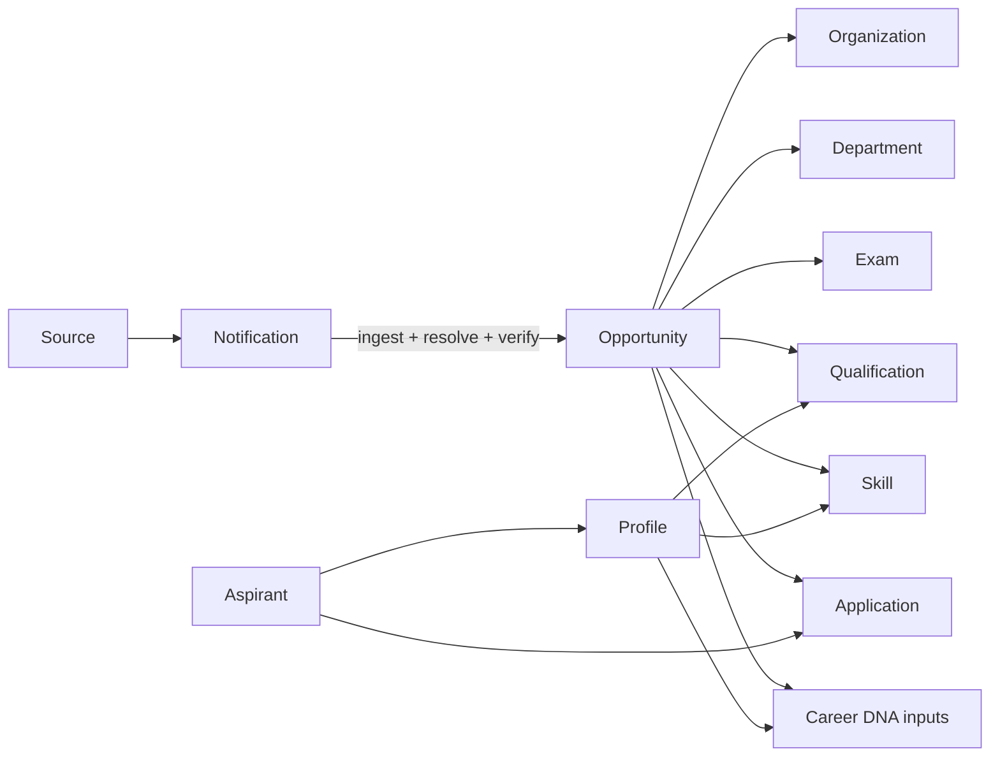
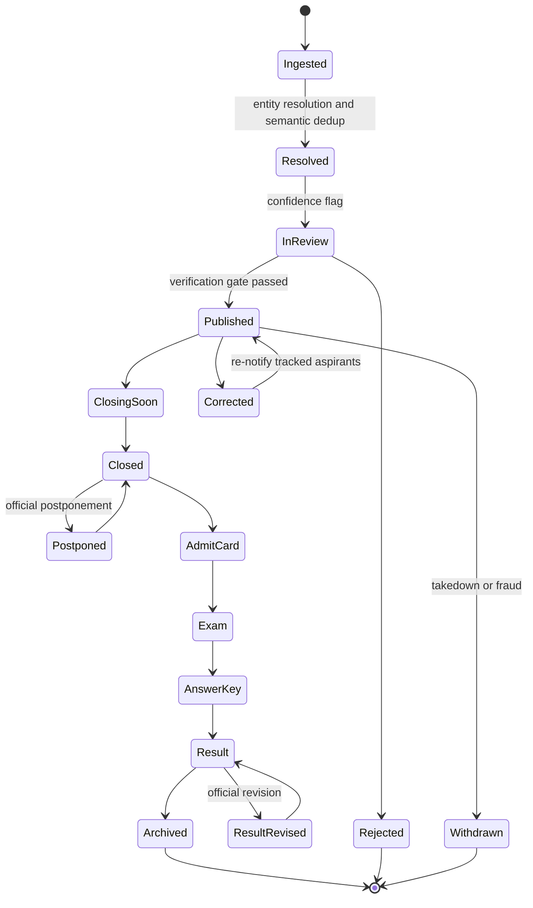
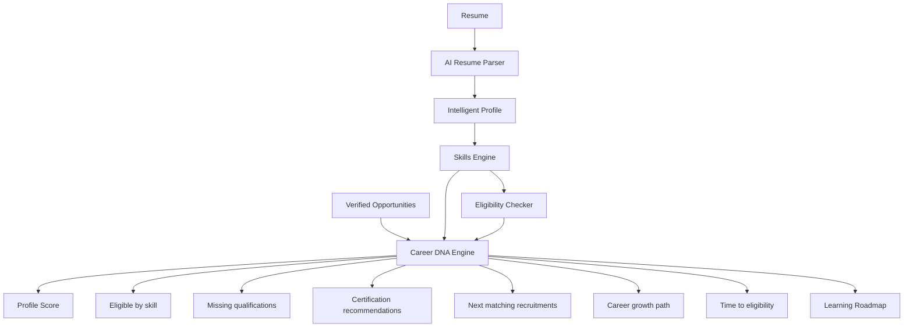
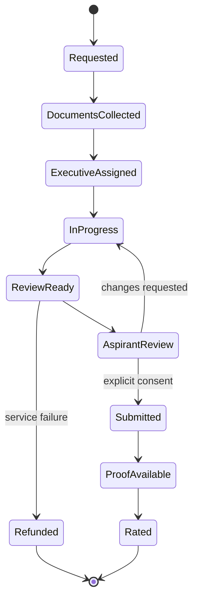
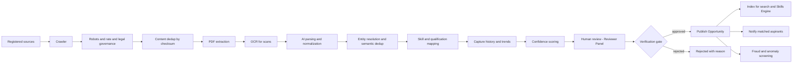

# CareerMitra — Master Product Requirements Document (PRD)

| | |
|---|---|
| **Product** | CareerMitra — India's AI-powered Government Career Operating System |
| **Company** | Astralabs Technologies LLP |
| **Document** | Master Product Requirements Document (single source of truth) |
| **Version** | 3.0 (post design-review rewrite) |
| **Status** | Approved for build — MVP first; decade-guiding |
| **Last updated** | 2026-07-01 |
| **Supersedes** | PRD v2.0 |
| **Review** | `docs/00_Project/PRD_REVIEW.md` (investment-grade design review) |
| **Foundation** | `PROJECT_CONTEXT.md`, `PROJECT_RULES.md`, `AI_INSTRUCTIONS.md`, `CONTRIBUTING.md`, `PROJECT_MANIFEST.json` |
| **Out of scope** | Architecture, API design, database schema, UI design, source code |

> This is the fundable, build-ready, decade-guiding source of truth for CareerMitra. It is written
> so 50+ engineers can build from it and so it survives contact with 100M users, 50M profiles, and
> 100k official sources. Diagrams are **Mermaid**; no implementation code, APIs, or schemas appear.
> Every section addressed a specific gap identified in the design review.

---

## 1. Executive summary & product vision

### 1.1 Vision
**CareerMitra is the operating system for every government career in India** — the single place to
discover, understand, apply for, track, and *plan* a public-sector career, powered by AI that is
grounded, honest, and genuinely useful. Aspirants should never need a second website.

### 1.2 What we are not
Not a "Sarkari Result" clone. Clones stop at *notification*. CareerMitra owns the **entire journey
and the data behind it** — verified opportunities, canonical entities (organizations, exams,
skills), historical trends, eligibility, skills, applications, and a living career identity
(**Career DNA**).

### 1.3 The wedge and the moat
- **Wedge:** the most trustworthy, fastest government-opportunity discovery in India (verified,
  deduplicated, SEO-discoverable).
- **Moat (compounding):** (1) canonical, verified data with provenance; (2) the **Skills Engine +
  Career DNA** that turn listings into career plans; (3) **historical/trends data** captured from
  day one that no new entrant can retroactively create; (4) full-journey lock-in (profile, vault,
  tracker, roadmap); (5) grounded AI trust.

### 1.4 Inspiration, adapted
| We admire | Adapted as |
|---|---|
| LinkedIn (identity + entity pages) | Intelligent Profile + Organization/Exam/Skill profiles |
| Indeed / Google Jobs (search) | 18-facet government search + AI Smart Search + ranking loop |
| Glassdoor (transparency) | Cutoff/vacancy/salary **trends** and verified provenance |
| Naukri (resume + apply) | AI Resume Builder/Parser + Form Filling Service |
| Duolingo (habit) | Deadline nudges, exam planner, skill/roadmap progress |
| Notion (workspace) | Dashboard as a personal career workspace |
| GitHub (profile = credibility) | Career DNA — a scored, living career identity |
| Stripe (docs + trust) | Rigorous governance, grounded AI, verified data |

---

## 2. Goals, non-goals & business objectives

### 2.1 Product goals
1. Be the first and only destination across the full government-career journey.
2. Deliver **verified, deduplicated, trustworthy** data — accuracy is the brand.
3. Make eligibility and fit instantly clear via AI + the Skills Engine.
4. Turn discovery into **planning** via Career DNA, Career Paths, and Learning Roadmaps.
5. Reduce application friction via assisted, consent-gated Form Filling.
6. Be inclusive: mobile-first, low-bandwidth, accessible, multilingual.

### 2.2 Business objectives (new — the review's #1 blocker)
1. Build a **sustainable revenue model** (freemium + services + B2B) with positive contribution
   margin per active user (see §30).
2. Make **organic/SEO** the dominant, low-cost acquisition channel via entity/profile pages (§31).
3. Establish **defensible data assets** (verified corpus + historical trends) that compound.
4. Control **unit economics**: AI, OCR, crawling, and SMS cost per active user are tracked and
   budgeted (§30, §40).

### 2.3 Non-goals (explicit)
- Not the official application portal — external government portals remain the system of record; we
  assist to consented review, never auto-submit.
- Never publish unverified data for speed.
- Never make guaranteed claims ("you will be selected", "you are certainly eligible").
- This document defines product scope only — no architecture, APIs, schema, UI, or code.

---

## 3. Market, opportunity & competitive landscape

### 3.1 Market framing
Tens of millions of Indians actively pursue government careers each year across central, state, PSU,
banking, railway, defence, judiciary, university, and research recruitment. The category is
enormous, fragmented, low-trust, and under-productized — a durable, defensible opportunity.

### 3.2 Segments
- **Aspirants (B2C):** the core — free tier + premium + paid services.
- **Institutions (B2B, later):** departments/boards wanting faster, structured publishing and
  analytics; and coaching/ed-tech partners.
- **Ecosystem:** certification providers and skilling partners (referrals).

### 3.3 Competitive advantage
| Competitor | Strength | Where it stops | CareerMitra edge |
|---|---|---|---|
| Sarkari Result | Fast listings | Static, no personalization/eligibility/trends | Verified + dedup + Career DNA + full journey |
| FreeJobAlert | Broad alerts | Noise, no fit scoring | Relevance-based alerts, Skill/Profile Match |
| Adda247 / Testbook | Exam prep | Weak discovery/tracking/eligibility | Discovery + eligibility + tracking unified |
| Jagran Josh | Content/news | Not a personal workspace | Dashboard, roadmap, assisted applications, verified news |
| Naukri | Private jobs/resumes | Not government-native | Records, admit cards, answer keys, calendar, eligibility |
| LinkedIn | Professional identity | Not government-focused | Government career identity + verified opportunities |
| Indeed / Google Jobs | Search | Generic; no records/eligibility/trends | Government-tuned search + Skills Engine + planning + trends |

**The moat in one line:** verified data + Skills Engine/Career DNA + day-one historical trends +
full-journey lock-in + grounded AI = a compounding advantage clones cannot copy quickly.

---

## 4. Personas

### Aspirant personas
| Persona | Snapshot | Primary need |
|---|---|---|
| **Aarti — first-timer** | 22, Tier-3, Hindi-first, mobile data | Plain-language clarity; "what can I apply for and am I eligible?" |
| **Rohan — power aspirant** | 26, many parallel exams | Unified calendar, precise alerts, tracking |
| **Sunita — professional** | 29, employed, time-poor | High-relevance, low-noise matches |
| **Vijay — low-connectivity** | 24, rural, 2G/3G, shared device | Lightweight, guided forms, regional language, offline |
| **Kabir — skill specialist** | 27, cybersecurity (SOC, Splunk) | Jobs by skill; skill-fit scoring; certification guidance |
| **Meera — minor aspirant** | 17, applying where age permits | Age-appropriate handling, guardian-aware consent |
| **Priya — premium upgrader** | 25, willing to pay for speed | Priority alerts, assisted form filling, advanced Career DNA |

### Operator & partner personas
| Persona | Role | Primary need |
|---|---|---|
| **Meena — Reviewer** | Content verification | Fast, accurate review queue; verification gate |
| **Anil — Admin** | Platform ops | Source health, roles, corrections, analytics, audit |
| **Sara — Support agent** | Aspirant support | Ticketing, account/grievance resolution, escalation |
| **Ravi — Trust & Safety** | Fraud/abuse | Detect fake listings, scams, impersonation, executive abuse |
| **Dept. publisher** (B2B, later) | Institution | Structured publishing, verification, analytics |

---

## 5. Product principles (binding)
1. **Trustworthy by default** — verified, deduplicated data; unverified data is never shipped.
2. **Clarity over cleverness** — plain language, one next step, no dark patterns.
3. **Mobile-first, low-friction** — works on 3G; 16px min body; 44px targets; offline for essentials.
4. **A companion, not an agent** — assists and organizes; never acts without explicit consent.
5. **Accessible & multilingual** — WCAG 2.1 AA; English, Hindi, regional scripts.
6. **Grounded intelligence** — every AI factual claim grounded in verified data or cited sources;
   no fabricated facts, no guaranteed outcomes.
7. **Measure everything** — every surface emits governed analytics; decisions are evidenced (§29).
8. **Capture history from day one** — trend data (cutoffs, vacancies) is captured continuously so it
   can never be "added later" (§11).
9. **Privacy & consent first** — minimize PII, gate every use behind consent, honor data rights (§34).
10. **Sustainable by design** — every feature considers unit cost and contribution margin (§30).

---

## 6. Information architecture

```mermaid
flowchart TD
    A[Aspirant] --> DISC[Discovery]
    A --> CAREER[Career planning]
    A --> APPLY[Application]
    A --> INSIGHT[Insights]

    subgraph Discovery
      DISC --> OPP[Opportunity modules]
      DISC --> REC[Records - Results Admit Answer]
      DISC --> CAL[Exam Calendar]
      DISC --> PROFILES[Entity profiles - Org Dept Exam Qual Skill]
      DISC --> SEARCH[Search and AI Smart Search]
      DISC --> NEWS[Career News]
      DISC --> SCHEMES[Government Schemes]
    end

    subgraph Career
      CAREER --> UPROF[Intelligent Profile]
      CAREER --> SKILLS[Skills Engine]
      CAREER --> DNA[Career DNA Engine]
      CAREER --> PATHS[Career Paths and Learning Roadmaps]
      CAREER --> AIM[AI modules]
    end

    subgraph Application
      APPLY --> SAVED[Saved Jobs]
      APPLY --> TRACK[Application Tracker]
      APPLY --> VAULT[Document Vault]
      APPLY --> FORM[Form Filling Service]
      APPLY --> NOTIF[Notifications]
    end

    subgraph Insights
      INSIGHT --> TRENDS[Cutoff and Vacancy and Salary trends]
      INSIGHT --> HIST[Recruitment history]
    end

    ING[Data Ingestion] --> OPP
    ING --> REC
    SR[Source Registry and Health] --> ING
    GATE[Reviewer Panel - Verification Gate] --> OPP
    ING --> GATE
    ADMIN[Admin and Trust and Safety] --> ING
    ADMIN --> OPP
    AIGOV[AI Governance] --> AIM
    ANALYTICS[Analytics and Experimentation] --> A
```

---

## 7. Domain model & canonical entities

The root cause of scale failure in listing products is free-text data. CareerMitra models a small
set of **canonical entities** with stable identities; everything else references them. This enables
deduplication, entity resolution, trends, profile pages, and analytics.

### 7.1 Canonical entities
| Entity | Identity & why it must be canonical |
|---|---|
| **Source** | An official website/portal feed; enables Source Registry & health, provenance, legal governance |
| **Notification** | The raw official announcement; provenance for every derived record |
| **Opportunity** | The verified, deduplicated listing (job/scholarship/etc.); the atomic user-facing unit |
| **Organization** | e.g., SSC, IBPS, DRDO, a specific PSU/university/court; powers profiles, trends, dedup |
| **Department/Ministry** | The parent government body; powers department analytics |
| **Exam** | e.g., SSC CGL, IBPS PO; links results/admit cards/answer keys/cutoffs across years |
| **Qualification** | e.g., B.Tech, GATE, NET; powers eligibility and qualification profiles |
| **Skill** | Normalized capability node; powers Skills Engine and skill profiles |
| **Certification** | Recognized certifications (e.g., CEH); powers recommendations |
| **Scheme** | Government scheme entity; powers the Schemes module |
| **CareerPath** | A sequence of roles/levels; powers roadmaps |
| **Aspirant / Profile** | The user and their career identity |
| **Application** | An aspirant's engagement with an Opportunity across stages |

### 7.2 Entity resolution (design-time, non-negotiable)
Because the same recruitment appears across many sources, ingestion must perform **entity
resolution**: map raw notifications to canonical `Organization`, `Exam`, and `Opportunity`
identities and **semantically deduplicate** (not merely by checksum). Resolution confidence is
scored; low-confidence merges go to human review. Without this, discovery quality and trust fail at
scale. (Pipeline in §25.)

---

## 8. Entity & profile modules

First-class, SEO-critical profile pages — the LinkedIn-company-page equivalent for government
careers. They structure the corpus, power discovery, and are the cheapest acquisition channel.

| Profile | Contents | Value |
|---|---|---|
| **Organization Profiles** | About, recruiting bodies, active & past opportunities, exams, cutoff/vacancy trends, hiring calendar | SEO hub; trust; discovery by employer |
| **Department/Ministry Profiles** | Constituent organizations, aggregate hiring, department analytics | Macro view; SEO |
| **Exam Profiles** | Pattern, eligibility, stages, admit-card/result/answer-key history, cutoff history, calendar | The most-searched pages in this category; retention |
| **Qualification Profiles** | Eligible opportunities & exams for a qualification, typical roles, pathways | Onboarding by "what I studied" |
| **Skill Profiles** | Opportunities & exams needing a skill, recommended certifications, demand trend | Powers skill-based discovery + Career DNA |

**Requirements:** every profile is server-rendered and SEO-structured (§31); shows verified data
with provenance; cross-links to related entities; exposes historical/trend widgets (§11);
localized; and is generated/maintained from canonical entities (never hand-authored per page).

---

## 9. Opportunity modules (unified taxonomy)

All categories are **facets** of one `Opportunity` — one data model, one search, one Skills Engine,
one Career DNA. Adding a category is data classification, not a new codebase.

### 9.1 Facets
| Facet | Values |
|---|---|
| Sector | Central, State, PSU, University, Judiciary, Railway, Banking, Defence, Research, Autonomous, International |
| Employment type | Permanent, Contract, Temporary, Apprenticeship, Internship, Fellowship |
| Organisation type | Ministry/Dept, Commission, Board, Bank, PSU, University, Court, Defence, Research Institute |
| Opportunity type | Job, Scholarship, Fellowship, Internship, Apprenticeship |
| Level | Entry, Junior, Officer, Senior, Specialist |

### 9.2 Job categories (all requested types via facets)
| Category | Facet mapping | Category-specific fields |
|---|---|---|
| Central / State Government Jobs | Sector | Ministry, cadre, pay level, domicile |
| PSU Jobs | Sector = PSU | GATE requirement, PSU name |
| University Jobs | Org = University | Teaching/non-teaching, NET/PhD |
| Court Jobs | Sector = Judiciary | Court level, typing/steno norms |
| Railway Jobs | Org = Railway | Zone/RRB region, medical standards |
| Bank Jobs | Sector = Banking | IBPS/SBI track, scale, mobility |
| Defence Jobs | Sector = Defence | Physical standards, branch |
| Research Jobs | Sector = Research | Discipline, JRF/SRF track |
| Permanent / Contract Jobs | Employment type | Confirmation/pension vs duration/renewal |

### 9.3 Non-job opportunities
| Type | Key fields |
|---|---|
| Scholarships | Income limit, category, course, merit, renewal, documents |
| Fellowships | Stipend, duration, host institution, discipline |
| Internships | Stipend, duration, eligibility |
| Apprenticeships | Trade, stipend, duration, eligibility |

### 9.4 Official records
| Module | Purpose & key requirements |
|---|---|
| **Results** | Correct exam linkage, official link, cutoff/scorecard where available, notify tracked aspirants, survive result-day surges, capture into Cutoff History (§11) |
| **Admit Cards** | Release alerts, official link, exam-stage linkage, optional consented Vault storage, pre-exam reminders |
| **Answer Keys** | Provisional & final, per-set, objection-window dates into calendar, optional score estimation where officially supported |

### 9.5 Exam Calendar
Unified, personalized calendar of every date type (open/close, admit card, exam, answer-key &
objection windows, result), marking provisional vs confirmed, filtered to saved/relevant items,
exportable/subscribable, and the primary trigger source for Notifications.

### 9.6 International Government Opportunities (future)
Facet `Sector = International` (UN bodies, foreign public institutions). Included in the model now to
avoid rework; activated in the long-term roadmap.

---

## 10. Opportunity lifecycle & states

Every transition changing a material date/fact re-notifies tracked aspirants and is captured into
history. `Postponed`, `ResultRevised`, and `Withdrawn` are explicit because they are common and
high-impact in Indian government recruitment — omitting them (as v2.0 did) is a real defect.

---

## 11. Historical data, trends & public analytics

A day-one commitment (Principle 8): the platform **continuously captures** recruitment data so it can
surface trends that compound into a moat and drive SEO + retention.

| Module | Contents | Value |
|---|---|---|
| **Recruitment History** | Every past recruitment per organization/exam, with dates and outcomes | Context, credibility, SEO |
| **Cutoff History** | Category-wise cutoffs across years per exam | The single most-demanded insight; retention driver |
| **Vacancy Trends** | Vacancy counts over time per organization/role | Planning signal for aspirants |
| **Salary Trends** | Pay-level/consolidated-pay trends by role/sector | Decision support |
| **Department & Organization Analytics** | Aggregate hiring activity, frequency, seasonality | Powers profiles (§8) and B2B analytics (§30) |

**Requirements:** data is captured at ingestion/result time (not reconstructed later); trends are
verified and provenance-linked; presented on entity profiles and dashboards; available (in aggregate,
privacy-safe form) as a future B2B analytics product. Missing history capture from day one is
treated as a severity-1 planning defect.

---

## 12. Skills Engine

Organizes government careers by **skill**, not only department — powering skill-based discovery, fit
scoring, skill profiles (§8), and Career DNA (§13).

### 12.1 Skill taxonomy governance
- A **managed, versioned taxonomy** with domains, nodes, synonyms, and aliases (e.g., InfoSec → Cyber
  Security; ML → Machine Learning), so aspirant-entered and ingestion-extracted skills map to one
  canonical node.
- Governance: an owner, a change process, deprecation handling, and quality metrics (coverage,
  mapping accuracy). New skills are proposed via ingestion signals and admin-approved.
- Illustrative coverage: Cyber Security (SOC, Splunk, Elastic, ArcSight, Digital Forensics, SIEM);
  Software/Data (Python, Java, Networking, Cloud, AI, ML, Data Science, Electronics, Robotics); Core
  Engineering (Civil, Mechanical, Electrical, Architecture, GIS); Professional (Law, Finance,
  Accounting, Research); Care (Teaching, Medical, Nursing, Pharmacy); Field (Agriculture).

### 12.2 Capabilities
Search by skill · save skills · recommend jobs by skill fit · recommend certifications · recommend
missing qualifications · Skill Match Score · Profile Match Score · surface upcoming recruitments by
skill (with confidence and provenance).

### 12.3 Scoring model (conceptual)
- **Skill Match Score (0–100):** weighted over an Opportunity's required skills by coverage,
  proficiency, evidence/recency, and criticality (must-have vs nice-to-have).
- **Profile Match Score (0–100):** combines Skill Match with a hard **eligibility gate**
  (ineligible cannot score as strong) and preference alignment (state, department, salary, type).
- Scores are **explainable** (every score shows its factors) and are **guidance, not guarantees**.

### 12.4 Certification recommendations
Backed by a governed **Certification** reference dataset; recommendations tie each suggestion to the
concrete fit improvement it produces (feeds Career DNA and Learning Roadmaps).

---

## 13. Career DNA Engine (flagship)

Turns a resume or profile into a scored, actionable **career identity** — the reason users choose and
stay. It plans a career, not just lists jobs.

### 13.1 Inputs
Uploaded resume (via AI Resume Parser) and/or Intelligent Profile · Skill Taxonomy · verified
Opportunity corpus · Eligibility rules · the aspirant's qualifications, category, age, experience.

### 13.2 Outputs — the Career DNA Card (example: cybersecurity aspirant)
| Signal | Example |
|---|---|
| 🎯 Profile Score | 84 / 100 |
| 🛡 Eligible now (Cyber Security) | 27 opportunities |
| 📚 Missing qualification | GATE / M.Tech (where the target role requires it) |
| 🏆 Recommended certifications | Security+, CEH |
| 📅 Next matching recruitments | CERT-In, NIC, DRDO, RailTel |
| 📈 Career growth path | SOC Analyst → Security Engineer → Cyber Security Officer |
| ⏳ Estimated time to eligibility | ~8–12 months (GATE + one certification) |

Every number is **explainable** and **grounded**; "eligible now" strictly reflects passing published
eligibility rules; nothing guarantees selection.

### 13.3 Composition & scoring definition

- **Profile Score** = weighted blend of profile completeness, verified credentials, breadth of
  eligible opportunities, and skill depth — each contribution shown to the user.
- **Time-to-eligibility** = estimated from the fastest realistic path to acquire missing
  qualifications/certifications, clearly labeled as an estimate.

### 13.4 Requirements
Regenerates on profile/resume change; caches the last card for instant load; distinguishes "eligible
now" vs "eligible after action" (with the action); ties every recommendation to a next step; treats
parsed content as sensitive PII (encrypted, access-logged, consent-gated — §34).

---

## 14. Career Paths, Learning Roadmaps & Certification Recommendations

| Module | Purpose | Requirements |
|---|---|---|
| **Career Paths** | Model realistic role progressions per domain (e.g., SOC Analyst → Security Officer) | Built from canonical roles/levels; grounded in real opportunities; shows eligibility gates between steps |
| **Learning Roadmaps** | Convert gaps into an ordered plan (qualifications → certifications → target recruitments) | Actionable, time-estimated, tied to verified opportunities; integrates with AI Exam Planner |
| **Certification Recommendations** | Suggest recognized certifications that raise fit | Governed reference data; each suggestion shows the fit/eligibility improvement |

These make CareerMitra a **planning** product and deepen retention beyond a single application cycle.

---

## 15. AI modules

All obey one rule: **grounded, honest, non-guaranteeing** (governed by §16). Each cites/links the
verified data behind any factual claim.

| # | Module | What it does | Safety note |
|---|---|---|---|
| 1 | AI Eligibility Checker | Explains eligible/not, incl. relaxations | Deterministic rules; shows why |
| 2 | AI Resume Parser | Structured profile from a resume | Sensitive PII; user reviews extraction |
| 3 | AI Resume Builder | Government-appropriate resumes | Multilingual; reuses profile + Vault |
| 4 | AI Career Assistant | Conversational journey guidance | Grounds every fact; cites sources; no guarantees |
| 5 | AI Notification Summaries | Long notifications → key facts | Links to source; never invents facts |
| 6 | AI Profile Completion | Highest-impact next profile field | Transparent score impact |
| 7 | AI Skill Gap Analysis | Missing skills/quals for targets | Backed by Skills Engine |
| 8 | AI Career Roadmap | Step-by-step growth plan | Grounded in real roles/timelines |
| 9 | AI Personalized Recommendations | Ranks opps/exams/certs | Explainable; eligibility-gated |
| 10 | AI Interview Preparation (future) | Practice & guidance | Labeled practice; no false assurance |
| 11 | AI Exam Planner | Study/exam schedule | Uses verified calendar dates only |
| 12 | AI Document Analyzer | Checks document completeness/validity | Sensitive PII; flags, never alters originals |
| 13 | AI Smart Search | NL intent → structured facets | Falls back to verified structured results |

---

## 16. AI governance & safety (new — the review's #3 blocker)

For an AI-first product at 100M users, AI must be a **governed system**, not a feature.

| Area | Requirement |
|---|---|
| **Model lifecycle** | Versioned models/prompts in a registry; staged rollout; rollback; every AI output records model+version for audit |
| **Grounding gates** | Factual claims (dates, eligibility, official process) must resolve to verified data or a cited source, or the surface degrades to "see official source" |
| **Evaluation harness** | Golden datasets and automated evals for accuracy, grounding fidelity, and refusal correctness, run pre-release and continuously |
| **Hallucination controls** | Measured hallucination rate with a guardrail threshold; block release on regression |
| **Human oversight** | High-impact outputs (eligibility, form filling) have human-review paths; low-confidence outputs defer to official sources |
| **Prompt-injection defense** | Untrusted content (notifications, resumes, web) is treated as data, never instructions; tool/data boundaries enforced |
| **PII in prompts** | Minimize PII sent to models; never log prompts/outputs containing PII in plaintext; honor consent and retention (§34) |
| **Cost & latency budgets** | Per-surface token/inference budgets; caching; fallback when models are slow/unavailable; cost tracked per active user (§40) |
| **Fairness** | Guard against biased recommendations across category/region/language; monitor outcome disparities |
| **Red-teaming** | Periodic adversarial testing for misinformation, injection, and unsafe guidance |

No AI surface ships without passing its evals and grounding gate. See `AI_INSTRUCTIONS.md` for the
build-time rules AI tooling must follow.

---

## 17. Intelligent User Profile

The identity and fuel for AI. Progressively completed, never a wall of fields.

### 17.1 Fields
Identity/demographics (age via DOB, category, gender optional, PwD optional, ex-serviceman) ·
education, qualifications, certificates, languages · experience, skills (taxonomy-mapped) ·
preferences (state, department, salary, job type, skills, organizations) · assets (Vault, resume) ·
derived signals (Profile Completion %, Eligibility Score, Skill/Profile Match, Career DNA).

### 17.2 Derived signals
- **Profile Completion %** — impact-weighted, with the single next-best action surfaced.
- **Eligibility Score** — breadth of qualification across the corpus.
- **Career DNA** — the composed identity (§13).

### 17.3 Profile-data verification & integrity (new)
Where accuracy matters (qualifications, category), the profile supports **evidence** from the Vault
and flags unverified self-reported data. Eligibility results state which inputs are unverified.

### 17.4 Consent, minors & sensitivity (new)
Optional demographics (gender, PwD) improve accuracy only and are sensitive PII. **Minors** (common:
17–18) get age-appropriate handling and guardian-aware consent where required. Every use of PII is
consent-gated and access-logged (§34).

---

## 18. Search & ranking

India's best government search: fast structured filtering + AI Smart Search + a **governed ranking
system** (the review's underspecified area).

### 18.1 Filters
Qualification · Age · Salary · State · Department · Skill · Organization · Experience · Category ·
Reservation · Location · Job Type · Exam Type · Deadline · Application Status · Profile Match ·
Eligibility.

### 18.2 Ranking (governed subsystem, not one line)
| Requirement | Detail |
|---|---|
| Signals | Relevance, eligibility gate, Profile Match, freshness, deadline proximity, authority (verified source), personalization |
| Quality loop | Ranking quality is measured (engagement, apply-through, satisfaction) and improved via experiments |
| Experimentation | Ranking changes ship behind A/B tests with guardrails (§29) |
| Spam/fraud suppression | Suspected fake/duplicate listings are demoted/withheld (§28) |
| Fairness | No systematic disadvantage by region/category/language |
| Fallback | Non-personalized deterministic ranking when signals/personalization are unavailable |

### 18.3 Experience
AI Smart Search maps natural language ("cyber security jobs in Delhi for B.Tech, no fee") to facets;
zero-result recovery relaxes the least-important facet and explains it; all results are verified.

---

## 19. Notifications & engagement

Proactive, relevant, never spammy — and **cost-aware**.

| Aspect | Requirement |
|---|---|
| Channels | In-app, push, email, SMS (SMS reserved for high-value time-critical alerts due to cost) |
| Alert types | Deadline reminders, admit card released, result out, answer key out, new matching opportunity, profile/skill suggestions |
| AI summaries | Long notifications condensed to key facts, linked to source |
| Preferences | Per-type and per-channel; quiet hours; digest option |
| Anti-fatigue | Frequency caps, relevance thresholds |
| **Result-day surge** | Batching, digesting, backpressure, and staggered delivery so peak days never cause outages or cost spikes |
| Reliability | Idempotent delivery; no duplicates/drops under retry |
| Re-notification | Triggered on material date/fact change of a tracked Opportunity |
| Cost control | Channel cost per notification tracked; SMS budgeted; cheaper channels preferred |

---

## 20. Aspirant tools — Saved, Tracker, Vault

| Module | Purpose | Key requirements |
|---|---|---|
| **Saved Jobs** | Personal shortlist | Save/label; sync across devices; offline access; feeds calendar/alerts |
| **Application Tracker** | Track applications & stages | Stages (interested → applied → admit card → exam → result); per-application document checklist; deadlines; manual + assisted updates; links to records |
| **Document Vault** | Secure document store | Store IDs, marksheets, certificates, photo, signature; reuse in Resume Builder & Form Filling; encryption + field-level protection; access logging; consent per use; shared-device safety; aspirant-controlled deletion; retention policy |

---

## 21. Form Filling Service (assisted, consent-gated, fraud-aware)

Human-plus-AI assisted completion of official forms. Consent-gated, never auto-submits, never stores
external portal credentials — now with the fraud, refund, and SLA controls the review demanded.

### 21.1 Aspirant capabilities
Request form filling · upload/reuse Vault documents · track progress · view assigned executive ·
receive updates · review before finalizing · download proof · rate the service.

### 21.2 Lifecycle

### 21.3 Guardrails (new)
- **Explicit consent** before any submission; consent recorded and auditable.
- Validated against eligibility rules; issues flagged before review.
- **Executive-abuse controls:** least-privilege, scoped, time-boxed access to a request; all actions
  logged; separation of duties; anomaly detection on executive behavior (§28).
- **Refund policy** for service failure; **SLA** on turnaround; **dispute/grievance** path (§27).
- Documents/form data are sensitive PII: encrypted, access-logged, purged per retention (§34).
- Security-sensitive by definition → Security Review required (`PROJECT_RULES.md` R16).

---

## 22. Government Schemes (new)

Beyond recruitment, aspirants need relevant government **schemes** (scholarships-adjacent, skilling,
welfare tied to category/domicile).

**Requirements:** canonical `Scheme` entities with eligibility, benefits, deadlines, documents, and
official links; discoverable via search and eligibility; surfaced in Career DNA where relevant; same
verification gate and provenance as opportunities.

---

## 23. Government Career News (new)

Verified, sourced news relevant to aspirants (recruitment announcements, exam-date changes, policy
updates) — an engagement and SEO driver.

**Requirements:** every item links to an official/credible source; clearly separates verified fact
from commentary; ties to affected entities (exam/organization) so news drives re-notification and
appears on relevant profiles; no rumor amplification (trust principle).

---

## 24. Community features (future)

A future, carefully-moderated community (peer Q&A, preparation groups, verified mentor answers).

**Requirements (when built):** strong moderation and Trust & Safety (§28); no unverified official
claims presented as fact; reputation system; abuse reporting; privacy-preserving identities;
explicitly out of early roadmap.

---

## 25. Data ingestion pipeline

Raw official information → trustworthy, structured, deduplicated, personalized data. Idempotent,
observable, legally governed, and gated by human verification.

### 25.1 Trust & scale rules
- **Entity resolution + semantic dedup** are mandatory (not checksum-only) — the core scale fix.
- Nothing publishes without passing the **verification gate**; every record carries provenance.
- Low-confidence and high-impact fields (dates, eligibility) always get human review.
- **Legal governance:** respect robots/rate limits/terms; correct attribution; the ingestion trust
  boundary is security-sensitive and change-gated.
- History/trends are captured at this stage (Principle 8).

---

## 26. Source Registry & Source Health Monitoring (new)

At 100k sources, sources are first-class managed assets.

| Capability | Requirement |
|---|---|
| **Source Registry** | Canonical registry of every official source: owner, type, jurisdiction, crawl config, legal status, reliability score |
| **Source Health Monitoring** | Freshness, success/failure rates, drift detection (format changes), and alerts; failing sources are triaged with SLAs |
| **Coverage management** | Track coverage gaps by sector/state; prioritize onboarding of missing sources |
| **Reliability scoring** | Sources scored on accuracy/timeliness; low-reliability sources get stricter review |

Silent source failure is treated as a production incident, not a backlog item.

---

## 27. Operational workflows

The product *is* operations at scale. Role-based, audited, SLA'd.

| Workflow | Purpose |
|---|---|
| **Reviewer** | Verify/normalize ingested data — the verification gate; prioritized queue with confidence flags and SLA |
| **Admin** | Sources, entities, users, roles, corrections, feature flags, dashboards |
| **Support** | Aspirant ticketing: account, data, billing, service issues; response SLAs |
| **Escalation / Grievance** | Formal grievance redressal (incl. legally-expected channels), with tracking and resolution SLA |
| **Content moderation & takedown** | Handle corrections, duplicates, fake/withdrawn listings; propagate corrections and re-notify |
| **Incident / on-call** | Severity model, on-call rotation, incident response, blameless postmortems (runbooks added before production launch — sprint S091+) |

Material corrections trigger re-notification of tracked aspirants; every operator action is audited.

---

## 28. Fraud detection & Trust & Safety (new)

Government-job scams are endemic in India; the platform will be targeted. Trust & Safety is a
first-class subsystem.

| Threat | Control |
|---|---|
| Fake/scam job listings | Source-reliability + anomaly detection + human review; suspicious listings withheld/demoted |
| Platform impersonation / phishing | Brand monitoring; clear provenance; user education; report channel |
| Executive fraud (Form Filling) | Least-privilege, separation of duties, behavior anomaly detection, audit (§21) |
| Document tampering | AI Document Analyzer validation; integrity checks; manual review for high-risk |
| Account abuse / bot signups | Rate limiting, abuse detection, verification challenges |
| Misinformation (News/Community) | Source verification; no rumor amplification; moderation |

**Abuse reporting:** every user-facing surface has a "report" path; reports feed Trust & Safety with
SLAs. Trust & Safety changes are security-reviewed.

---

## 29. Analytics, experimentation & feedback (new)

You cannot run ranking, notifications, or growth without this.

| Capability | Requirement |
|---|---|
| **Event taxonomy** | A governed catalog of product events (view, save, apply, notify, DNA-run, etc.) with owners and definitions |
| **Product analytics** | Funnels, cohorts, retention, segment analysis across the journey |
| **A/B experimentation** | Framework with guardrail metrics, sample-size discipline, and a decision log; ranking/notification/growth changes ship behind experiments |
| **Metric governance** | One definition per metric; a metrics catalog; no conflicting numbers |
| **Feedback system** | In-product feedback, ratings (e.g., Form Filling), and surveys feed prioritization |
| **Privacy** | Analytics use minimized, consented, and (where possible) anonymized/aggregated data (§34) |

---

## 30. Monetization & business model (new — the review's #1 blocker)

CareerMitra must be a business, not a grant. The model is **freemium + services + B2B**, designed
around trust (no dark patterns, no pay-to-rank).

### 30.1 Revenue lines
| Line | Description | Notes |
|---|---|---|
| **Free tier** | Discovery, calendar, basic alerts, basic eligibility, basic Career DNA | The trust-building, SEO-fed top of funnel |
| **Premium (subscription)** | Priority/real-time alerts, advanced Career DNA (paths, time-to-eligibility), advanced trends (full cutoff history), unlimited saves, ad-light | Recurring revenue; clear value over free |
| **Form Filling Service (paid)** | Assisted application completion with proof and SLA (§21) | High-value, per-use or bundled |
| **B2B / Institutional (later)** | Structured publishing + verified data + analytics for departments/boards and skilling/coaching partners | Higher-margin, defensible |
| **Ecosystem referrals** | Certification/skilling partner referrals aligned to recommendations | Must be relevance-driven, disclosed, never pay-to-rank |
| **Advertising (guardrailed)** | Optional, clearly-labeled, non-intrusive, never influencing verified data or ranking | Trust guardrails are absolute |

### 30.2 Guardrails (non-negotiable)
Verified data and ranking are **never** for sale. No pay-to-rank, no fake urgency, no deceptive
upsell. Premium adds convenience/insight, never gates a citizen's access to a basic opportunity.

### 30.3 Unit economics (must be tracked)
Contribution margin per active user = revenue − variable cost (AI inference, OCR, crawling, storage,
SMS/email, support). Each is a tracked metric (§40); features consider their unit cost (Principle 10).

---

## 31. Growth engine (new)

### 31.1 SEO strategy (primary acquisition channel)
Government-opportunity search is the largest organic channel. **Entity/profile pages** (§8) — for
organizations, exams, qualifications, skills, and every opportunity — are server-rendered, structured
(rich results), interlinked, localized, and continuously fresh. This is architected from day one, not
retrofitted.

### 31.2 Referral & virality
Referral system (aspirants invite peers; incentives that respect trust); shareable Career DNA cards,
opportunity pages, and results; group/exam sharing.

### 31.3 Retention loops
Deadline reminders, exam planner streaks, roadmap progress, trend updates, and "new matching
opportunity" alerts create repeated, valuable returns across a multi-year journey.

### 31.4 Feedback-driven growth
Feedback and analytics (§29) drive prioritization; NPS/trust tracked as a growth guardrail.

---

## 32. User dashboard

The aspirant's career workspace — mobile-first, most time-critical widgets first, reorderable,
graceful on low bandwidth (skeletons, progressive load, offline saved items).

| Priority | Widget |
|---|---|
| 1 | Upcoming Deadlines |
| 2 | Career DNA summary (score + top gap + next action) |
| 3 | Recommended Jobs |
| 4 | Recommended Exams |
| 5 | Application Tracker |
| 6 | Saved Jobs |
| 7 | Skill Match |
| 8 | Profile Score |
| 9 | Notifications (with AI summaries) |
| 10 | Calendar |
| 11 | Resume |
| 12 | Documents |
| 13 | Recent Activity |
| 14 | Career Roadmap |

Every widget has defined empty, loading, and error states.

---

## 33. Security architecture (product-level)

| Area | Requirement |
|---|---|
| AuthN/Z | Secure sign-in; support for gov-SSO adapters; session management |
| RBAC | Granular, least-privilege roles for aspirants, reviewers, admins, support, Trust & Safety, and (later) institutions |
| Data classification | public / internal / pii / sensitive-pii / secret (per `PROJECT_MANIFEST.json`) |
| Encryption | In transit and at rest; field-level for sensitive PII (Vault, resume, form data) |
| Secrets | Vault-managed; never in git; `.env.example` is the only committed contract |
| Audit | Tamper-evident logs of all operator actions and every sensitive-PII access |
| Least privilege | Scoped, time-boxed credentials for services and executives |
| Change gating | Vault, Resume Parser, Form Filling, identity, ingestion boundary changes require Security Review (R16) |

---

## 34. Privacy, consent & legal compliance (new)

Citizen PII at national scale demands a real compliance posture, not a paragraph.

| Area | Requirement |
|---|---|
| **Consent management** | Purpose-specific, granular, revocable consent for every PII use; consent events recorded and auditable |
| **DPDP alignment** | Purpose limitation, data minimization, defined retention schedules, and lawful processing consistent with India's data-protection direction |
| **Data-subject rights** | Access, correction, deletion, and portability requests with defined SLAs and workflows (§27) |
| **Minors** | Age-appropriate handling and guardian-aware consent where required (§17.4) |
| **Retention & deletion** | Explicit retention per data class; automatic purge; Vault/form data purged after service completion |
| **Data residency** | Defined stance on where citizen data is stored/processed |
| **Grievance** | A grievance officer/channel and redressal SLA |
| **Breach response** | Detection, containment, notification, and postmortem plan |
| **Vendor/AI data** | Third-party/model processors bound to the same privacy terms; PII minimized in prompts (§16) |

---

## 35. Non-functional requirements

| Category | Requirement / target |
|---|---|
| Performance | Cached opportunity detail p95 < 300 ms; usable first content on 3G; fast search on mobile |
| Availability | ≥ 99.9% monthly read availability for discovery/detail |
| Scalability | 100M users, 50M profiles, 100k sources; horizontal scale; entity resolution scales sub-linearly with dedup |
| Surge resilience | Result-day/admit-card spikes handled by graceful degradation (cached fallbacks, digesting, backpressure) — never a hard outage |
| Cost efficiency | Tracked cost per active user (AI, OCR, crawl, SMS, storage); budgets and caching enforced |
| Observability | Metrics, traces, structured logs; freshness and pipeline dashboards; no PII in logs |
| Internationalization | English + Hindi at launch; regional languages over time; correct script rendering |
| Offline | Offline access to saved items and downloaded documents; resilient sync (early where feasible, expanded over time) |
| Accessibility | WCAG 2.1 AA (see §38) |
| Data integrity | Published verified-field accuracy ≥ 99.5%; provenance on every record |

---

## 36. Disaster recovery, backup & business continuity (new)

| Area | Requirement |
|---|---|
| **Backups** | Regular, tested, encrypted backups of all durable data (opportunities, profiles, vault, history) |
| **RTO / RPO** | Defined recovery-time and recovery-point objectives per data class; sensitive/critical data has the tightest targets |
| **DR strategy** | Multi-zone resilience; documented failover; periodic DR drills |
| **Restore testing** | Backups are restore-tested on a schedule — an untested backup is assumed broken |
| **Continuity** | Runbooks for source-outage, pipeline-stall, search-outage, and notifier-backlog (added before production launch — sprint S091+) |

---

## 37. Internationalization & localization

Localize content and UI (English, Hindi, then regional languages) with translatable strings (no
concatenation), correct Devanagari/regional rendering, locale-aware dates/numbers, and localized
entity/profile pages for SEO. AI outputs and notifications respect the aspirant's language. The
international-opportunities facet (§9.6) extends this in the long term.

---

## 38. Accessibility

WCAG 2.1 AA as an acceptance criterion, not backlog: keyboard operability, visible focus, 44px touch
targets, 16px minimum body text, sufficient contrast, screen-reader semantics, captions/alt text,
reduced-motion support, and testing with assistive technology. Accessibility is verified per release.

---

## 39. Roadmap

> Direction and sequencing; detailed sprint plan in `docs/09_Sprints`, decisions as ADRs in `docs/10_ADR`.

### MVP — "Find, understand, never miss" (trust + core discovery)
Accounts + Intelligent Profile (core) + Profile Completion · Government Jobs (Central/State + core
sectors), Results, Admit Cards, Exam Calendar · **canonical entities + entity resolution + Exam/
Organization profiles** (SEO from day one) · Smart Search (structured) + Saved Jobs · AI Eligibility
Checker (core) + Skills Engine (search-by-skill, Skill Match) · Career DNA v1 · Notifications
(deadline/released; in-app/push/email) · **Source Registry + Source Health + Reviewer + core Admin +
Ingestion with history capture** · **Analytics event taxonomy + basic experimentation** · **Consent +
core compliance** · **Trust & Safety v1 (fake-listing screening)** · English + Hindi · WCAG AA · SEO.

### Version 2 — "Plan and apply"
Answer Keys · Scholarships, Fellowships, Internships, Apprenticeships · broader sectors (PSU,
University, Court, Railway, Bank, Defence, Research) · Qualification & Skill profiles · Cutoff/Vacancy
trends · AI Resume Builder + Document Vault + Application Tracker · AI Career Roadmap, Skill Gap,
Recommendations, Notification Summaries, Exam Planner · Career Paths + Learning Roadmaps · full
multichannel Notifications (incl. SMS, anti-fatigue) · **Premium tier v1** · Support/Grievance
workflows · additional regional languages.

### Version 3 — "Automate and assist"
AI Resume Parser + AI Document Analyzer · Form Filling Service (assisted, fraud-aware) · AI Career
Assistant · advanced Career DNA (paths, time-to-eligibility) · Government Schemes · Salary Trends +
Department/Org analytics · **B2B analytics (early)** · A/B experimentation at depth · DR drills.

### Version 5 — "Intelligence & ecosystem"
AI Interview Preparation · predictive upcoming-recruitment modeling · Career News at scale ·
institutional publishing partnerships · ecosystem referrals · deep personalization · offline
expansion.

### Long-term vision
International Government Opportunities facet · Community features · offline-first for low-connectivity
regions · CareerMitra as the recognized career operating system and identity layer (Career DNA)
carried across an aspirant's entire journey.

---

## 40. Success metrics & KPIs

### North Star
**Weekly Active Aspirants who take a tracked action on a verified Opportunity** (save, track, remind,
run Career DNA, or begin assisted application).

### AARRR + product
| Stage | Metrics |
|---|---|
| Acquisition | New aspirants; **organic/SEO share**; profile-page traffic |
| Activation | % completing profile basics + saving ≥ 1 opportunity in week 1 |
| Engagement | WAA; Career DNA runs; saves; calendar/dashboard usage; trend-page views |
| Retention | 4-week / 12-week retention; multi-cycle return rate |
| Revenue | Premium conversion & churn; Form Filling revenue & completion; **contribution margin/active user** |
| Referral | Invites sent/accepted; shared-card virality |

### Guardrails — must not regress
Published verified-field accuracy ≥ 99.5% · reviewer SLA · material-error correction time ·
**AI grounding fidelity / hallucination rate** · **cost per active user** · notification opt-out rate ·
PII/security incidents (zero-tolerance) · fraud/scam listings reaching users (near-zero) ·
accessibility conformance.

### Per-module KPIs
Each module owns KPIs (e.g., ingestion freshness, dedup precision/recall, search apply-through, DNA
action rate, form-filling CSAT). Definitions live in the metrics catalog (§29).

---

## 41. Risks

| # | Risk | Impact | Likelihood | Mitigation |
|---|---|---|---|---|
| RK-1 | Source fragmentation breaks ingestion | High | High | Resilient crawlers, Source Health, human backstop (§26) |
| RK-2 | Wrong published date/eligibility erodes trust | Critical | Medium | Verification gate, provenance, fast correction + re-notify, accuracy guardrail |
| RK-3 | Duplicate/unresolved entities degrade quality | Critical | High | Entity resolution + semantic dedup from day one (§7, §25) |
| RK-4 | PII exposure (Vault, Parser, Form Filling) | Critical | Low | Encryption, field-level, access logs, least privilege, Security Review, DR |
| RK-5 | Fraud/scams via platform | Critical | High | Trust & Safety subsystem, screening, reporting (§28) |
| RK-6 | AI hallucination / over-promising | High | Medium | AI governance, evals, grounding gates (§16) |
| RK-7 | No/weak monetization → burn | High | Medium | Freemium + services + B2B; unit-economics tracking (§30) |
| RK-8 | Result-day surges cause outages | High | Medium | Surge design, cached fallbacks, backpressure (§19, §35) |
| RK-9 | Compliance/regulatory blocker | High | Medium | Consent, DPDP alignment, grievance, breach plan (§34) |
| RK-10 | Content-ops bottleneck | Medium | High | Confidence prioritization, bulk tooling, AI-assisted review, SLAs |
| RK-11 | AI/infra cost outruns revenue | High | Medium | Cost budgets, caching, channel discipline, per-user cost metric |
| RK-12 | Missing history capture | High | Medium | Capture at ingestion/result time from day one (§11) |
| RK-13 | Legal/attribution issues | Medium | Low | Source legal governance, attribution, official links (§25) |
| RK-14 | Over-scoping delays MVP | Medium | Medium | Facet model, strict MVP, phased roadmap |
| RK-15 | Key-person / knowledge risk | Medium | Medium | Documentation-first foundation; ADRs; runbooks |

---

## 42. Assumptions
Official data is publicly available and attributable · aspirants are mobile-first, often low-bandwidth
· many prefer Hindi/regional languages · human verification is required for accuracy · aspirants share
minimal PII for clarity/alerts/Career DNA if privacy is respected · external portals remain the system
of record · standard push/email/SMS providers exist · a meaningful share will pay for premium
convenience and assisted services · SEO via entity pages is a durable acquisition channel.

---

## 43. Open questions (resolve during MVP; architectural ones become ADRs)
Launch set of sectors/exams/states · minimal profile fields for first Eligibility/Career DNA ·
prioritized regional languages · notification frequency-cap & quiet-hours defaults · reviewer SLA &
staffing for expected volume · entity-resolution confidence thresholds & merge policy · certification/
qualification reference-data sources · premium packaging & price points · data-residency stance · ads
policy boundaries.

---

## 44. Out of scope for this document
Product scope only. No system architecture, API contracts, database schemas, UI designs, or code.
Those are produced separately under `PROJECT_RULES.md`; architectural choices are recorded as ADRs in
`docs/10_ADR`.

---

## 45. Appendix — module coverage matrix

Every reviewed capability and its home in this PRD. (Full v2.0→v3.0 gap analysis: `PRD_REVIEW.md`.)

| Capability | Section |
|---|---|
| Government Jobs; Central/State/PSU/University/Court/Railway/Bank/Defence/Research; Permanent/Contract | §9 |
| Results; Admit Cards; Answer Keys | §9.4 |
| Exam Calendar | §9.5 |
| Scholarships; Fellowships; Internships; Apprenticeships | §9.3 |
| Skill-based Careers; Skill Taxonomy | §12 |
| Career DNA; AI Career Guidance | §13, §15 |
| Career Paths; Learning Roadmaps; Certification Recommendations | §14 |
| Resume Builder; Resume Parser; Document Analyzer | §15 |
| AI Search; Search Ranking | §18 |
| AI Governance | §16 |
| Eligibility Engine; Recommendation Engine | §15, §17, §18 |
| Intelligent Profile; Consent; Minors | §17 |
| Organization/Department/Exam/Qualification/Skill Profiles | §8 |
| Recruitment/Cutoff History; Vacancy/Salary Trends; Dept/Org Analytics | §11 |
| Notifications | §19 |
| Saved Jobs; Application Tracker; Document Vault | §20 |
| Form Filling Service | §21 |
| Government Schemes | §22 |
| Government Career News | §23 |
| Community (future) | §24 |
| Data Ingestion | §25 |
| Source Registry; Source Health Monitoring | §26 |
| Admin/Reviewer/Support/Escalation/Moderation/Incident Workflows | §27 |
| Fraud Detection; Trust & Safety; Feedback | §28, §29 |
| Analytics; A/B Testing; Metric Governance | §29 |
| Monetization; Premium; Revenue; Ads policy | §30 |
| Growth Engine; Referral; SEO Strategy; Retention | §31 |
| Dashboard | §32 |
| Security; RBAC; Audit Logs; Privacy | §33, §34 |
| Legal Compliance; Consent; Data Rights | §34 |
| NFRs; Scalability; Offline | §35 |
| Disaster Recovery; Backup | §36 |
| Internationalization; Localization | §37 |
| Accessibility | §38 |
| Roadmap (MVP/V2/V3/V5/long-term) | §39 |
| Metrics; Retention; Cost | §40 |

---

*End of Master PRD v3.0 — the fundable, build-ready, decade-guiding single source of truth for
CareerMitra. It evolves only through versioned updates and ADR-recorded decisions, never through
undocumented drift.*
