# CareerMitra — Domain Model

| | |
|---|---|
| **Product** | CareerMitra — India's AI-powered Government Career Platform |
| **Company** | Astralabs Technologies LLP |
| **Document** | Domain Model (business entities, relationships, bounded contexts) |
| **Version** | 1.0 |
| **Status** | Approved — foundation for data, API, services, search, AI, analytics, crawler |
| **Last updated** | 2026-07-01 |
| **Source of truth** | `docs/00_Project/PRD.md` (v3.0) |
| **Scope** | Domain only — **no** SQL, schema, API, code, or UI |

> This document defines the **business domain** of CareerMitra using Domain-Driven Design. It is the
> shared language and structural contract that lets database architects, backend, frontend, AI, and
> DevOps engineers build their parts independently and consistently. It models **entities, value
> objects, aggregates, relationships, bounded contexts, lifecycles, events, and workflows** — never
> storage or transport. Diagrams are **Mermaid**. It is designed to remain valid for 10+ years.

---

## 1. Domain overview

### 1.1 The domain in one paragraph
An **Aspirant** discovers verified **Opportunities** (derived from official **Notifications** ingested
from **Sources**) published by **Organizations** under **Departments/Government Bodies** via
**Recruitment Boards**, and linked to **Exams** with **Results**, **Answer Keys**, **Admit Cards**,
and **Cutoffs**. The Aspirant maintains an intelligent **Profile** (**Skills**, **Qualifications**,
**Experience**, **Certificates**, **Resume**, **Documents**), against which the platform computes
**Eligibility**, **Skill/Profile Match**, **Recommendations**, and a **Career DNA** with
**Career Roadmaps**. The Aspirant **saves**, **applies**, and **tracks Applications**, optionally
buying **Premium** or a **Form Filling Service** (fulfilled by an **Executive**), all governed by
**Reviewers**, **Admins**, **Support**, **Trust & Safety**, **Analytics**, and **AI Governance**.

### 1.2 Design tenets (from the PRD, binding here)
1. **Canonical entities over free text.** Organizations, Departments, Exams, Qualifications, Skills,
   Certifications, and Sources have stable identities. Everything references them. This is the root
   of deduplication, entity resolution, trends, profiles, and analytics.
2. **Provenance everywhere.** Every published fact traces to a Notification and a Source.
3. **Verification gate.** No Opportunity/record becomes visible without passing human review.
4. **Consent-first PII.** Every use of sensitive personal data is consent-gated and audit-logged.
5. **History captured continuously** so trends can never be "added later."
6. **Grounded AI.** AI outputs reference verified data; they are guidance, never guarantees.

### 1.3 Building blocks (DDD vocabulary used throughout)
- **Entity** — has identity and lifecycle (e.g., Opportunity, Aspirant).
- **Value Object** — defined by its attributes, no identity (e.g., EligibilityResult, Money, DateRange).
- **Aggregate** — a consistency boundary with a **root** entity (e.g., Application aggregate).
- **Bounded Context** — an autonomous domain with its own model and language.
- **Domain Event** — a business fact that happened (e.g., `OpportunityPublished`).
- **Read Model / Projection** — a derived, query-optimized view (e.g., Search Index, Application Tracker).

---

## 2. Domain map

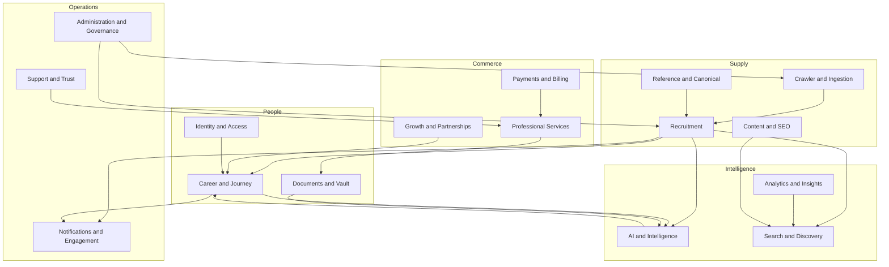

---

## 3. Bounded contexts

CareerMitra is partitioned into 16 bounded contexts. The 11 named in the brief are marked **[brief]**;
the 5 additional contexts are DDD refinements required for a platform of this scale (justified inline).

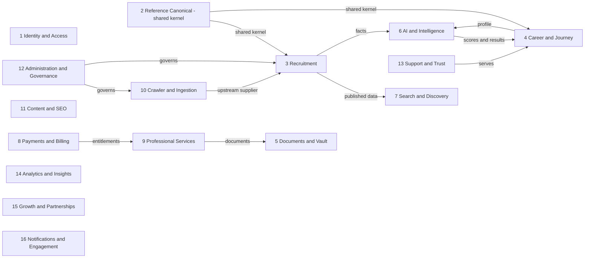

### 3.1 Context registry & brief mapping
| # | Bounded context | Brief? | Purpose | Core aggregates |
|---|---|---|---|---|
| 1 | **Identity & Access** | [brief] Identity | Who the user is and what they may do | User, Session, Role, Consent |
| 2 | **Reference & Canonical** | *(refinement — the PRD's canonical-entity thesis needs a shared kernel)* | Stable identities shared by all contexts | Organization, Department, Exam, Skill, Qualification, Certification, Location |
| 3 | **Recruitment** | [brief] Recruitment | Verified opportunities, records, cutoffs, forms | Notification, Recruitment, Opportunity, Vacancy, Result, AdmitCard, AnswerKey, Cutoff, Scheme |
| 4 | **Career & Journey** | [brief] Career | Aspirant career identity and journey | Profile, Application, CareerDNA, Roadmap, Saved items |
| 5 | **Documents & Vault** | *(refinement — sensitive-PII isolation)* | Secure aspirant documents | DocumentVault, Document |
| 6 | **AI & Intelligence** | [brief] AI | AI outputs and governance | ResumeParseJob, EligibilityEvaluation, Recommendation, AIModel |
| 7 | **Search & Discovery** | [brief] Search | Search index, ranking, facets | SearchDocument, RankingModel |
| 8 | **Payments & Billing** | [brief] Payments | Money and entitlements | Plan, Subscription, Order, Payment, Invoice |
| 9 | **Professional Services** | *(refinement — Form Filling is a distinct fulfilment domain)* | Assisted form filling | ServiceRequest, Executive |
| 10 | **Crawler & Ingestion** | [brief] Crawler | Source registry, crawling, extraction, publish | Source, CrawlerRun, OCRJob, AIParsingJob |
| 11 | **Content & SEO** | [brief] Content | Editorial and SEO surfaces | SEOPage, News, FAQ, Blog, KBArticle |
| 12 | **Administration & Governance** | [brief] Administration | Verification, moderation, audit, config | ReviewTask, PublishingWorkflow, AuditLog |
| 13 | **Support & Trust** | [brief] Support | Tickets, grievances, fraud, reviews | SupportTicket, Grievance, FraudCase, Review |
| 14 | **Analytics & Insights** | [brief] Analytics | Events, experiments, reports | AnalyticsEvent, Experiment, Report |
| 15 | **Growth & Partnerships** | *(refinement — growth is its own domain)* | Referral, affiliate, partners | Referral, Affiliate, Partner |
| 16 | **Notifications & Engagement** | *(refinement — cross-cutting delivery domain)* | Alerts and preferences | Alert, AlertSubscription, AlertTemplate |

### 3.2 Context relationship patterns (strategic DDD)
| Upstream → Downstream | Pattern | Meaning |
|---|---|---|
| Reference → all | **Shared Kernel** | Canonical entities are a small shared model all contexts agree on |
| Crawler → Recruitment | **Customer–Supplier** | Recruitment consumes what ingestion supplies; ingestion serves Recruitment's needs |
| Recruitment → Search/AI/Notifications | **Published Language (events)** | Downstream reacts to domain events, not shared tables |
| Payments → Services/Career | **Conformist** | Downstream conforms to entitlement facts from Payments |
| External govt portals → CrawlerCrawler | **Anti-Corruption Layer** | Messy external data is translated into the canonical model, never leaking inward |

---

## 4. Relationship types used in this model
- **One-to-One (1:1)** — e.g., Aspirant ↔ Profile.
- **One-to-Many (1:N)** — e.g., Recruitment → Vacancies; Organization → Recruitments.
- **Many-to-Many (M:N)** — e.g., Opportunity ↔ Skill; Aspirant ↔ Skill (via association entities).
- **Inheritance / specialization** — e.g., Executive and Reviewer are specializations of User.
- **Aggregation** — a whole references parts that can exist independently (Profile aggregates Skills
  which exist in Reference).
- **Composition** — parts cannot exist without the whole (Application composes ApplicationStageHistory;
  DocumentVault composes Documents).
- **Association entity** — resolves M:N with its own attributes (ProfileSkill carries proficiency).

---

## 5. Entity catalogue

Every entity below carries the full facet set. *Attributes are **business** attributes, not database
columns.* "Owner" is the bounded context that owns the entity's lifecycle. Permissions are expressed
by role (aspirant, reviewer, admin, support, trust-safety, executive, system).

Legend for lifecycle arrows: `A -> B` means state A transitions to B.

### 5.1 Context 1 — Identity & Access

**User** *(aggregate root)*
- **Purpose:** The account identity of any human actor (aspirant or operator).
- **Owner:** Identity & Access. **Lifecycle:** `Registered -> Active -> Suspended -> Deactivated -> Deleted`.
- **Attributes:** userId, primary contact (email/phone), display name, locale/language, account type (aspirant/operator), status, createdAt, lastActiveAt.
- **Business rules:** one canonical account per verified primary contact; operators are Users with operator roles; deletion triggers data-rights workflow (§ Support).
- **Validation:** contact must be verified before sensitive actions; unique verified contact; locale from supported set.
- **Relationships:** 1:1 Profile (aspirants); 1:N Session; M:N Role via UserRole; 1:N ConsentRecord.
- **Permissions:** self read/update; admin manage; support view; system create on registration.
- **Dependencies:** Authentication, Consent. **Future:** gov-SSO identities, multiple linked contacts, organization membership (B2B).

**AuthCredential / Authentication**
- **Purpose:** Verifiable proof by which a User authenticates (password hash, OTP, SSO link, passkey).
- **Owner:** Identity & Access. **Lifecycle:** `Issued -> Active -> Rotated -> Revoked`.
- **Attributes:** credentialId, userId, method (password/otp/sso/passkey), status, lastUsedAt.
- **Business rules:** secrets never exposed; multiple methods per user; step-up auth for sensitive actions (Vault, Form Filling, payments).
- **Validation:** method-specific strength policy; OTP expiry; SSO issuer allow-list.
- **Relationships:** N:1 User.
- **Permissions:** self manage; system verify; admin cannot read secrets. **Dependencies:** User. **Future:** biometric, DigiLocker-style identity, WebAuthn.

**Session**
- **Purpose:** An authenticated, time-bounded interaction context, especially important on shared devices.
- **Owner:** Identity & Access. **Lifecycle:** `Created -> Active -> Expired | Revoked`.
- **Attributes:** sessionId, userId, device/agent, createdAt, expiresAt, revokedAt.
- **Business rules:** shared-device safety — explicit sign-out clears local sensitive data; concurrent-session limits configurable.
- **Validation:** expiry enforced; revoke on password change.
- **Relationships:** N:1 User. **Permissions:** self view/revoke own; admin revoke. **Dependencies:** AuthCredential. **Future:** device trust, risk-based session scoring.

**Role**
- **Purpose:** A named bundle of permissions (aspirant, reviewer, admin, support, trust-safety, executive, finance).
- **Owner:** Identity & Access. **Lifecycle:** `Defined -> Active -> Deprecated`.
- **Attributes:** roleId, name, description, permission set, scope.
- **Business rules:** least privilege; separation of duties (e.g., reviewer ≠ publisher for same record); operator roles time-boxed where sensitive.
- **Validation:** role names unique; permissions from a governed catalog.
- **Relationships:** M:N User (UserRole); M:N Permission. **Permissions:** admin manage. **Dependencies:** Permission. **Future:** attribute-based access, per-region roles.

**Permission**
- **Purpose:** An atomic capability (e.g., `opportunity.publish`, `vault.read`).
- **Owner:** Identity & Access. **Lifecycle:** `Defined -> Active -> Deprecated`.
- **Attributes:** permissionId, code, resource, action, sensitivity.
- **Business rules:** sensitive permissions (PII, publish, refund) require justification and are audited on use.
- **Validation:** code unique; resource/action from catalog.
- **Relationships:** M:N Role. **Permissions:** admin manage. **Dependencies:** none. **Future:** fine-grained field-level permissions.

**ConsentRecord**
- **Purpose:** A recorded, purpose-specific grant/revocation of consent for a PII use.
- **Owner:** Identity & Access (with Compliance in Administration). **Lifecycle:** `Requested -> Granted -> Revoked | Expired`.
- **Attributes:** consentId, userId, purpose, scope, grantedAt, revokedAt, version of terms.
- **Business rules:** every sensitive-PII use checks a valid consent; minors require guardian-aware consent; consent is revocable and honored promptly.
- **Validation:** purpose from governed catalog; cannot act without matching active consent.
- **Relationships:** N:1 User; referenced by Vault, AI, Form Filling, Notifications. **Permissions:** self manage; system verify; audit read. **Dependencies:** User. **Future:** consent receipts, granular per-field consent.

### 5.2 Context 2 — Reference & Canonical (Shared Kernel)

**Organization** *(aggregate root)*
- **Purpose:** A canonical government recruiting entity (e.g., SSC, IBPS, DRDO, a specific PSU/university/court).
- **Owner:** Reference & Canonical. **Lifecycle:** `Draft -> Verified -> Active -> Merged | Archived`.
- **Attributes:** organizationId, canonical name, aliases, type, parent department, jurisdiction (central/state), official domains, logo, description.
- **Business rules:** canonical identity used for dedup and provenance; merges preserve history and redirect references; only verified organizations are user-visible.
- **Validation:** unique canonical identity; aliases resolve to one org; official domains validated for provenance.
- **Relationships:** N:1 Department; 1:N Recruitment; 1:N Exam (conducting); powers Organization Profile & analytics.
- **Permissions:** admin/reviewer manage; public read (verified). **Dependencies:** Department. **Future:** direct B2B publishing identity, org-managed profiles.

**Department / Ministry / GovernmentBody**
- **Purpose:** The parent government body a set of organizations belongs to.
- **Owner:** Reference & Canonical. **Lifecycle:** `Draft -> Verified -> Active -> Archived`.
- **Attributes:** departmentId, name, level (central/state), jurisdiction, child organizations.
- **Business rules:** enables department-level analytics; stable hierarchy; renames preserve history.
- **Validation:** unique per level/jurisdiction.
- **Relationships:** 1:N Organization; powers Department Profile & analytics. **Permissions:** admin/reviewer manage; public read. **Dependencies:** none. **Future:** multi-level hierarchies, international bodies.

**RecruitmentBoard**
- **Purpose:** The body that conducts a recruitment/exam on behalf of organizations (e.g., a Staff Selection body, an RRB).
- **Owner:** Reference & Canonical. **Lifecycle:** `Draft -> Verified -> Active -> Archived`.
- **Attributes:** boardId, name, aliases, scope, conducting organizations.
- **Business rules:** links exams and recruitments to a conducting authority; used in provenance and profiles.
- **Validation:** unique canonical identity.
- **Relationships:** M:N Organization; 1:N Exam; 1:N Recruitment. **Permissions:** admin/reviewer manage; public read. **Dependencies:** Organization. **Future:** board-level reliability scoring.

**Exam** *(aggregate root)*
- **Purpose:** A canonical, recurring examination identity (e.g., SSC CGL) that links records across years.
- **Owner:** Reference & Canonical. **Lifecycle:** `Draft -> Verified -> Active -> Archived`.
- **Attributes:** examId, canonical name, aliases, conducting board/organization, pattern summary, stages, typical eligibility, recurrence.
- **Business rules:** the anchor for cross-year Results, AdmitCards, AnswerKeys, Cutoffs, and history; user-visible only when verified.
- **Validation:** unique canonical identity; stages from a controlled vocabulary.
- **Relationships:** N:1 Board/Organization; 1:N Recruitment; 1:N Result/AdmitCard/AnswerKey/Cutoff; powers Exam Profile.
- **Permissions:** admin/reviewer manage; public read. **Dependencies:** Board, Organization. **Future:** syllabus/topic graph, prep linkage.

**Skill** *(taxonomy node)*
- **Purpose:** A normalized capability node in the governed Skill Taxonomy (e.g., Splunk, Python, Civil Engineering).
- **Owner:** Reference & Canonical. **Lifecycle:** `Proposed -> Approved -> Active -> Deprecated -> Merged`.
- **Attributes:** skillId, canonical name, synonyms/aliases, category, description, related skills, demand signal.
- **Business rules:** aspirant-entered and ingestion-extracted skills map to one canonical node; taxonomy is versioned and admin-governed.
- **Validation:** unique canonical name; synonyms resolve to one node; category from taxonomy.
- **Relationships:** N:1 SkillCategory; M:N Opportunity (required); M:N Profile (held, via ProfileSkill); M:N Certification. Powers Skill Profile.
- **Permissions:** admin govern; public read. **Dependencies:** SkillCategory. **Future:** skill graph, proficiency frameworks, auto-suggested skills.

**SkillCategory**
- **Purpose:** A grouping domain for skills (e.g., Cyber Security, Core Engineering).
- **Owner:** Reference & Canonical. **Lifecycle:** `Active -> Deprecated`.
- **Attributes:** categoryId, name, description, parent category.
- **Business rules:** shallow, curated hierarchy; stable names.
- **Validation:** unique name. **Relationships:** 1:N Skill. **Permissions:** admin govern; public read. **Dependencies:** none. **Future:** multi-parent categorization.

**Qualification** *(canonical)*
- **Purpose:** A recognized educational/eligibility qualification (e.g., B.Tech, GATE, NET).
- **Owner:** Reference & Canonical. **Lifecycle:** `Approved -> Active -> Deprecated`.
- **Attributes:** qualificationId, canonical name, level, aliases, equivalences.
- **Business rules:** used by Eligibility Engine and Qualification Profiles; equivalences governed.
- **Validation:** unique canonical name; level from controlled vocabulary.
- **Relationships:** M:N Opportunity (required); M:N Profile (held). Powers Qualification Profile. **Permissions:** admin govern; public read. **Dependencies:** none. **Future:** credential frameworks, foreign-degree equivalence.

**Certification** *(canonical)*
- **Purpose:** A recognized professional certification (e.g., CEH, Security+) recommended to close gaps.
- **Owner:** Reference & Canonical. **Lifecycle:** `Approved -> Active -> Deprecated`.
- **Attributes:** certificationId, name, issuer, related skills, validity, cost band.
- **Business rules:** powers certification recommendations tied to fit improvement; issuer governed.
- **Validation:** unique per issuer+name. **Relationships:** M:N Skill; referenced by Recommendation & Roadmap. **Permissions:** admin govern; public read. **Dependencies:** Skill. **Future:** partner/affiliate linkage (Growth).

**Location**
- **Purpose:** A canonical geography (state, district, city) for domicile, filters, and analytics.
- **Owner:** Reference & Canonical. **Lifecycle:** `Active -> Deprecated`.
- **Attributes:** locationId, name, type (state/district/city), parent, codes.
- **Business rules:** used for domicile eligibility and location filters; stable codes.
- **Validation:** unique within parent. **Relationships:** referenced by Opportunity, Profile, Organization. **Permissions:** admin govern; public read. **Dependencies:** none. **Future:** international geographies.

### 5.3 Context 3 — Recruitment

**Notification** *(aggregate root; provenance anchor)*
- **Purpose:** The raw official announcement ingested from a Source, from which Opportunities are derived.
- **Owner:** Recruitment (supplied by Crawler). **Lifecycle:** `Fetched -> Parsed -> Resolved -> Linked -> Archived`.
- **Attributes:** notificationId, sourceId, rawReference, checksum, fetchedAt, extracted text, attachments, parseStatus, confidence.
- **Business rules:** immutable provenance record; never user-facing directly; a Notification may yield one or more Opportunities after resolution.
- **Validation:** checksum dedup; must link to a registered Source; retained for audit.
- **Relationships:** N:1 Source; 1:N Opportunity (derived); 1:N RawDocument. **Permissions:** system write; reviewer/admin read. **Dependencies:** Source. **Future:** multi-language source text, structured official feeds.

**Recruitment** *(aggregate root)*
- **Purpose:** A verified recruitment drive by an Organization/Board (e.g., "SSC CGL 2026"), grouping vacancies, posts, and stages.
- **Owner:** Recruitment. **Lifecycle:** `Draft -> InReview -> Published -> ClosingSoon -> Closed -> Postponed -> Result -> Archived | Withdrawn`.
- **Attributes:** recruitmentId, title, organization, board, exam, dates (open/close/exam/result), vacancy total, category, status, provenance (Notification).
- **Business rules:** only published after verification gate; material date changes re-notify; captures into Recruitment/Cutoff History; withdrawal on fraud/takedown.
- **Validation:** dates coherent (open ≤ close ≤ exam ≤ result); vacancy total ≥ sum of vacancies; must reference canonical Organization/Exam.
- **Relationships:** N:1 Organization/Board/Exam; 1:N Vacancy; 1:N Post; 1:N Opportunity (view/facet); 1:1 ApplicationForm; 1:N Result/AdmitCard/AnswerKey/Cutoff.
- **Permissions:** reviewer/admin manage; public read (published). **Dependencies:** Organization, Exam, Notification. **Future:** multi-stage exam modeling, corrigendum tracking.

**Opportunity** *(the atomic user-facing unit; facet-typed)*
- **Purpose:** The verified, deduplicated listing an Aspirant discovers — a job/scholarship/fellowship/internship/apprenticeship view over a Recruitment.
- **Owner:** Recruitment. **Lifecycle:** mirrors Recruitment (`Published -> ClosingSoon -> Closed -> ...`).
- **Attributes:** opportunityId, recruitmentId, type facet, sector/employment/organisation facets, level, title, eligibility summary, key dates, pay level, location(s), required skills/qualifications, application link, provenance.
- **Business rules:** all category "modules" are facets of Opportunity; never shown unless verified; carries provenance; semantic dedup ensures one Opportunity per real recruitment.
- **Validation:** must reference a published Recruitment; facets from controlled vocabularies; required skills/quals resolve to canonical nodes.
- **Relationships:** N:1 Recruitment; M:N Skill; M:N Qualification; N:M Location; referenced by Saved, Application, Search, Career DNA, Notifications.
- **Permissions:** public read (published); reviewer/admin manage. **Dependencies:** Reference entities. **Future:** international facet, richer eligibility rule objects.

**Vacancy**
- **Purpose:** A quantified set of positions within a Recruitment, usually by post and category.
- **Owner:** Recruitment. **Lifecycle:** `Defined -> Published -> Revised -> Closed`.
- **Attributes:** vacancyId, recruitmentId, postId, category breakdown (reservation), count, PwD/ex-serviceman allocations.
- **Business rules:** category counts sum to total; revisions (corrigenda) are tracked and captured to Vacancy Trends.
- **Validation:** non-negative counts; category set from reservation vocabulary.
- **Relationships:** N:1 Recruitment; N:1 Post. **Permissions:** reviewer/admin manage; public read. **Dependencies:** Post. **Future:** dynamic vacancy updates, historical trend snapshots.

**Post**
- **Purpose:** A named role/designation within a Recruitment (e.g., Assistant Section Officer).
- **Owner:** Recruitment. **Lifecycle:** `Defined -> Published -> Archived`.
- **Attributes:** postId, name, pay level/scale, required qualifications, required skills, age criteria, job description.
- **Business rules:** eligibility rules attach at post level; skills/quals resolve to canonical nodes.
- **Validation:** pay level from vocabulary; age criteria coherent.
- **Relationships:** N:1 Recruitment; 1:N Vacancy; M:N Skill/Qualification. **Permissions:** reviewer/admin manage; public read. **Dependencies:** Reference entities. **Future:** structured, machine-evaluable eligibility rule sets.

**ApplicationForm**
- **Purpose:** The official form definition/link for applying to a Recruitment (structure, fields, required documents, fee).
- **Owner:** Recruitment. **Lifecycle:** `Draft -> Published -> Closed`.
- **Attributes:** formId, recruitmentId, official URL, required fields, required documents, fee, open/close window.
- **Business rules:** CareerMitra never submits it directly; it informs the Form Filling Service; fee and documents drive eligibility/readiness checks.
- **Validation:** official URL from the organization's verified domain; window within recruitment dates.
- **Relationships:** 1:1 Recruitment; referenced by ServiceRequest (Form Filling). **Permissions:** reviewer/admin manage; public read. **Dependencies:** Recruitment. **Future:** structured field mapping for assisted filling.

**Result**
- **Purpose:** An official result artefact/announcement for an Exam/Recruitment stage.
- **Owner:** Recruitment. **Lifecycle:** `Announced -> Published -> Revised -> Archived`.
- **Attributes:** resultId, exam/recruitment, stage, official link, scorecard availability, cutoff reference, publishedAt.
- **Business rules:** linked to canonical Exam for cross-year history; revisions tracked; result-day surge handling; capture to history.
- **Validation:** must reference published Recruitment/Exam; official link verified.
- **Relationships:** N:1 Exam/Recruitment; N:1 Cutoff. **Permissions:** reviewer/admin manage; public read. **Dependencies:** Exam. **Future:** individual result lookup (consented), scorecard parsing.

**AnswerKey**
- **Purpose:** Provisional/final answer keys with objection windows.
- **Owner:** Recruitment. **Lifecycle:** `Provisional -> ObjectionWindowOpen -> Final -> Archived`.
- **Attributes:** answerKeyId, exam/recruitment, type (provisional/final), per-set keys, objection window, official link.
- **Business rules:** objection-window dates flow into Exam Calendar; provisional vs final clearly distinguished.
- **Validation:** window within recruitment timeline; type from vocabulary.
- **Relationships:** N:1 Exam/Recruitment. **Permissions:** reviewer/admin manage; public read. **Dependencies:** Exam. **Future:** score-estimation aid where officially supported.

**AdmitCard**
- **Purpose:** Availability and retrieval reference for an exam admit card.
- **Owner:** Recruitment. **Lifecycle:** `Announced -> Available -> Expired`.
- **Attributes:** admitCardId, exam/recruitment, stage, release date, official link.
- **Business rules:** release alerts to tracking aspirants; optional consented Vault storage of the aspirant's downloaded copy (in Documents context).
- **Validation:** release date before exam date; official link verified.
- **Relationships:** N:1 Exam/Recruitment; may link to a Document (Vault). **Permissions:** reviewer/admin manage; public read. **Dependencies:** Exam. **Future:** deep-link retrieval assistance.

**Cutoff**
- **Purpose:** Category-wise qualifying marks for an exam stage/year — the core of Cutoff History.
- **Owner:** Recruitment. **Lifecycle:** `Recorded -> Verified -> Published`.
- **Attributes:** cutoffId, exam, year, stage, category-wise marks, source.
- **Business rules:** captured continuously to power trends; category set governed; verified before publish.
- **Validation:** marks within valid range; category from vocabulary; year plausible.
- **Relationships:** N:1 Exam; N:1 Result. Powers Exam Profile & trends. **Permissions:** reviewer/admin manage; public read. **Dependencies:** Exam. **Future:** predictive cutoff modeling (AI).

**CalendarEvent** *(Exam Calendar)*
- **Purpose:** A dated event (open/close/admit/exam/answer-key/objection/result) projected into a unified, personalizable calendar.
- **Owner:** Recruitment (projection consumed by Notifications/Career). **Lifecycle:** `Provisional -> Confirmed -> Passed | Cancelled`.
- **Attributes:** eventId, opportunity/exam ref, type, date/range, confidence (provisional/confirmed), source.
- **Business rules:** provisional vs confirmed clearly marked; changes re-notify; personalized to saved/relevant items.
- **Validation:** date coherence with parent recruitment; type from vocabulary.
- **Relationships:** N:1 Opportunity/Exam; drives Alerts & dashboard calendar. **Permissions:** system generate; public read. **Dependencies:** Recruitment. **Future:** calendar export/subscribe standards.

**GovernmentScheme**
- **Purpose:** A government scheme (welfare/skilling/scholarship-adjacent) relevant to aspirants.
- **Owner:** Recruitment (content-adjacent). **Lifecycle:** `Draft -> InReview -> Published -> Closed -> Archived`.
- **Attributes:** schemeId, name, benefits, eligibility, deadlines, documents, official link, provenance.
- **Business rules:** same verification gate and provenance as Opportunities; discoverable via search/eligibility.
- **Validation:** official link verified; eligibility resolves to canonical qualifications/categories.
- **Relationships:** M:N Qualification/Category; referenced by Career DNA. **Permissions:** reviewer/admin manage; public read. **Dependencies:** Reference entities. **Future:** scheme-application assistance.

### 5.4 Context 4 — Career & Journey

**Profile** *(aggregate root; 1:1 with aspirant User)*
- **Purpose:** The intelligent career identity of an Aspirant — the fuel for eligibility, matching, and Career DNA.
- **Owner:** Career & Journey. **Lifecycle:** `Created -> InProgress -> Complete -> Updated` (continuous).
- **Attributes:** profileId, userId, demographics (age via DOB, category, gender optional, PwD optional, ex-serviceman), languages, preferences (state, department, salary, job type, skills, organizations), derived scores (Profile Completion %, Eligibility Score).
- **Business rules:** progressively completed; optional demographics used only for eligibility accuracy; unverified self-reported fields flagged; minors handled age-appropriately.
- **Validation:** DOB yields plausible age; category/PwD/ex-serviceman from vocabularies; preferences reference canonical entities.
- **Relationships:** 1:1 User; 1:N ProfileSkill/ProfileQualification/Experience/Certificate; 1:1 Resume (current); 1:1 CareerDNA; 1:N SavedJob/SavedSearch/Bookmark/Application.
- **Permissions:** self read/write; system read for AI; support view (consented); operators no edit. **Dependencies:** Reference entities, Consent. **Future:** verified credentials, profile portability.

**ProfileSkill** *(association entity)*
- **Purpose:** An Aspirant's held skill with proficiency and evidence.
- **Owner:** Career & Journey. **Lifecycle:** `Added -> Evidenced -> Updated -> Removed`.
- **Attributes:** profileId, skillId, proficiency level, years, evidence (certificate/experience refs), source (self/parsed).
- **Business rules:** resolves the M:N between Profile and canonical Skill; parsed skills require aspirant confirmation.
- **Validation:** skillId canonical; proficiency from scale.
- **Relationships:** N:1 Profile; N:1 Skill; may reference Certificate/Experience. **Permissions:** self manage. **Dependencies:** Skill. **Future:** verified/assessed proficiency.

**ProfileQualification** *(association entity)*
- **Purpose:** An Aspirant's held qualification with details and evidence.
- **Owner:** Career & Journey. **Lifecycle:** `Added -> Evidenced -> Updated -> Removed`.
- **Attributes:** profileId, qualificationId, institution, year, marks/grade, evidence (Document ref), verified flag.
- **Business rules:** drives eligibility; evidence enables verification; unverified flagged in eligibility output.
- **Validation:** qualificationId canonical; year/marks plausible.
- **Relationships:** N:1 Profile; N:1 Qualification; may reference Document. **Permissions:** self manage. **Dependencies:** Qualification, Documents. **Future:** issuer verification.

**Experience**
- **Purpose:** An Aspirant's work/experience entry.
- **Owner:** Career & Journey. **Lifecycle:** `Added -> Updated -> Removed`.
- **Attributes:** experienceId, profileId, employer, role, dates, description, skills used.
- **Business rules:** contributes to skill evidence and eligibility (where experience gates apply).
- **Validation:** date coherence; skills resolve to canonical nodes.
- **Relationships:** N:1 Profile; M:N Skill. **Permissions:** self manage. **Dependencies:** Skill. **Future:** verified experience.

**Certificate** *(held credential)*
- **Purpose:** An Aspirant's earned certificate instance (distinct from canonical Certification).
- **Owner:** Career & Journey. **Lifecycle:** `Added -> Verified -> Expired -> Removed`.
- **Attributes:** certificateId, profileId, certification ref, issuer, issue/expiry, document ref.
- **Business rules:** may back a ProfileSkill; stored evidence lives in the Vault.
- **Validation:** references canonical Certification where applicable; expiry coherent.
- **Relationships:** N:1 Profile; N:1 Certification; 1:1 Document. **Permissions:** self manage. **Dependencies:** Certification, Documents. **Future:** verifiable credentials.

**Resume**
- **Purpose:** The Aspirant's resume artefact (built or uploaded), export-ready.
- **Owner:** Career & Journey. **Lifecycle:** `Draft -> Generated -> Updated -> Archived`.
- **Attributes:** resumeId, profileId, template, sections, language, exportable output ref, source (built/uploaded).
- **Business rules:** reuses profile + Vault data; multiple versions allowed; sensitive PII.
- **Validation:** template from set; language supported.
- **Relationships:** N:1 Profile; produced/consumed by AI Resume Builder/Parser; may reference Documents. **Permissions:** self manage. **Dependencies:** Documents, AI. **Future:** role-tailored resumes.

**CareerDNA** *(derived aggregate)*
- **Purpose:** The Aspirant's scored, living career identity and plan (Profile Score, eligible-by-skill, gaps, next recruitments, path, time-to-eligibility).
- **Owner:** Career & Journey (computed by AI context). **Lifecycle:** `Computed -> Cached -> Stale -> Recomputed`.
- **Attributes:** careerDnaId, profileId, profile score, eligible counts by domain, missing qualifications, recommended certifications, next matching recruitments, growth path, time-to-eligibility estimate, computedAt, model version.
- **Business rules:** regenerates on profile/resume change; "eligible now" strictly reflects passing eligibility; explainable; guidance not guarantee; grounded in verified data.
- **Validation:** references only verified Opportunities; every figure has an explanation.
- **Relationships:** 1:1 Profile; consumes Skills/Eligibility/Recommendation/Opportunity; produces CareerRoadmap. **Permissions:** self read; system compute. **Dependencies:** AI, Recruitment, Skills. **Future:** predictive recruitment matching, interview readiness.

**CareerRoadmap**
- **Purpose:** An ordered plan converting gaps into steps (qualifications → certifications → target recruitments) with time estimates.
- **Owner:** Career & Journey (AI-generated). **Lifecycle:** `Generated -> Active -> Completed -> Superseded`.
- **Attributes:** roadmapId, profileId, steps (ordered), milestones, target roles/recruitments, estimated timelines.
- **Business rules:** grounded in real roles/eligibility; integrates with AI Exam Planner; steps tie to concrete actions.
- **Validation:** steps reference canonical entities; timelines labeled as estimates.
- **Relationships:** N:1 Profile; references Certification/Qualification/Opportunity. **Permissions:** self read; system generate. **Dependencies:** AI, Reference. **Future:** adaptive roadmaps, progress tracking.

**Application** *(aggregate root; composition of stage history)*
- **Purpose:** An Aspirant's engagement with an Opportunity across its stages — the tracker unit.
- **Owner:** Career & Journey. **Lifecycle:** `Interested -> Applied -> AdmitCard -> Exam -> Result -> Closed | Withdrawn`.
- **Attributes:** applicationId, profileId, opportunityId, current stage, document checklist, deadlines, notes, source of updates (manual/assisted).
- **Business rules:** composes an immutable ApplicationStageHistory; deadlines drive notifications; links to records (AdmitCard/Result); assisted updates from Form Filling.
- **Validation:** references a valid Opportunity; stage transitions follow the allowed order.
- **Relationships:** N:1 Profile; N:1 Opportunity; 1:N ApplicationStageHistory; may link ServiceRequest. **Permissions:** self manage; system update (assisted). **Dependencies:** Recruitment. **Future:** auto-status from official sources (consented).

**ApplicationStageHistory** *(composition)*
- **Purpose:** Immutable record of each stage transition of an Application.
- **Owner:** Career & Journey. **Lifecycle:** append-only.
- **Attributes:** entryId, applicationId, fromStage, toStage, at, actor, note.
- **Business rules:** never edited/deleted; forms an audit trail of the journey.
- **Validation:** valid transition; timestamp monotonic.
- **Relationships:** N:1 Application. **Permissions:** self read; system append. **Dependencies:** Application. **Future:** verified official-stage sync.

**SavedJob / Bookmark**
- **Purpose:** An Aspirant's saved Opportunity (shortlist) feeding calendar and alerts.
- **Owner:** Career & Journey. **Lifecycle:** `Saved -> Updated -> Removed`.
- **Attributes:** savedId, profileId, opportunityId, labels, savedAt.
- **Business rules:** offline-accessible; drives personalized calendar/notifications.
- **Validation:** references a valid Opportunity.
- **Relationships:** N:1 Profile; N:1 Opportunity. **Permissions:** self manage. **Dependencies:** Recruitment. **Future:** collections/folders.

**SavedSearch**
- **Purpose:** A stored search/filter set that can alert on new matches.
- **Owner:** Career & Journey (consumed by Search & Notifications). **Lifecycle:** `Created -> Active -> Muted -> Deleted`.
- **Attributes:** savedSearchId, profileId, query, facets, alert frequency.
- **Business rules:** new matching Opportunities can trigger alerts; respects anti-fatigue.
- **Validation:** facets valid; frequency from allowed set.
- **Relationships:** N:1 Profile; feeds AlertSubscription. **Permissions:** self manage. **Dependencies:** Search, Notifications. **Future:** smart-search NL queries saved.

**LearningResource**
- **Purpose:** A recommended learning/preparation resource tied to a skill/qualification/roadmap step.
- **Owner:** Career & Journey (curated; partner-linked later). **Lifecycle:** `Draft -> Published -> Archived`.
- **Attributes:** resourceId, title, type, related skill/qualification/certification, provider, link.
- **Business rules:** relevance-driven, disclosed if affiliate; no pay-to-rank.
- **Validation:** links valid; references canonical entities.
- **Relationships:** M:N Skill/Qualification/Certification; referenced by Roadmap. **Permissions:** admin curate; public read. **Dependencies:** Reference. **Future:** partner catalog integration (Growth).

### 5.5 Context 5 — Documents & Vault

**DocumentVault** *(aggregate root; composition of documents)*
- **Purpose:** An Aspirant's secure store of identity/education documents, reused across resume, applications, and form filling.
- **Owner:** Documents & Vault. **Lifecycle:** `Created -> Active -> Locked -> Purged`.
- **Attributes:** vaultId, profileId, storage policy, encryption metadata.
- **Business rules:** highest sensitivity; field-level encryption; every access logged; consent-gated; shared-device safety; aspirant-controlled deletion; retention enforced.
- **Validation:** access requires active Session + step-up auth + consent for the purpose.
- **Relationships:** 1:1 Profile; composes 1:N Document; 1:N VaultAccessLog. **Permissions:** self full; executives scoped/time-boxed (consented); system encrypt. **Dependencies:** Identity, Consent. **Future:** government document-locker interoperability.

**Document**
- **Purpose:** A single stored document (marksheet, ID, photo, signature, admit card copy).
- **Owner:** Documents & Vault. **Lifecycle:** `Uploaded -> Scanned -> Verified -> Expired -> Deleted`.
- **Attributes:** documentId, vaultId, type, issuer, validity, integrity checksum, sensitivity, analysis result.
- **Business rules:** never logged in plaintext; virus/integrity scanned; AI Document Analyzer may flag issues but never alters the original.
- **Validation:** allowed type; size/format policy; checksum integrity.
- **Relationships:** N:1 DocumentVault; referenced by Certificate/ProfileQualification/ServiceRequest/AdmitCard. **Permissions:** self manage; executive scoped read (consented). **Dependencies:** DocumentVault. **Future:** verifiable, tamper-evident documents.

**VaultAccessLog**
- **Purpose:** Tamper-evident record of every Vault/Document access.
- **Owner:** Documents & Vault (feeds Audit). **Lifecycle:** append-only.
- **Attributes:** logId, vaultId/documentId, actor, purpose, consentRef, at.
- **Business rules:** immutable; every sensitive access recorded with purpose and consent.
- **Validation:** must reference a purpose and (for non-self actors) a consent.
- **Relationships:** N:1 DocumentVault/Document; mirrored to AuditLog. **Permissions:** self read own; audit read. **Dependencies:** Consent, Audit. **Future:** user-visible access history.

### 5.6 Context 6 — AI & Intelligence

**ResumeParseJob**
- **Purpose:** An AI job that extracts a structured profile from an uploaded resume for aspirant review.
- **Owner:** AI & Intelligence. **Lifecycle:** `Queued -> Running -> Extracted -> Confirmed | Discarded`.
- **Attributes:** jobId, profileId, source document, extracted fields, confidence, model version.
- **Business rules:** extraction is proposed, not applied — aspirant confirms; sensitive PII; never logged in plaintext; consent-gated.
- **Validation:** input is an allowed resume document; output mapped to canonical skills/qualifications.
- **Relationships:** N:1 Profile; reads Document; proposes ProfileSkill/Qualification. **Permissions:** self trigger; system run. **Dependencies:** Documents, Reference, AIModelVersion. **Future:** multi-format, multi-language parsing.

**ResumeBuildJob**
- **Purpose:** An AI job that generates a government-appropriate resume from profile + Vault data.
- **Owner:** AI & Intelligence. **Lifecycle:** `Queued -> Running -> Generated -> Delivered`.
- **Attributes:** jobId, profileId, template, language, output ref, model version.
- **Business rules:** reuses verified profile data; multilingual; no fabricated content.
- **Validation:** template/language supported.
- **Relationships:** N:1 Profile; produces Resume. **Permissions:** self trigger; system run. **Dependencies:** Profile, Documents. **Future:** role-tailored generation.

**EligibilityEvaluation** *(value object / result entity)*
- **Purpose:** The explainable result of checking an Aspirant against an Opportunity's eligibility rules.
- **Owner:** AI & Intelligence (deterministic engine). **Lifecycle:** `Computed -> Cached -> Invalidated`.
- **Attributes:** evaluationId, profileId, opportunityId, verdict (eligible/not/insufficient-data), reasons, relaxations applied, unverified-input flags, computedAt.
- **Business rules:** deterministic and explainable; category age relaxations applied; guidance not guarantee; flags unverified inputs.
- **Validation:** references published Opportunity; reasons enumerated.
- **Relationships:** N:1 Profile; N:1 Opportunity; consumed by CareerDNA/Recommendation/Search. **Permissions:** self read; system compute. **Dependencies:** Reference, Recruitment. **Future:** machine-evaluable structured rule sets.

**Recommendation**
- **Purpose:** A ranked, explainable suggestion (opportunity, exam, certification) for an Aspirant.
- **Owner:** AI & Intelligence. **Lifecycle:** `Generated -> Served -> Actioned | Dismissed -> Expired`.
- **Attributes:** recommendationId, profileId, target (opportunity/exam/certification), score, factors, model version.
- **Business rules:** eligibility-gated; explainable; no pay-to-rank; respects preferences.
- **Validation:** targets are verified entities; factors disclosed.
- **Relationships:** N:1 Profile; references Opportunity/Exam/Certification; feeds Dashboard/Career DNA. **Permissions:** self read; system generate. **Dependencies:** Skills, Eligibility, Recruitment. **Future:** contextual bandit optimization (governed).

**AssistantSession**
- **Purpose:** A grounded conversational session with the AI Career Assistant.
- **Owner:** AI & Intelligence. **Lifecycle:** `Started -> Active -> Ended`.
- **Attributes:** sessionId, profileId, messages (grounded, with citations), model version, safety flags.
- **Business rules:** every official fact grounded/cited; no guarantees; untrusted content treated as data (prompt-injection defense); PII minimized; no plaintext PII logs.
- **Validation:** responses pass grounding gate or degrade to "see official source".
- **Relationships:** N:1 Profile; reads verified data. **Permissions:** self; system. **Dependencies:** AI Governance, Recruitment. **Future:** multimodal, voice, regional languages.

**AIModelVersion**
- **Purpose:** A registered, versioned model/prompt configuration governing an AI capability.
- **Owner:** AI & Intelligence (AI Governance). **Lifecycle:** `Registered -> Evaluated -> Staged -> Active -> RolledBack | Retired`.
- **Attributes:** modelVersionId, capability, provider, version, prompt template ref, eval status, cost/latency budget.
- **Business rules:** every AI output records its model version; no activation without passing evals; staged rollout + rollback.
- **Validation:** eval status = passed before Active; budgets defined.
- **Relationships:** referenced by all AI jobs/outputs; 1:N AIEvaluationRun. **Permissions:** AI-governance admin. **Dependencies:** none. **Future:** automated canary evaluation.

**AIEvaluationRun**
- **Purpose:** An evaluation of a model version against golden datasets (accuracy, grounding, refusal, bias).
- **Owner:** AI & Intelligence. **Lifecycle:** `Queued -> Running -> Passed | Failed`.
- **Attributes:** runId, modelVersionId, dataset, metrics (accuracy, grounding fidelity, hallucination rate), thresholds, result.
- **Business rules:** release blocked on regression beyond guardrail thresholds.
- **Validation:** dataset versioned; thresholds defined.
- **Relationships:** N:1 AIModelVersion. **Permissions:** AI-governance admin. **Dependencies:** governed datasets. **Future:** continuous online evaluation.

### 5.7 Context 7 — Search & Discovery

**SearchDocument** *(read model / projection)*
- **Purpose:** A query-optimized projection of an Opportunity (and entity profiles) for fast, faceted search.
- **Owner:** Search & Discovery. **Lifecycle:** `Indexed -> Updated -> Removed` (event-driven from Recruitment).
- **Attributes:** documentId, opportunityId/entity ref, denormalized facets, skills, dates, freshness, authority.
- **Business rules:** only verified/published data indexed; kept fresh via domain events; never the source of truth.
- **Validation:** derived solely from published sources.
- **Relationships:** projects Opportunity + Reference entities. **Permissions:** public query; system write. **Dependencies:** Recruitment events. **Future:** vector/semantic search index.

**RankingModel**
- **Purpose:** The governed configuration that orders search results.
- **Owner:** Search & Discovery. **Lifecycle:** `Draft -> Experiment -> Active -> Retired`.
- **Attributes:** rankingModelId, signals & weights (relevance, eligibility gate, profile match, freshness, deadline, authority, personalization), version.
- **Business rules:** changes ship behind A/B experiments with guardrails; no pay-to-rank; fairness monitored; deterministic fallback exists.
- **Validation:** signals from a governed set; eligibility is a hard gate.
- **Relationships:** consumes EligibilityEvaluation, Profile Match; linked to Experiment (Analytics). **Permissions:** search-admin. **Dependencies:** AI, Analytics. **Future:** learned ranking (governed).

**Facet**
- **Purpose:** A search filter dimension (qualification, age, salary, state, skill, etc.).
- **Owner:** Search & Discovery. **Lifecycle:** `Defined -> Active -> Deprecated`.
- **Attributes:** facetId, name, source field, value type, controlled values.
- **Business rules:** facets map to canonical entities where applicable.
- **Validation:** values from canonical vocabularies.
- **Relationships:** applied to SearchDocument. **Permissions:** search-admin. **Dependencies:** Reference. **Future:** dynamic facets by segment.

**SearchQueryLog**
- **Purpose:** A privacy-safe record of queries for quality, zero-result analysis, and ranking improvement.
- **Owner:** Search & Discovery (feeds Analytics). **Lifecycle:** append-only, retention-bounded.
- **Attributes:** queryId, parsed facets, result count, engagement, at (anonymized where possible).
- **Business rules:** minimized/anonymized; used to improve relevance and recover zero-results.
- **Validation:** no PII in plaintext.
- **Relationships:** feeds Experiment/Analytics. **Permissions:** analytics read. **Dependencies:** Analytics. **Future:** intent modeling for Smart Search.

### 5.8 Context 8 — Payments & Billing

**PremiumPlan**
- **Purpose:** A purchasable subscription plan defining premium entitlements.
- **Owner:** Payments & Billing. **Lifecycle:** `Draft -> Active -> Deprecated`.
- **Attributes:** planId, name, price, billing period, entitlements, region.
- **Business rules:** premium adds convenience/insight, never gates basic access to opportunities; no dark patterns.
- **Validation:** price/currency valid; entitlements from catalog.
- **Relationships:** 1:N Subscription. **Permissions:** finance-admin manage; public read. **Dependencies:** none. **Future:** localized pricing, student tiers.

**Subscription** *(billing subscription)*
- **Purpose:** An Aspirant's active entitlement to a PremiumPlan. *(Distinct from AlertSubscription in Notifications.)*
- **Owner:** Payments & Billing. **Lifecycle:** `Trial -> Active -> PastDue -> Cancelled -> Expired`.
- **Attributes:** subscriptionId, userId, planId, status, currentPeriod, renewal.
- **Business rules:** entitlements enforced by status; grace period on PastDue; cancellation retains access to period end.
- **Validation:** one active subscription per user (unless add-ons); status transitions valid.
- **Relationships:** N:1 User; N:1 PremiumPlan; 1:N Order/Payment/Invoice. **Permissions:** self view/cancel; finance manage. **Dependencies:** Plan. **Future:** family/institutional plans.

**Order**
- **Purpose:** A purchase intent (subscription or Form Filling Service) capturing what is being bought.
- **Owner:** Payments & Billing. **Lifecycle:** `Created -> Pending -> Paid -> Failed -> Cancelled`.
- **Attributes:** orderId, userId, line items (plan/service), amount, currency, status.
- **Business rules:** an Order precedes fulfilment; Form Filling fulfilment starts only after Paid.
- **Validation:** amount = sum of line items; currency valid.
- **Relationships:** N:1 User; 1:1 Payment; 1:1 Invoice; may create Subscription or ServiceRequest. **Permissions:** self view; finance manage. **Dependencies:** Plan/Service. **Future:** partial payments, coupons.

**Payment**
- **Purpose:** A money-movement record for an Order (via an external provider; no card data stored).
- **Owner:** Payments & Billing. **Lifecycle:** `Initiated -> Authorized -> Captured -> Failed -> Refunded`.
- **Attributes:** paymentId, orderId, amount, method, provider reference, status.
- **Business rules:** sensitive payment data handled by the provider, never stored; refunds via Refund.
- **Validation:** amount matches Order; provider reference present.
- **Relationships:** 1:1 Order; 1:N Refund. **Permissions:** self view; finance manage; system reconcile. **Dependencies:** external provider. **Future:** UPI/wallet methods.

**Invoice**
- **Purpose:** The billing document for a paid Order.
- **Owner:** Payments & Billing. **Lifecycle:** `Draft -> Issued -> Paid -> Void`.
- **Attributes:** invoiceId, orderId, line items, tax, total, issuedAt.
- **Business rules:** issued on payment capture; immutable once issued; tax per jurisdiction.
- **Validation:** totals reconcile with Order/Payment.
- **Relationships:** 1:1 Order. **Permissions:** self download; finance manage. **Dependencies:** Order. **Future:** GST specifics, B2B invoicing.

**Refund**
- **Purpose:** A reversal of payment for service failure or eligible cancellation.
- **Owner:** Payments & Billing. **Lifecycle:** `Requested -> Approved -> Processed -> Rejected`.
- **Attributes:** refundId, paymentId, amount, reason, status.
- **Business rules:** Form Filling failure triggers refund eligibility; approvals separated from requesters (SoD).
- **Validation:** amount ≤ captured; reason from catalog.
- **Relationships:** N:1 Payment; may link ServiceRequest/Grievance. **Permissions:** support request; finance approve. **Dependencies:** Payment. **Future:** automated failure-based refunds.

### 5.9 Context 9 — Professional Services (Form Filling)

**ServiceRequest** *(aggregate root)*
- **Purpose:** An Aspirant's request for assisted Form Filling for a specific Opportunity.
- **Owner:** Professional Services. **Lifecycle:** `Requested -> DocumentsCollected -> ExecutiveAssigned -> InProgress -> ReviewReady -> AspirantReview -> Submitted -> ProofAvailable -> Rated | Refunded`.
- **Attributes:** requestId, profileId, opportunityId/formId, documents, assigned executive, status, consent record, proof, rating.
- **Business rules:** starts only after paid Order; consent-gated; never auto-submits; never stores external portal credentials; refund on failure; SLA on turnaround.
- **Validation:** references a valid ApplicationForm; consent present before submission.
- **Relationships:** N:1 Profile; N:1 ApplicationForm; N:1 Executive; references Documents; produces ServiceProof; 1:1 ServiceReview; links Application. **Permissions:** self manage; assigned executive scoped; support view; trust-safety monitor. **Dependencies:** Payments, Documents, Consent, Recruitment. **Future:** structured field auto-mapping.

**Executive**
- **Purpose:** An operator who fulfils ServiceRequests (specialization of User).
- **Owner:** Professional Services. **Lifecycle:** `Onboarded -> Active -> Suspended -> Offboarded`.
- **Attributes:** executiveId, userId, skills/languages, capacity, performance rating.
- **Business rules:** least-privilege, time-boxed, scoped access to an assigned request only; separation of duties; behavior anomaly-monitored (Trust & Safety).
- **Validation:** background/role checks; capacity limits.
- **Relationships:** specialization of User; 1:N ServiceRequest (assigned). **Permissions:** scoped request access; no broad Vault access. **Dependencies:** Identity, Trust & Safety. **Future:** skill-based routing.

**ServiceAssignment**
- **Purpose:** The scoped, time-boxed grant linking an Executive to a ServiceRequest.
- **Owner:** Professional Services. **Lifecycle:** `Assigned -> Active -> Completed -> Revoked`.
- **Attributes:** assignmentId, requestId, executiveId, grantedScope, expiry.
- **Business rules:** access auto-revokes on completion/expiry; all actions audited.
- **Validation:** scope limited to the request; expiry enforced.
- **Relationships:** N:1 ServiceRequest; N:1 Executive. **Permissions:** admin assign; system enforce. **Dependencies:** Identity. **Future:** dynamic reassignment.

**ServiceProof**
- **Purpose:** The downloadable proof of a submitted assisted application.
- **Owner:** Professional Services. **Lifecycle:** `Generated -> Available -> Archived`.
- **Attributes:** proofId, requestId, artefact ref, generatedAt.
- **Business rules:** generated only after aspirant-consented submission; immutable.
- **Validation:** exists only for Submitted requests.
- **Relationships:** 1:1 ServiceRequest; stored via Documents. **Permissions:** self download; support view. **Dependencies:** Documents. **Future:** verifiable proof.

**ServiceReview** *(rating)*
- **Purpose:** The Aspirant's rating/feedback on a completed ServiceRequest.
- **Owner:** Professional Services (feeds Support/Analytics). **Lifecycle:** `Submitted -> Published | Moderated`.
- **Attributes:** reviewId, requestId, rating, comment, at.
- **Business rules:** one review per completed request; moderated for abuse.
- **Validation:** rating in range; request must be completed.
- **Relationships:** 1:1 ServiceRequest; N:1 Executive (performance). **Permissions:** self submit; support moderate. **Dependencies:** Support. **Future:** executive quality scoring.

### 5.10 Context 10 — Crawler & Ingestion

**Source** *(aggregate root; Source Registry member)*
- **Purpose:** A registered official source/portal that publishes notifications.
- **Owner:** Crawler & Ingestion. **Lifecycle:** `Registered -> Verified -> Active -> Failing -> Disabled -> Retired`.
- **Attributes:** sourceId, name, official domain, jurisdiction, category, crawl config, legal status (robots/terms), reliability score, owner org.
- **Business rules:** the Source Registry; respect robots/rate/terms (anti-corruption layer); reliability scored; failing sources triaged with SLAs.
- **Validation:** official domain validated; legal status recorded before crawling.
- **Relationships:** N:1 SourceCategory; N:1 Organization (mapped); 1:N CrawlerJob; 1:N Notification; 1:1 SourceHealth. **Permissions:** admin manage; system read. **Dependencies:** Reference (Organization). **Future:** official structured feeds, direct publishing.

**SourceCategory**
- **Purpose:** A classification of sources (central portal, state portal, board, bank, PSU).
- **Owner:** Crawler & Ingestion. **Lifecycle:** `Active -> Deprecated`.
- **Attributes:** categoryId, name, description.
- **Business rules:** drives coverage management by sector/state.
- **Validation:** unique name. **Relationships:** 1:N Source. **Permissions:** admin manage. **Dependencies:** none. **Future:** coverage-gap analytics.

**SourceHealth**
- **Purpose:** The rolling health/freshness snapshot of a Source.
- **Owner:** Crawler & Ingestion. **Lifecycle:** continuously updated.
- **Attributes:** sourceId, lastSuccessAt, success rate, freshness, drift/format-change signal, alert status.
- **Business rules:** silent failure is an incident; drift detection flags format changes; alerts triaged.
- **Validation:** metrics within expected windows.
- **Relationships:** 1:1 Source; feeds Admin dashboards & alerts. **Permissions:** admin/system. **Dependencies:** Source. **Future:** predictive failure detection.

**CrawlerJob**
- **Purpose:** A scheduled/triggered definition of what to crawl for a Source.
- **Owner:** Crawler & Ingestion. **Lifecycle:** `Scheduled -> Enabled -> Paused -> Retired`.
- **Attributes:** crawlerJobId, sourceId, schedule, scope, rate limits.
- **Business rules:** respects source rate/legal limits; idempotent.
- **Validation:** schedule valid; rate within legal bounds.
- **Relationships:** N:1 Source; 1:N CrawlerRun. **Permissions:** admin manage; system execute. **Dependencies:** Source. **Future:** adaptive scheduling by source volatility.

**CrawlerRun**
- **Purpose:** A single execution instance of a CrawlerJob.
- **Owner:** Crawler & Ingestion. **Lifecycle:** `Started -> Fetching -> Completed | Failed | PartiallyFailed`.
- **Attributes:** runId, crawlerJobId, startedAt, finishedAt, items found/new/failed, errors.
- **Business rules:** every run recorded for observability; failures update SourceHealth.
- **Validation:** timestamps coherent; counts consistent.
- **Relationships:** N:1 CrawlerJob; 1:N RawDocument/Notification. **Permissions:** admin/system. **Dependencies:** CrawlerJob. **Future:** replay/backfill runs.

**RawDocument**
- **Purpose:** A raw fetched artefact (HTML/PDF/image) prior to extraction.
- **Owner:** Crawler & Ingestion. **Lifecycle:** `Fetched -> Extracted -> Archived -> Purged`.
- **Attributes:** rawDocId, runId, sourceRef, checksum, content ref, mimeType.
- **Business rules:** checksum dedup; retained for provenance/audit; feeds OCR/parse.
- **Validation:** checksum present; type allowed.
- **Relationships:** N:1 CrawlerRun; 1:1 Notification (post-parse); 1:N OCRJob. **Permissions:** system; admin read. **Dependencies:** CrawlerRun. **Future:** content-diffing for corrigenda.

**OCRJob**
- **Purpose:** An OCR extraction task for scanned/image notifications.
- **Owner:** Crawler & Ingestion. **Lifecycle:** `Queued -> Running -> Completed | Failed`.
- **Attributes:** ocrJobId, rawDocId, extracted text, confidence, language.
- **Business rules:** low-confidence output flagged for human review; multilingual.
- **Validation:** input is an image/scan; language detected.
- **Relationships:** N:1 RawDocument; feeds AIParsingJob. **Permissions:** system; admin read. **Dependencies:** RawDocument. **Future:** layout-aware extraction.

**AIParsingJob**
- **Purpose:** An AI job normalizing extracted text into the canonical model (dates, vacancies, eligibility, skills) and resolving entities.
- **Owner:** Crawler & Ingestion (uses AI context models). **Lifecycle:** `Queued -> Running -> Parsed -> Resolved | NeedsReview`.
- **Attributes:** parseJobId, notificationRef, structured output, entity-resolution result, confidence, model version.
- **Business rules:** performs entity resolution + semantic dedup; low confidence → human review; never publishes directly.
- **Validation:** output maps to canonical entities; confidence scored.
- **Relationships:** N:1 Notification; produces resolved Recruitment/Opportunity drafts; creates ReviewTask. **Permissions:** system; reviewer/admin read. **Dependencies:** AI models, Reference. **Future:** self-improving resolution.

### 5.11 Context 11 — Content & SEO

**SEOPage** *(read model / generated)*
- **Purpose:** A server-rendered, structured page for an entity (organization/exam/skill/qualification/opportunity) — the primary acquisition channel.
- **Owner:** Content & SEO. **Lifecycle:** `Generated -> Published -> Updated -> Deprecated`.
- **Attributes:** pageId, entity ref, canonical URL, structured metadata, localized variants, freshness.
- **Business rules:** generated from canonical entities (never hand-authored per page); localized; interlinked; only verified data.
- **Validation:** canonical URL unique; entity verified.
- **Relationships:** projects Reference/Recruitment entities. **Permissions:** system generate; admin manage; public read. **Dependencies:** Reference, Recruitment. **Future:** automated internal-link graph optimization.

**CareerNews** *(Government Career News)*
- **Purpose:** Verified, sourced news relevant to aspirants (announcements, date changes, policy).
- **Owner:** Content & SEO. **Lifecycle:** `Draft -> InReview -> Published -> Updated -> Archived`.
- **Attributes:** newsId, title, body, official source link, related entities, publishedAt.
- **Business rules:** every item links to a credible source; fact vs commentary separated; no rumor amplification; ties to entities to drive re-notification.
- **Validation:** source link present/verified.
- **Relationships:** M:N Exam/Organization; feeds Notifications. **Permissions:** content-editor create; reviewer approve; public read. **Dependencies:** Reference. **Future:** personalized news feed.

**FAQ / Blog / KnowledgeBaseArticle**
- **Purpose:** Editorial/help content: FAQs, guides/blogs, and support knowledge base.
- **Owner:** Content & SEO (KB shared with Support). **Lifecycle:** `Draft -> InReview -> Published -> Archived`.
- **Attributes:** contentId, type, title, body, tags/related entities, language, author.
- **Business rules:** reviewed before publish; localized; KB articles power self-service support.
- **Validation:** required fields; language supported.
- **Relationships:** M:N entities/skills; KB linked to SupportTicket deflection. **Permissions:** editor create; reviewer approve; public read. **Dependencies:** Reference. **Future:** AI-assisted drafting (grounded), community contributions.

### 5.12 Context 12 — Administration & Governance

**ReviewTask** *(verification gate work item)*
- **Purpose:** A human-review unit for verifying/normalizing ingested data before publish.
- **Owner:** Administration & Governance. **Lifecycle:** `Created -> Assigned -> InReview -> Approved | Rejected | Escalated`.
- **Attributes:** taskId, target (Recruitment/Opportunity/Cutoff/Scheme), confidence, assignee, decision, notes.
- **Business rules:** the verification gate — nothing publishes without Approved; low-confidence prioritized; reviewer ≠ record author; SLA tracked.
- **Validation:** decision recorded; approval required to publish.
- **Relationships:** N:1 target; N:1 Reviewer; triggers PublishingWorkflow. **Permissions:** reviewer act; admin oversee. **Dependencies:** Crawler/Recruitment. **Future:** AI-assisted pre-review.

**Reviewer** *(specialization of User)*
- **Purpose:** An operator who performs content verification.
- **Owner:** Administration & Governance. **Lifecycle:** `Onboarded -> Active -> Suspended -> Offboarded`.
- **Attributes:** reviewerId, userId, domains, throughput, accuracy.
- **Business rules:** least privilege; separation of duties from publishing where required; performance monitored.
- **Validation:** role checks. **Relationships:** specialization of User; 1:N ReviewTask. **Permissions:** review scope. **Dependencies:** Identity. **Future:** specialization by sector.

**PublishingWorkflow**
- **Purpose:** The controlled process that makes an approved record visible and indexes/notifies.
- **Owner:** Administration & Governance. **Lifecycle:** `Triggered -> Publishing -> Published -> RolledBack`.
- **Attributes:** workflowId, target, steps (publish, index, notify, capture history), status.
- **Business rules:** only Approved targets publish; publishing captures history and triggers notifications; rollbackable.
- **Validation:** preconditions (approval, provenance) met.
- **Relationships:** N:1 ReviewTask/target; emits domain events. **Permissions:** admin/system. **Dependencies:** Recruitment, Search, Notifications, Analytics. **Future:** staged/canary publishing.

**ModerationAction / TakedownRequest**
- **Purpose:** Corrective actions on published content (correction, duplicate merge, withdrawal/takedown).
- **Owner:** Administration & Governance. **Lifecycle:** `Requested -> Approved -> Applied -> Reverted`.
- **Attributes:** actionId, target, type, reason, actor.
- **Business rules:** material corrections re-notify tracked aspirants; fraud/withdrawal transitions Opportunity to Withdrawn; audited.
- **Validation:** reason from catalog; authority to act.
- **Relationships:** N:1 target; links FraudCase/Grievance. **Permissions:** admin/trust-safety. **Dependencies:** Recruitment, Trust & Safety. **Future:** automated correction propagation.

**AuditLog**
- **Purpose:** The tamper-evident record of operator actions and sensitive-PII access.
- **Owner:** Administration & Governance. **Lifecycle:** append-only, retention-bounded.
- **Attributes:** logId, actor, action, resource, purpose, at, context.
- **Business rules:** immutable; every sensitive action recorded; supports compliance and forensics.
- **Validation:** actor + action + resource required.
- **Relationships:** references any entity/actor. **Permissions:** audit/security read; no edit. **Dependencies:** all contexts. **Future:** real-time anomaly alerting.

**FeatureFlag**
- **Purpose:** Controlled enablement of features/experiments/rollouts.
- **Owner:** Administration & Governance. **Lifecycle:** `Defined -> Active -> Archived`.
- **Attributes:** flagId, key, scope/segment, status.
- **Business rules:** gates rollouts and experiments; changes audited.
- **Validation:** unique key. **Relationships:** referenced across contexts; links Experiment. **Permissions:** admin manage. **Dependencies:** Analytics. **Future:** targeted rollouts by cohort.

### 5.13 Context 13 — Support & Trust

**SupportTicket** *(aggregate root; composes messages)*
- **Purpose:** An aspirant-raised support request (account, data, billing, service).
- **Owner:** Support & Trust. **Lifecycle:** `Open -> InProgress -> Waiting -> Resolved -> Closed -> Reopened`.
- **Attributes:** ticketId, userId, category, priority, messages, assignee, SLA, resolution.
- **Business rules:** response/resolution SLAs; KB deflection; escalation to Grievance where formal.
- **Validation:** category/priority from catalog.
- **Relationships:** N:1 User; 1:N TicketMessage; may link Order/ServiceRequest/Grievance. **Permissions:** self create/view; support act. **Dependencies:** Identity. **Future:** AI-assisted support (grounded).

**Grievance**
- **Purpose:** A formal grievance/redressal case (incl. legally-expected channels), tracked to resolution.
- **Owner:** Support & Trust. **Lifecycle:** `Filed -> Acknowledged -> Investigating -> Resolved -> Closed`.
- **Attributes:** grievanceId, userId, subject, severity, resolution, SLA.
- **Business rules:** grievance-officer ownership; defined redressal SLA; auditable.
- **Validation:** acknowledgement within SLA.
- **Relationships:** N:1 User; may link Ticket/ServiceRequest/DataRightsRequest. **Permissions:** self file; grievance-officer act. **Dependencies:** Compliance. **Future:** regulator reporting.

**Feedback**
- **Purpose:** In-product feedback, ratings, and survey responses feeding prioritization.
- **Owner:** Support & Trust (feeds Analytics/Growth). **Lifecycle:** `Submitted -> Triaged -> Actioned | Archived`.
- **Attributes:** feedbackId, userId, surface, rating, comment, at.
- **Business rules:** drives prioritization; NPS/trust tracked.
- **Validation:** rating in range where present.
- **Relationships:** N:1 User; feeds Analytics. **Permissions:** self submit; product read. **Dependencies:** Analytics. **Future:** closed-loop follow-up.

**AbuseReport**
- **Purpose:** A user/operator report of fake listings, scams, impersonation, or abuse.
- **Owner:** Support & Trust. **Lifecycle:** `Reported -> Triaged -> Actioned | Dismissed`.
- **Attributes:** reportId, reporter, target, reason, evidence.
- **Business rules:** available on every user-facing surface; feeds Trust & Safety with SLAs.
- **Validation:** target and reason present.
- **Relationships:** references target entity; may create FraudCase/ModerationAction. **Permissions:** any user report; trust-safety act. **Dependencies:** Trust & Safety. **Future:** reputation-weighted reporting.

**FraudCase / FraudSignal**
- **Purpose:** Detection and case management for fraud/scam/abuse (fake jobs, executive abuse, tampering, bots).
- **Owner:** Support & Trust (Trust & Safety). **Lifecycle:** `SignalRaised -> UnderReview -> Confirmed -> Actioned -> Closed | Dismissed`.
- **Attributes:** caseId, type, subject (listing/user/executive/document), signals, severity, action taken.
- **Business rules:** suspicious listings withheld/demoted; executive-behavior anomalies escalate; document tampering flagged; security-reviewed.
- **Validation:** severity/type from catalog.
- **Relationships:** references Opportunity/Source/User/Executive/Document; triggers ModerationAction. **Permissions:** trust-safety act; audit read. **Dependencies:** Search, Recruitment, Services, Documents. **Future:** ML-based fraud scoring (governed).

### 5.14 Context 14 — Analytics & Insights

**AnalyticsEvent**
- **Purpose:** A governed product event (view, save, apply, notify, dna_run, search, pay) from the event taxonomy.
- **Owner:** Analytics & Insights. **Lifecycle:** append-only, retention-bounded.
- **Attributes:** eventId, name, actor (pseudonymous), properties, at, context.
- **Business rules:** one governed definition per event; minimized/anonymized; no plaintext PII; consented.
- **Validation:** event name from catalog; schema per event.
- **Relationships:** references entities by id; aggregates into Reports/Cohorts. **Permissions:** analytics read; system write. **Dependencies:** Consent. **Future:** streaming analytics.

**MetricDefinition**
- **Purpose:** The single governed definition of a metric (e.g., activation, retention, cost per active user).
- **Owner:** Analytics & Insights. **Lifecycle:** `Proposed -> Approved -> Active -> Deprecated`.
- **Attributes:** metricId, name, definition, formula description, owner.
- **Business rules:** one definition per metric — no conflicting numbers; guardrail metrics flagged.
- **Validation:** unique name; owner assigned.
- **Relationships:** used by Reports/Experiments. **Permissions:** analytics govern. **Dependencies:** event taxonomy. **Future:** metric lineage tracking.

**Experiment** *(A/B)*
- **Purpose:** A controlled experiment (ranking, notifications, growth) with guardrails and a decision log.
- **Owner:** Analytics & Insights. **Lifecycle:** `Designed -> Running -> Analyzed -> Decided -> Archived`.
- **Attributes:** experimentId, hypothesis, variants, primary & guardrail metrics, sample size, result, decision.
- **Business rules:** changes to ranking/notifications/growth ship behind experiments; guardrails must hold; decisions logged.
- **Validation:** sample-size discipline; guardrails defined.
- **Relationships:** links FeatureFlag, RankingModel, MetricDefinition. **Permissions:** product/analytics. **Dependencies:** FeatureFlag. **Future:** automated experiment analysis.

**Report**
- **Purpose:** An operational/product/quality report (coverage, funnels, verification SLA, cost).
- **Owner:** Analytics & Insights (some admin-owned). **Lifecycle:** `Defined -> Generated -> Distributed -> Archived`.
- **Attributes:** reportId, type, metrics, period, audience.
- **Business rules:** built on governed metrics; privacy-safe aggregation.
- **Validation:** metrics from catalog.
- **Relationships:** aggregates AnalyticsEvent/MetricDefinition. **Permissions:** role-scoped. **Dependencies:** Analytics. **Future:** self-serve dashboards.

**Cohort**
- **Purpose:** A defined user segment for retention/analysis/experiment targeting.
- **Owner:** Analytics & Insights. **Lifecycle:** `Defined -> Active -> Archived`.
- **Attributes:** cohortId, definition, size, criteria.
- **Business rules:** privacy-safe; used for retention and targeting, not exclusionary harm.
- **Validation:** criteria reference governed fields.
- **Relationships:** referenced by Experiment/Report/Notifications. **Permissions:** analytics. **Dependencies:** events. **Future:** predictive cohorts.

### 5.15 Context 15 — Growth & Partnerships

**Referral**
- **Purpose:** A tracked invite from one aspirant to another, with trust-respecting incentives.
- **Owner:** Growth & Partnerships. **Lifecycle:** `Created -> Sent -> Accepted -> Rewarded | Expired`.
- **Attributes:** referralId, referrerId, invitee ref, status, reward.
- **Business rules:** incentives never compromise data access or trust; anti-abuse checks.
- **Validation:** self-referral blocked; reward rules enforced.
- **Relationships:** N:1 User (referrer); links new User. **Permissions:** self; system. **Dependencies:** Identity, Trust & Safety. **Future:** milestone rewards.

**Affiliate**
- **Purpose:** An external affiliate relationship for disclosed, relevance-driven referrals (e.g., certifications).
- **Owner:** Growth & Partnerships. **Lifecycle:** `Registered -> Active -> Suspended -> Terminated`.
- **Attributes:** affiliateId, partner, terms, disclosure, tracking.
- **Business rules:** always disclosed; never pay-to-rank; relevance-driven only.
- **Validation:** disclosure present.
- **Relationships:** links LearningResource/Certification. **Permissions:** growth-admin. **Dependencies:** Content. **Future:** attribution analytics.

**PartnerOrganization / CoachingPartner** *(future)*
- **Purpose:** A B2B/ecosystem partner (institution publisher, skilling/coaching partner).
- **Owner:** Growth & Partnerships. **Lifecycle:** `Prospect -> Onboarding -> Active -> Churned`.
- **Attributes:** partnerId, type, agreement, entitlements, contacts.
- **Business rules:** partner data access is scoped and audited; verification standards preserved for any partner publishing.
- **Validation:** agreement recorded.
- **Relationships:** may map to Organization; enables publishing/analytics. **Permissions:** partner-admin. **Dependencies:** Identity, Recruitment. **Future:** partner portal, direct verified publishing.

### 5.16 Context 16 — Notifications & Engagement

> **Naming note:** the entity **`Notification`** denotes the *official recruitment announcement*
> (Recruitment context, §5.3). An **outbound message to an aspirant** is an **`Alert`** — the entities
> below. See `UBIQUITOUS_LANGUAGE.md` §4.1.

**Alert**
- **Purpose:** A single message CareerMitra delivers to an Aspirant across a channel (deadline, result-out, admit-card, new-match).
- **Owner:** Notifications & Engagement. **Lifecycle:** `Created -> Queued -> Sent -> Delivered -> Read | Failed`.
- **Attributes:** alertId, userId, type, channel, template, payload refs, status, at.
- **Business rules:** idempotent delivery; anti-fatigue caps; result-day surge batching; cost-aware channel choice; re-send on material change.
- **Validation:** respects AlertPreference and quiet hours; channel eligible for type.
- **Relationships:** N:1 User; N:1 AlertTemplate; triggered by domain events. **Permissions:** self view; system send. **Dependencies:** Recruitment/Career events, AlertPreference. **Future:** rich/interactive alerts.

**AlertTemplate**
- **Purpose:** A localized, versioned template for an Alert type.
- **Owner:** Notifications & Engagement. **Lifecycle:** `Draft -> Active -> Deprecated`.
- **Attributes:** templateId, type, channel, localized content, variables.
- **Business rules:** localized; approved before use; AI summaries link to source.
- **Validation:** required variables present; languages supported.
- **Relationships:** 1:N Alert. **Permissions:** admin manage. **Dependencies:** none. **Future:** experiment-driven templates.

**AlertPreference**
- **Purpose:** An Aspirant's per-type, per-channel Alert preferences and quiet hours.
- **Owner:** Notifications & Engagement. **Lifecycle:** `Default -> Customized -> Updated`.
- **Attributes:** userId, per-type channels, frequency, quiet hours, digest option.
- **Business rules:** honored on every send; anti-fatigue enforced; opt-out respected.
- **Validation:** channels valid; frequency from set.
- **Relationships:** 1:1 User. **Permissions:** self manage; system read. **Dependencies:** Identity. **Future:** smart defaults by behavior.

**AlertSubscription**
- **Purpose:** A standing subscription to Alerts for a SavedSearch, Opportunity, Exam, or Skill. *(Distinct from billing Subscription.)*
- **Owner:** Notifications & Engagement. **Lifecycle:** `Created -> Active -> Muted -> Cancelled`.
- **Attributes:** alertSubId, userId, target (SavedSearch/Opportunity/Exam/Skill), frequency.
- **Business rules:** new matches/updates trigger Alerts; respects anti-fatigue.
- **Validation:** target valid; frequency allowed.
- **Relationships:** N:1 User; N:1 target; feeds Alert. **Permissions:** self manage. **Dependencies:** Search, Recruitment. **Future:** predictive "upcoming recruitment" alerts.

---

## 6. Relationship matrix

Key relationships with cardinality and DDD type. (Association entities resolve M:N with attributes.)

| From | To | Cardinality | Type |
|---|---|---|---|
| User | Profile | 1:1 | Composition (aspirant) |
| User | Session | 1:N | Composition |
| User | Role | M:N | Association (UserRole) |
| User | ConsentRecord | 1:N | Composition |
| Executive / Reviewer | User | specializes | Inheritance |
| Department | Organization | 1:N | Aggregation |
| Organization | Recruitment | 1:N | Aggregation |
| RecruitmentBoard | Exam | 1:N | Aggregation |
| Exam | Result / AdmitCard / AnswerKey / Cutoff | 1:N | Aggregation |
| Source | Notification | 1:N | Composition (provenance) |
| Notification | Opportunity | 1:N | Aggregation (derivation) |
| Recruitment | Opportunity | 1:N | Aggregation (facet view) |
| Recruitment | Vacancy / Post | 1:N | Composition |
| Recruitment | ApplicationForm | 1:1 | Composition |
| Opportunity | Skill / Qualification | M:N | Association |
| Opportunity | Location | M:N | Association |
| Profile | ProfileSkill → Skill | 1:N → N:1 | Association entity |
| Profile | ProfileQualification → Qualification | 1:N → N:1 | Association entity |
| Profile | Experience / Certificate | 1:N | Composition |
| Profile | Resume | 1:1 (current) | Composition |
| Profile | CareerDNA | 1:1 | Composition (derived) |
| Profile | CareerRoadmap | 1:N | Aggregation |
| Profile | Application | 1:N | Aggregation |
| Application | ApplicationStageHistory | 1:N | Composition |
| Application | Opportunity | N:1 | Association |
| Profile | SavedJob / SavedSearch / Bookmark | 1:N | Composition |
| Profile | DocumentVault | 1:1 | Composition |
| DocumentVault | Document | 1:N | Composition |
| Document | VaultAccessLog | 1:N | Composition |
| Profile | EligibilityEvaluation / Recommendation | 1:N | Aggregation (derived) |
| Opportunity | SearchDocument | 1:1 | Projection |
| User | Subscription (billing) | 1:N (1 active) | Aggregation |
| PremiumPlan | Subscription | 1:N | Aggregation |
| Order | Payment / Invoice | 1:1 | Composition |
| Payment | Refund | 1:N | Composition |
| Profile | ServiceRequest | 1:N | Aggregation |
| ServiceRequest | Executive | N:1 (via Assignment) | Association |
| ServiceRequest | ServiceProof / ServiceReview | 1:1 | Composition |
| Source | CrawlerJob → CrawlerRun → RawDocument | 1:N chains | Composition |
| RawDocument | OCRJob → AIParsingJob | 1:N → 1:1 | Composition |
| ReviewTask | PublishingWorkflow | 1:1 (on approve) | Association |
| User | Alert | 1:N | Aggregation |
| User | AlertPreference | 1:1 | Composition |
| User | AlertSubscription | 1:N | Aggregation |
| User | SupportTicket / Grievance / Feedback | 1:N | Aggregation |
| AnalyticsEvent | Cohort / Report | N:M | Aggregation |

---

## 7. Business rules (cross-cutting invariants)

These are domain-wide invariants every context must uphold (derived from `PROJECT_RULES.md` + PRD).

1. **Verification gate.** No Opportunity, Recruitment, Result, Cutoff, or Scheme is user-visible
   without an Approved ReviewTask. *(Recruitment, Administration)*
2. **Provenance.** Every published fact references a Notification and a Source. *(Recruitment, Crawler)*
3. **Canonical references.** Opportunities/Profiles reference canonical Organization/Exam/Skill/
   Qualification/Location — never free text. *(Reference)*
4. **Entity resolution before publish.** Notifications are resolved and semantically de-duplicated to
   one Opportunity per real recruitment. *(Crawler → Recruitment)*
5. **Consent before sensitive PII use.** Any Vault/Resume/Form-Filling/AI use of sensitive PII checks
   an active, purpose-matching ConsentRecord; minors get guardian-aware consent. *(Identity, all)*
6. **No plaintext PII/secret logging.** Anywhere. *(All)*
7. **Auditability.** Operator actions and sensitive-PII accesses append immutable AuditLog/
   VaultAccessLog entries. *(Administration, Documents)*
8. **Grounded AI.** AI outputs cite/reference verified data or degrade to "see official source"; no
   fabricated official facts; no guaranteed outcomes; outputs record model version. *(AI)*
9. **Consent-gated services.** Form Filling never auto-submits and never stores external portal
   credentials; submission requires explicit recorded consent. *(Professional Services)*
10. **Least privilege & separation of duties.** Executives/reviewers get scoped, time-boxed access;
    reviewer ≠ publisher; refund requester ≠ approver. *(Identity, Services, Payments)*
11. **Continuous history capture.** Cutoffs/vacancies/recruitments are captured at ingest/result time
    for trends. *(Recruitment)*
12. **Material-change re-notification.** Any change to a tracked Opportunity's date/eligibility
    re-notifies affected aspirants. *(Recruitment → Notifications)*
13. **No pay-to-rank.** Verified data and ranking are never for sale; premium/affiliate never alter
    ranking or gate basic access. *(Search, Payments, Growth)*
14. **Idempotency.** Ingestion and Alert delivery are idempotent and retry-safe. *(Crawler, Notifications)*
15. **Date coherence.** open ≤ close ≤ exam ≤ result; provisional vs confirmed always marked. *(Recruitment)*

---

## 8. Lifecycle diagrams

### 8.1 Application (aspirant journey)
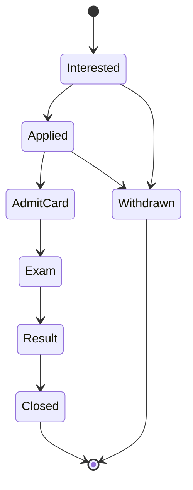

### 8.2 ServiceRequest (Form Filling)
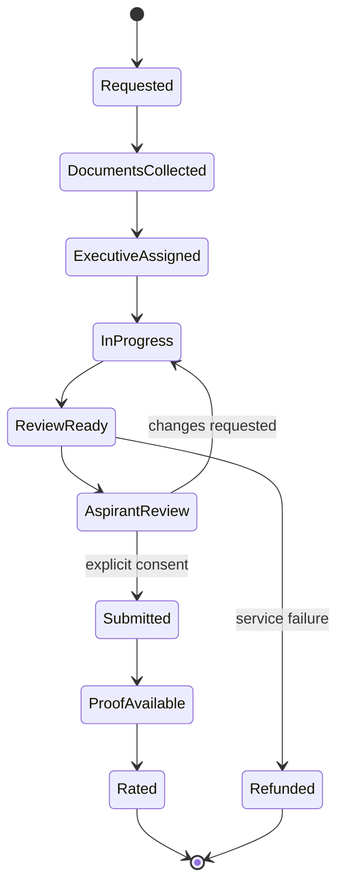

### 8.3 Verification & publishing (ReviewTask → PublishingWorkflow)
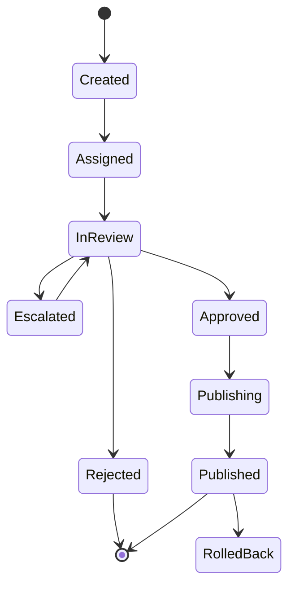

### 8.4 Alert
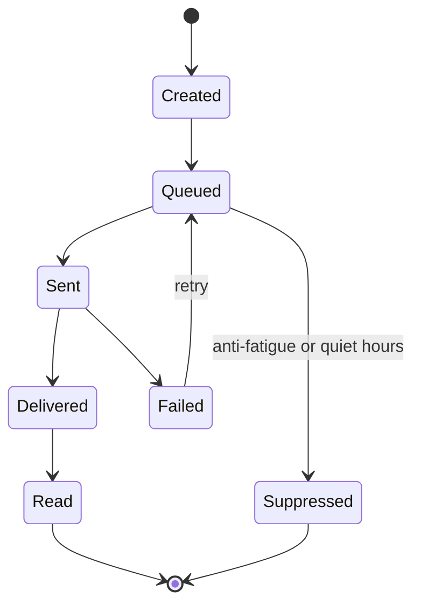

### 8.5 Billing Subscription
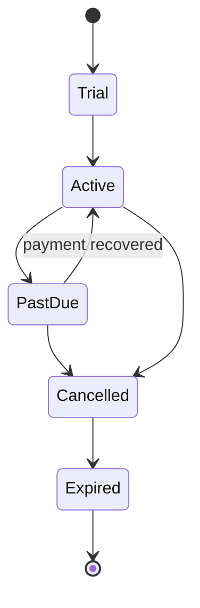

### 8.6 Source (registry & health)
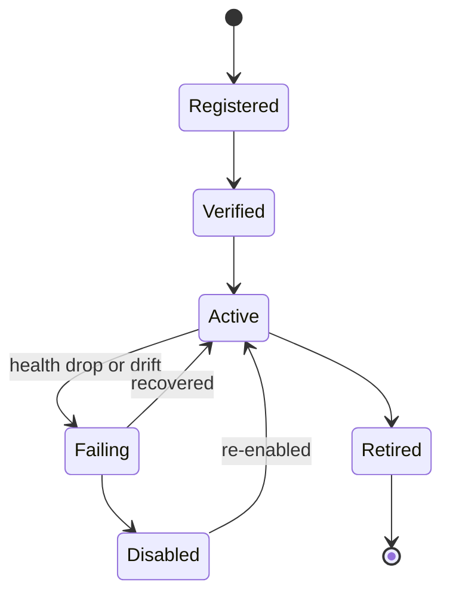

---

## 9. Domain workflows

Each workflow names the contexts and entities involved and the events emitted. Diagrams show the
critical paths; others are given as ordered steps.

### 9.1 Crawler → Publishing (ingestion to visible Opportunity)
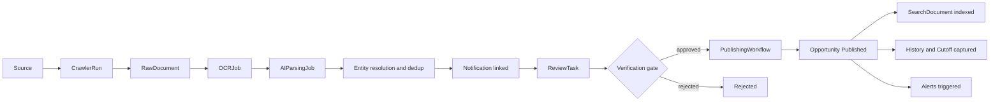
*Emits:* `NotificationIngested`, `EntityResolved`, `ReviewTaskCreated`, `OpportunityPublished`,
`HistoryCaptured`.

### 9.2 Content review & admin approval
Steps: AIParsingJob flags confidence → `ReviewTask` created and assigned (reviewer ≠ author) →
reviewer normalizes fields (dates, vacancies, eligibility, entity links) → **Approve/Reject/
Escalate** → on Approve, `PublishingWorkflow` publishes, indexes, captures history, notifies →
material corrections later go through `ModerationAction` and re-notify. *(Contexts: Crawler,
Administration, Recruitment, Notifications.)*

### 9.3 Job discovery
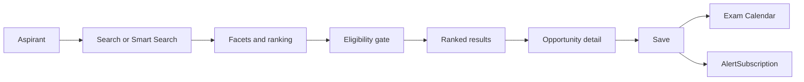
*Emits:* `SearchPerformed`, `OpportunityViewed`, `OpportunitySaved`.

### 9.4 Resume upload
Steps: aspirant uploads resume → stored as `Document` in the Vault (sensitive PII, access-logged) →
availability recorded → offered to Resume Parser. *(Contexts: Documents, Career.)* *Emits:*
`DocumentUploaded`.

### 9.5 Resume parsing
Steps: `ResumeParseJob` queued → AI extracts structured fields → mapped to canonical Skills/
Qualifications → **presented for aspirant confirmation** → on confirm, ProfileSkill/Qualification
updated → Profile Completion & Career DNA invalidated/recomputed. *(Contexts: AI, Career, Reference.)*
*Emits:* `ResumeParsed`, `ProfileUpdated`, `CareerDnaInvalidated`.

### 9.6 Skill matching
Steps: on Profile or Opportunity change → Skills Engine computes Skill Match and Profile Match
(eligibility as hard gate) → scores cached and explainable → feed Recommendations, Search ranking,
Career DNA. *(Contexts: AI, Search, Career.)* *Emits:* `MatchComputed`.

### 9.7 Eligibility checking
Steps: aspirant views Opportunity (or DNA runs) → `EligibilityEvaluation` computed deterministically
with category relaxations → returns eligible/not/insufficient-data with reasons and unverified-input
flags → guidance only. *(Contexts: AI, Recruitment, Career.)* *Emits:* `EligibilityEvaluated`.

### 9.8 Application tracking
Steps: aspirant marks Interested/Applied → `Application` created; `ApplicationStageHistory` appended
on each transition → deadlines drive Alerts; AdmitCard/Result stages link records; assisted
updates from Form Filling. *(Contexts: Career, Recruitment, Notifications.)* *Emits:*
`ApplicationStageChanged`.

### 9.9 Form Filling Service
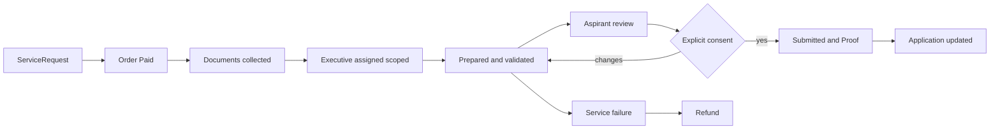
*Emits:* `ServiceRequested`, `ServicePaid`, `ExecutiveAssigned`, `ServiceSubmitted`,
`ServiceRefunded`.

### 9.10 Payment
Steps: aspirant selects Plan/Service → `Order` created → `Payment` via external provider
(Initiated → Authorized → Captured) → `Invoice` issued → entitlement granted (`Subscription` active
or `ServiceRequest` fulfilment starts) → failures/refunds via `Refund`. *(Contexts: Payments,
Professional Services.)* *Emits:* `OrderPaid`, `SubscriptionActivated`, `RefundProcessed`.

### 9.11 Alert delivery
Steps: a domain event (deadline near, result out, new match) → candidate `Alert` created →
checked against `AlertPreference` (channel, quiet hours) and anti-fatigue caps → batched
(surge-aware) → sent idempotently → status tracked (Delivered/Read/Failed→retry). *(Contexts:
Notifications, Recruitment, Career.)* *Emits:* `AlertSent`, `AlertDelivered`.

### 9.12 Workflow → context → key entities (summary)
| Workflow | Contexts | Key entities |
|---|---|---|
| Job Discovery | Search, Recruitment, AI, Career | Opportunity, SearchDocument, EligibilityEvaluation, SavedJob |
| Resume Upload | Documents, Career | Document, DocumentVault |
| Resume Parsing | AI, Career, Reference | ResumeParseJob, ProfileSkill, ProfileQualification |
| Skill Matching | AI, Search, Career | ProfileSkill, Recommendation, RankingModel |
| Eligibility Checking | AI, Recruitment, Career | EligibilityEvaluation, Post, Profile |
| Application Tracking | Career, Recruitment, Notifications | Application, ApplicationStageHistory |
| Form Filling | Services, Payments, Documents | ServiceRequest, Executive, ServiceProof |
| Payment | Payments, Services | Order, Payment, Invoice, Subscription |
| Alert Delivery | Notifications & Engagement, Recruitment | Alert, AlertPreference, AlertSubscription |
| Crawler Processing | Crawler | Source, CrawlerRun, RawDocument, OCRJob, AIParsingJob |
| Publishing | Administration, Recruitment | ReviewTask, PublishingWorkflow, Opportunity |
| Content Review | Administration | ReviewTask, Reviewer |
| Admin Approval | Administration | ReviewTask, ModerationAction, AuditLog |

---

## 10. Cross-domain dependencies

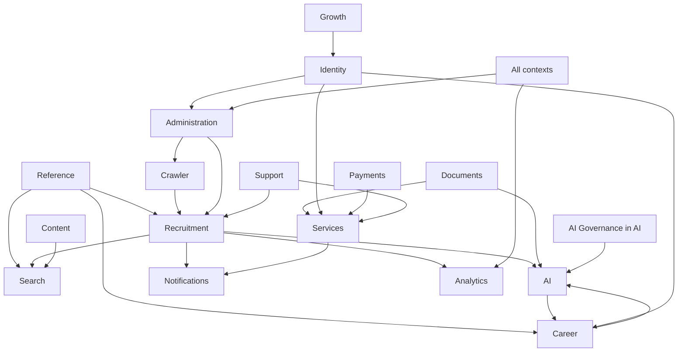

| Dependency | Direction | Coupling mechanism | Rule |
|---|---|---|---|
| Reference → everything | downstream reads canonical ids | Shared Kernel | Reference is stable; changes are governed |
| Crawler → Recruitment | supplies notifications | Customer–Supplier + ACL | External mess never leaks past ingestion |
| Recruitment → Search/AI/Notifications/Analytics | domain events | Published Language | Downstream reacts to events, not tables |
| Documents → AI/Services | consented reads | Explicit consent + scoped access | No sensitive PII without consent |
| Payments → Services/Career | entitlement facts | Conformist | Fulfilment starts only after Paid |
| All → Administration/Analytics | audit + events | Cross-cutting | Every action audited/measured |

**Anti-patterns forbidden:** no cross-context shared database tables; no context reads another's
private store; contexts integrate only via published events and explicit references to canonical ids.

---

## 11. Domain events

Contexts integrate through **domain events** (Published Language). Events are past-tense business
facts, versioned, and carry references (ids) — never sensitive PII payloads. Consumers react
asynchronously; producers do not know their consumers.

### 11.1 Event catalogue (by producing context)
| Context | Event | Meaning | Typical consumers |
|---|---|---|---|
| Identity | `UserRegistered` | A new account was created | Career, Growth, Analytics |
| Identity | `ConsentGranted` / `ConsentRevoked` | Consent state changed | Documents, AI, Notifications, Compliance |
| Crawler | `NotificationIngested` | A raw notification was fetched | Recruitment, Analytics |
| Crawler | `SourceHealthDegraded` | A source is failing/drifting | Administration, Analytics |
| Crawler | `EntityResolved` | A notification resolved to canonical entities | Recruitment |
| Administration | `ReviewTaskCreated` / `ReviewCompleted` | Verification work created/decided | Recruitment, Analytics |
| Recruitment | `OpportunityPublished` | A verified opportunity is visible | Search, AI, Notifications, Analytics, Content |
| Recruitment | `OpportunityCorrected` / `OpportunityWithdrawn` | Material change or takedown | Notifications, Search, Trust & Safety |
| Recruitment | `ResultAnnounced` / `AdmitCardReleased` / `AnswerKeyReleased` | A record became available | Notifications, Career |
| Recruitment | `CutoffRecorded` / `VacancyUpdated` | History/trend data captured | Analytics, Content |
| Recruitment | `CalendarEventChanged` | A key date changed | Notifications, Career |
| Career | `ProfileUpdated` | Profile changed | AI (recompute DNA/eligibility) |
| Career | `OpportunitySaved` | Aspirant saved an opportunity | Notifications, Analytics |
| Career | `ApplicationStageChanged` | Application progressed | Notifications, Analytics |
| Documents | `DocumentUploaded` / `VaultAccessed` | Document lifecycle/access | AI, Audit |
| AI | `ResumeParsed` | Structured data extracted | Career |
| AI | `EligibilityEvaluated` / `MatchComputed` / `RecommendationsGenerated` | AI outputs ready | Career, Search, Dashboard |
| AI | `CareerDnaComputed` | Career DNA refreshed | Dashboard, Notifications |
| AI | `AIModelActivated` / `AIEvaluationFailed` | Model governance events | Administration, Analytics |
| Payments | `OrderPaid` / `SubscriptionActivated` / `RefundProcessed` | Money/entitlement facts | Services, Career, Analytics |
| Services | `ServiceRequested` / `ExecutiveAssigned` / `ServiceSubmitted` / `ServiceRefunded` | Form-filling lifecycle | Notifications, Payments, Trust & Safety, Analytics |
| Support & Trust | `TicketOpened` / `GrievanceFiled` / `AbuseReported` / `FraudConfirmed` | Support/trust events | Administration, Recruitment (withdraw), Analytics |
| Notifications | `AlertSent` / `AlertDelivered` | Delivery facts | Analytics |
| Growth | `ReferralAccepted` | A referral converted | Identity, Analytics |
| Analytics | `ExperimentDecided` | An experiment concluded | Administration (flag change), Search |

### 11.2 Event design rules
- Past tense, immutable, versioned; carry ids and minimal metadata — **never** sensitive PII payloads.
- Idempotent consumers (safe replay); events are the integration contract between contexts.
- `OpportunityPublished`, `OpportunityCorrected`, and `*Released` events are the backbone of the
  proactive experience (calendar + notifications + search freshness).

---

## 12. Future expansion strategy

The model is built to extend **without restructuring**. New capabilities slot in as facets, entities,
or contexts — never as parallel taxonomies.

### 12.1 Extension mechanisms
| Need | Mechanism | Why it is safe |
|---|---|---|
| New opportunity category (e.g., new sector) | New **facet value** on Opportunity | No new codebase; search/AI/DNA work automatically |
| International opportunities | Activate `Sector = International` + `Location` international geographies | Model already anticipates it (§Reference) |
| New official record type | New entity under Recruitment referencing Exam | Reuses verification gate, provenance, notifications |
| New AI capability | New job/output entity in AI + `AIModelVersion` | Governed by the same eval/grounding gate |
| Community features | New **Community** context integrating via events | Isolated blast radius; Trust & Safety already exists |
| B2B / institutional publishing | Grow **Partner** entities + scoped roles | Verification standards preserved; ACL at the boundary |
| Verifiable credentials / gov document-locker | Extend Documents/Qualification with verification source | Consent and audit already first-class |
| Predictive recruitment/cutoff | New AI outputs consuming captured **history** | History captured from day one enables this |
| New channel (e.g., WhatsApp) | New `Channel` under Notifications | Preferences/anti-fatigue already abstract channels |

### 12.2 Guardrails during expansion
- **Reference stays small and governed.** The shared kernel must not bloat; new canonical entities
  are added deliberately with ownership.
- **No cross-context tables, ever.** Growth happens via events and canonical-id references.
- **New sensitive-PII features require consent + audit + Security Review** before build.
- **New AI surfaces require evals + grounding gate** before activation.
- **Every new entity carries the full facet set** (purpose, owner, lifecycle, attributes, rules,
  validation, relationships, permissions, dependencies, future) in this catalogue.
- **Architectural changes are ADR-gated** (`docs/10_ADR`); this model changes only through versioned
  updates, never undocumented drift.

### 12.3 Ten-year posture
The domain's spine — canonical entities, verified provenance, consent-first PII, event-driven context
integration, and history captured from day one — is deliberately conservative and boring so that a
decade of new features, categories, languages, and geographies can be added at the edges without
destabilizing the core. That stability is the point: it is what lets 50+ engineers build in parallel
against one shared, unambiguous model.

---

*End of Domain Model v1.0 — the shared language and structural contract for CareerMitra. It is the
foundation for database design, API contracts, backend services, frontend models, search, AI,
notifications, analytics, reporting, and the crawler system. It evolves only through versioned updates
and ADR-recorded decisions.*
