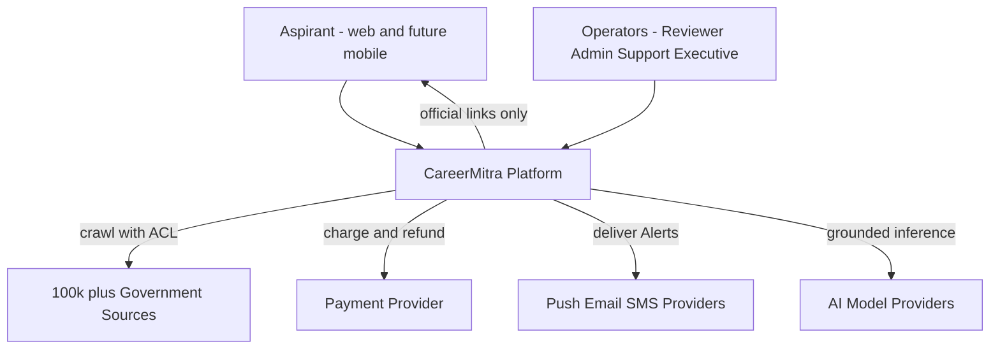
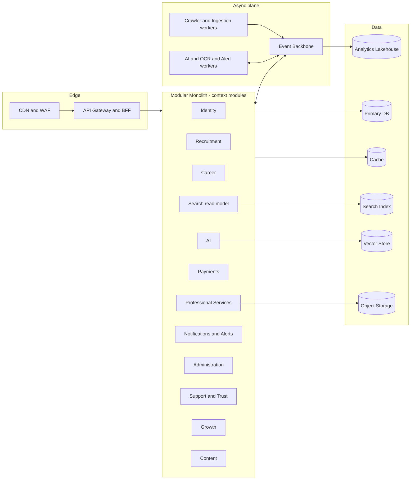

# CareerMitra — Architecture Overview

| | |
|---|---|
| **Product** | CareerMitra — India's AI-powered Government Career Platform |
| **Company** | Astralabs Technologies LLP |
| **Document** | Architecture Overview (entry point for `docs/02_Architecture`) |
| **Version** | 1.0 |
| **Status** | Approved — the architectural single source of truth |
| **Last updated** | 2026-07-01 |
| **Grounded in** | `PROJECT_CONTEXT.md`, `PROJECT_RULES.md`, `AI_INSTRUCTIONS.md`, `PROJECT_MANIFEST.json`, `docs/00_Project/PRD.md`, `docs/01_Domain/{DOMAIN_MODEL,BUSINESS_GLOSSARY,UBIQUITOUS_LANGUAGE}.md` |
| **Scope** | Architecture only — no code, APIs, schema, SQL, or UI |

> This is the map to CareerMitra's enterprise architecture. It never contradicts the PRD or Domain
> Model; it realizes them. It uses the Ubiquitous Language exactly (**Notification** = official
> announcement; **Alert** = outbound message; canonical entities; verification gate; provenance;
> consent-first PII; grounded AI). Every downstream document (02–16) elaborates one facet of this map.

---

## 1. What we are building (architecturally)
A platform that must serve **100M registered users, 5M daily active users, and ingest from 100,000+
government sources**, remain trustworthy (verified data + provenance), be AI-first (grounded), and
stay affordable per active user — for at least a decade. The architecture is therefore optimized for
**correctness and trust first, then scale, then cost, then speed of change**.

## 2. Architecture strategy in one line
**A cloud-native, event-driven Modular Monolith organized by the 16 bounded contexts, built with
Clean/Hexagonal layering and CQRS where beneficial, engineered from day one to extract into
microservices along context seams** (see `16_FUTURE_MICROSERVICES.md`).

### Why Modular Monolith first
- **Why chosen:** at pre-scale, a well-modularized monolith gives microservice-style boundaries
  (bounded contexts as modules with enforced dependencies) without the operational tax of a
  distributed system (network partitions, distributed transactions, 16 deployment pipelines).
- **Advantages:** one deploy, in-process calls (fast, simple), atomic refactors of boundaries, lower
  cost and cognitive load, faster MVP, easy local dev.
- **Trade-offs:** a single scaling/deploy unit; requires discipline (module boundaries must be
  enforced, not just documented); a bad module boundary is easy to violate.
- **Future evolution:** contexts extract to services along their existing seams (Crawler, AI, Search,
  Notifications, Payments first) using the strangler pattern once independent scaling, team autonomy,
  or fault-isolation demand it. Because integration is already **event-driven + published-language**,
  extraction moves code, not concepts.

## 3. Principles applied (and where)
| Principle | How it shows up | Primary doc |
|---|---|---|
| Domain-Driven Design | 16 bounded-context modules; shared kernel; ACL at ingestion | 02, 03 |
| Clean + Hexagonal | domain core isolated behind ports; adapters at the edges | 03 |
| Modular Monolith → Microservice-ready | context modules with enforced boundaries; extraction plan | 02, 16 |
| CQRS where beneficial | separate read models (Search, Tracker, dashboards) from write models | 03, 05, 06 |
| Event-Driven | domain events are the integration contract between contexts | 02, 03, 05 |
| SOLID / KISS / YAGNI | one responsibility per module; monolith-first; no speculative services | 03 |
| OWASP / Zero Trust | authN/Z on every hop; least privilege; no implicit trust | 09 |
| 12-Factor / Cloud-Native | stateless app tier, config via env, disposable containers | 04, 10 |
| API-First | contracts defined before implementation; BFF for clients; public API later | 03 |
| Observability-First | logs/metrics/traces from day one; SLOs | 04, 10, 11 |
| Security / Privacy / Accessibility by Design | consent-first PII, field-level encryption, WCAG | 05, 09, PRD §34/§38 |

## 4. The 4+1 architecture views (where each lives)
| View | Question it answers | Document |
|---|---|---|
| **Logical** | What are the modules and how do they relate? | 02, 03 |
| **Process** | How do requests/events flow at runtime? | 02, 03, 07, 08 |
| **Physical / Deployment** | Where does it run? | 04, 10 |
| **Development** | How is the code organized? | 13 |
| **Scenarios (+1)** | Do key journeys work end-to-end? | this doc §7, cross-refs |

## 5. C4 Level 1 — System context

## 6. High-level building blocks

## 7. Key end-to-end scenarios (traced across the architecture)
- **Ingest → publish an Opportunity:** Crawler (08) fetch → OCR/AI parse + entity resolution →
  ReviewTask (verification gate) → PublishingWorkflow emits `OpportunityPublished` → Search reindex
  (06), Alerts fan-out (Notifications), history capture (05).
- **Discover + eligibility:** Aspirant query → Search read model (06) with eligibility gate → AI
  eligibility (07) grounded on canonical data → save → AlertSubscription.
- **Assisted apply (paid):** Payments (Order paid) → ServiceRequest → scoped Executive assignment →
  consent-gated submission → ServiceProof (see 03 saga, 09 access control).
- **Result day surge:** `ResultAnnounced` → surge-aware Alert fan-out with backpressure (11).

## 8. Quality attributes (targets that shape the architecture)
Trustworthiness (verified + provenance) · Availability ≥ 99.9% reads · p95 cached detail < 300 ms ·
Scale to 100M/5M DAU/100k sources · Grounded-AI safety · DPDP/consent compliance · Cost per active
user tracked · Recoverability (DR with defined RTO/RPO). Detailed budgets in 11; NFRs in PRD §35.

## 9. Document index (docs/02_Architecture)
01 Overview · 02 System · 03 Application · 04 Infrastructure · 05 Data · 06 Search · 07 AI ·
08 Crawler · 09 Security · 10 Deployment · 11 Scalability · 12 Tech Stack · 13 Folder Structure ·
14 Decision Records · 15 Risk Register · 16 Future Microservices.

## 10. Golden constraints (never violated by any design here)
Verification gate before publish · provenance on every fact · consent before sensitive-PII use ·
no plaintext PII/secrets in logs · grounded AI or degrade to official source · no pay-to-rank ·
event-driven integration (no cross-context shared tables) · history captured from day one ·
architectural changes recorded as ADRs (`docs/10_ADR`).
