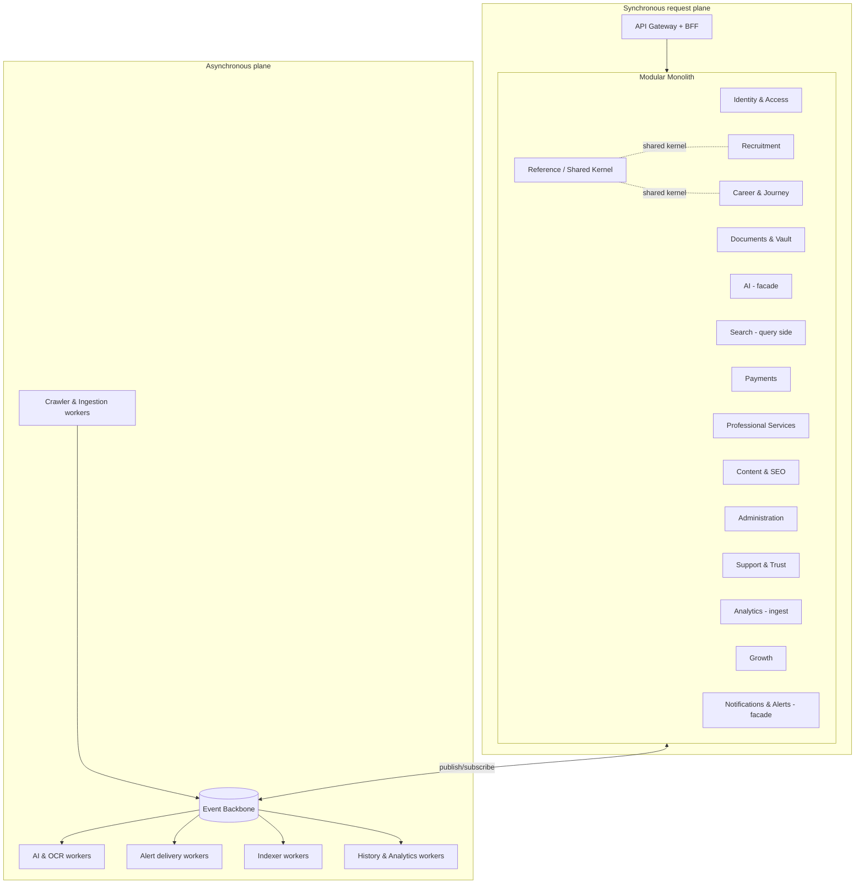
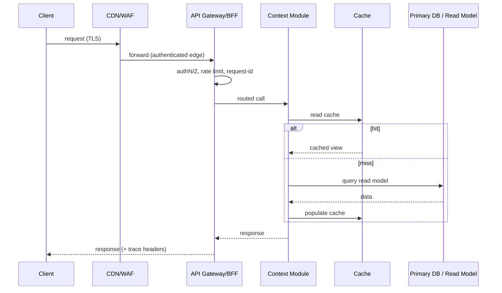
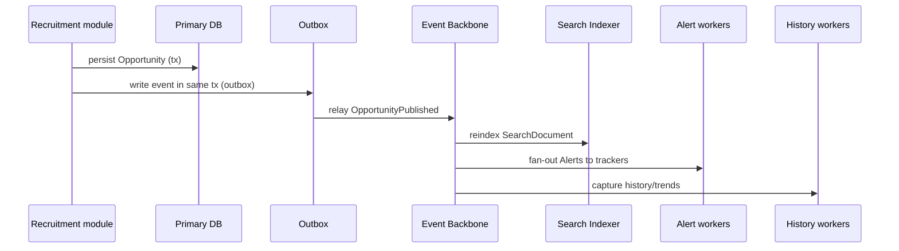
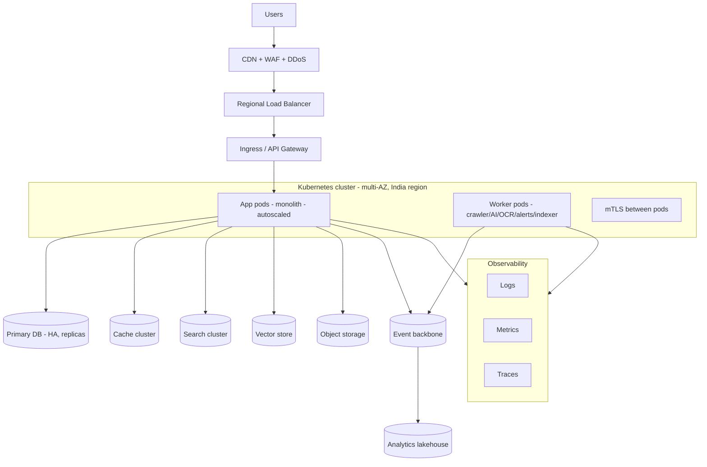

# CareerMitra — System Architecture (Logical & Physical)

| | |
|---|---|
| **Version** | 1.0 · **Status** | Approved · **Scope** | Architecture only |
| **Grounded in** | PRD v3.0, DOMAIN_MODEL v1.0, Ubiquitous Language v1.0 |

> The logical and physical shape of the system: modules, runtime planes, and the flows that connect
> them. Realizes the 16 bounded contexts as modules of a cloud-native, event-driven modular monolith.

---

## 1. Logical architecture — context modules
Each bounded context is a **module** with a public contract (commands, queries, events) and a private
model. Modules never reach into each other's data; they integrate via the event backbone and
canonical-id references (Published Language).

### Module dependency rules
- **Allowed:** any module → Reference (shared kernel, read-only canonical ids); any module →
  event backbone (publish/subscribe).
- **Forbidden:** module A reading module B's private store; synchronous cross-context call chains
  that create tight coupling; cross-context database joins.
- **Enforced by:** module-boundary linting/architecture tests in CI (see 03, 10).

## 2. Read vs write separation (CQRS where beneficial)
CQRS is applied **selectively** — only where read and write shapes genuinely diverge.

| Applied (separate read model) | Not applied (single model) |
|---|---|
| Search & Discovery (index) | Payments (transactional consistency wins) |
| Application Tracker, Dashboards | Identity/Consent (simple CRUD) |
| Cutoff/Vacancy/Salary Trends | Reference entities (low volume) |
| Organization/Exam/Skill profiles (SEO) | ServiceRequest state (aggregate) |

- **Why selective:** full CQRS everywhere violates KISS/YAGNI; targeted CQRS gives fast, denormalized
  reads for the heavy paths without eventual-consistency complexity where it isn't needed.
- **Trade-off:** read models are eventually consistent (rebuilt from events); acceptable for search/
  dashboards, unacceptable for money — hence the split above.

## 3. Runtime request lifecycle (synchronous read)

## 4. Event-driven write + propagation

- **Transactional Outbox** guarantees "state change + event" atomicity without distributed
  transactions. *Why:* avoids dual-write inconsistency; *trade-off:* a relay component + at-least-once
  delivery (consumers must be idempotent). *Future:* outbox relay becomes a change-data-capture
  stream when contexts split out.

## 5. Physical architecture (deployment shape)

## 6. Synchronous vs asynchronous boundaries
| Path | Mode | Why |
|---|---|---|
| User read (search, detail, dashboard) | sync + cache | latency-critical |
| User write (save, apply, profile) | sync persist + async propagate | fast ack, eventual fan-out |
| Ingestion (crawl→publish) | fully async | long-running, bursty, retry-heavy |
| AI (parse, DNA, recommend) | async jobs (sync facade for quick calls) | variable latency, cost control |
| Alerts | async fan-out | surge-heavy, retryable |
| Payments | sync with provider + async reconcile | consistency + webhook settlement |

## 7. External integration & Anti-Corruption Layer
Every external system (government sources, payment provider, AI providers, comms providers) is behind
an **adapter (ACL)** so external contracts and messiness never leak into the domain. *Why:* isolates
change and failure; *future:* adapters swap providers (e.g., add a new SMS vendor) without touching
domain logic.

## 8. Failure & isolation posture
- **Bulkheads:** worker pools per workload (crawler ≠ AI ≠ alerts) so one storm can't starve others.
- **Backpressure:** queues absorb spikes (result day); consumers scale independently.
- **Graceful degradation:** if AI/search degrade, fall back to deterministic structured results and
  "see official source" (grounding rule).
- **Idempotency everywhere** on the async plane (at-least-once delivery).

## 9. Evolution to microservices (seam preview)
Because modules already communicate via events and canonical ids, the physical split is mechanical:
promote a module to its own deployable + datastore, replace in-process events with backbone topics
(already the contract). Full plan in `16_FUTURE_MICROSERVICES.md`.
