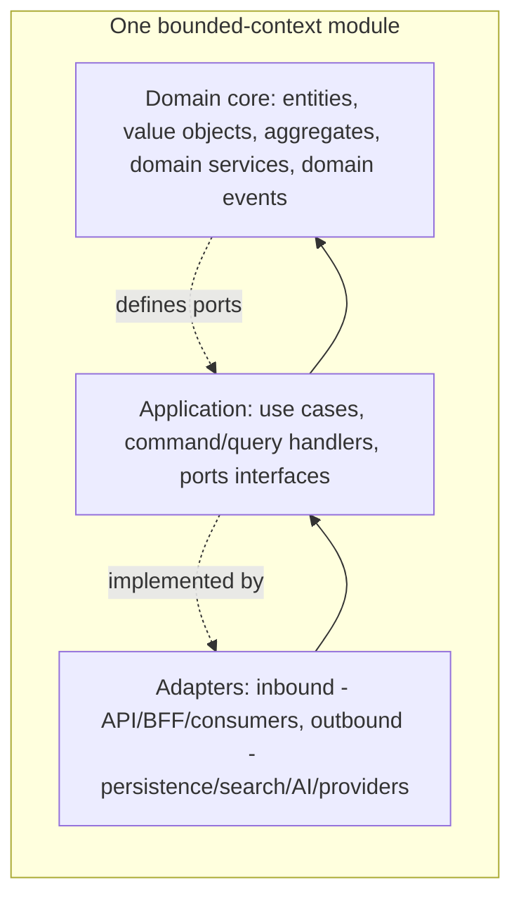
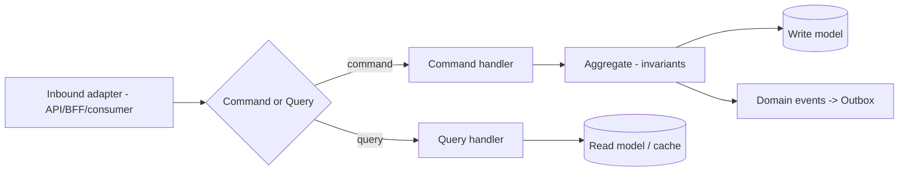
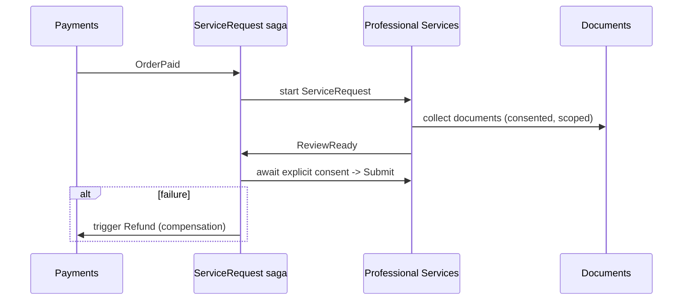
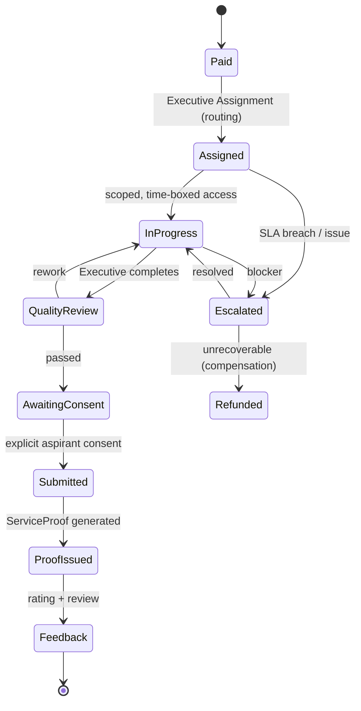

# CareerMitra — Application Architecture

| | |
|---|---|
| **Version** | 1.0 · **Status** | Approved · **Scope** | Architecture only (no code) |
| **Patterns** | DDD · Clean Architecture · Hexagonal (Ports & Adapters) · CQRS-where-beneficial · Event-Driven · SOLID · API-First |

> How each context module is structured internally so the domain stays pure, testable, and
> framework-independent, and how modules collaborate via ports, events, and process managers.

---

## 1. Layering (Clean + Hexagonal) per module

### The dependency rule (inward only)
- **Domain** depends on nothing (no framework, no DB, no HTTP). Pure business logic + invariants from
  `DOMAIN_MODEL.md` (verification gate, provenance, consent, grounding).
- **Application** depends on Domain; declares **ports** (interfaces) for what it needs.
- **Adapters** depend on Application; implement ports (persistence, search, AI gateway, providers,
  inbound API/event consumers).
- **Why:** business rules are the crown jewels — they must be testable and stable while databases,
  frameworks, and providers change. **Trade-off:** more indirection/mapping than a layered CRUD app;
  justified by the platform's 10-year lifespan and safety-critical rules. **Future:** a module lifts
  to a microservice by keeping Domain+Application intact and swapping adapters.

## 2. Ports & Adapters (hexagon) — examples
| Port (defined in Application) | Adapter (implementation) |
|---|---|
| `OpportunityRepository` (persist/read) | primary-DB adapter |
| `SearchIndexPort` | search-index adapter (06) |
| `AIGatewayPort` (ground, embed, parse) | AI platform adapter (07) |
| `EventPublisher` / `EventConsumer` | event-backbone adapter |
| `PaymentProviderPort` | payment-provider ACL (Payments) |
| `AlertChannelPort` | push/email/SMS adapters (Notifications) |
| `ConsentPort` | Identity/Consent adapter |
*(Names are conceptual roles, not code.)*

## 3. CQRS application structure

- **Commands** change state through an aggregate (which enforces invariants) and emit domain events.
- **Queries** hit read models/caches; never mutate.
- Applied only where beneficial (see 02 §2). *Why:* clean separation of intent; *trade-off:* two
  models to maintain on hot paths — accepted for search/tracker/trends, avoided elsewhere.

## 4. Aggregates & transaction boundaries
- One transaction = one aggregate (consistency boundary), per `DOMAIN_MODEL.md` (e.g., the
  `Application` aggregate composes `ApplicationStageHistory`; `ServiceRequest` composes proof/review).
- Cross-aggregate/cross-context consistency is **eventual**, via events + process managers.
- **Why:** avoids distributed locks and keeps write paths fast; **trade-off:** developers must design
  for eventual consistency (idempotent handlers, compensations).

## 5. Process managers / sagas (long-running workflows)
Multi-step, cross-context flows are orchestrated by **process managers** reacting to events, with
compensations for failure.

- Examples: assisted Form Filling; ingestion→publish→notify; subscription lifecycle.
- **Why:** encodes business workflows explicitly and resiliently; **trade-off:** more moving parts —
  mitigated by idempotency + observability (10).

### 5.1 Professional Services (Form Filling) — application architecture
The assisted-services flow (PRD §21, Domain §5.9) is the most operationally complex journey. It is
modeled as one `ServiceRequest` aggregate coordinated by a saga across Payments, Documents, and the
Professional Services context.

| Concern | Architectural handling |
|---|---|
| **Executive Assignment (routing)** | on `OrderPaid`, a routing policy assigns an available `Executive` by skill/language/load/region; grant is **scoped to this ServiceRequest and time-boxed** (ABAC, 09 §12) |
| **SLA** | each state carries a deadline; an SLA timer (process manager) tracks time-in-state and drives alerts to ops |
| **Escalation** | SLA breach or Executive-raised blocker transitions to `Escalated`, reassigns/notifies a supervisor, and is tracked to resolution; repeated breaches feed Trust & Safety |
| **Quality Review** | a reviewer (≠ the assigned Executive) validates completeness/accuracy before submission — separation of duties; failures route to rework |
| **Proof Generation** | on consented submission, a `ServiceProof` (what was submitted, when, by whom) is generated and stored (sensitive-PII, encrypted, 09) |
| **Customer Feedback** | post-completion `ServiceReview` (rating + comments) feeds quality scoring, Executive performance, and the analytics quality loop |
| **Customer Support** | `SupportTicket`/`Grievance` can attach to a `ServiceRequest`; unresolved issues escalate on the same SLA/escalation spine |
- **No auto-submit and no stored external credentials** (09 §12); every submission is consent-gated;
  failure compensates via `Refund` (Payments). **Why:** trust and accountability for a paid, PII-heavy
  service; **trade-off:** many states/timers — justified and made observable (10). **Future:** partner
  executives, capacity-based routing, and predictive SLA risk.

## 6. Domain events (integration contract)
- Past-tense, versioned, carry **ids only** (never sensitive PII), per Ubiquitous Language.
- Canonical events include `OpportunityPublished`, `EligibilityEvaluated`, `AlertSent`,
  `ServiceSubmitted`, `SourceHealthDegraded` (full catalogue in `DOMAIN_MODEL.md` §11).
- Delivered via Transactional Outbox → backbone; consumers are idempotent.

## 7. API-First
- Contracts (commands/queries/events + external API) are **designed before implementation** and
  reviewed; the BFF adapts them to client needs.
- **Client edge:** a **BFF** per client family (web now; mobile later) shapes payloads and aggregates
  reads; the **public/partner API** (future) is a separate, versioned, rate-limited surface.
- **Why API-first:** parallel front/back work, stable contracts, and a clean path to opening APIs to
  partners; **future:** the public API and mobile BFF reuse the same application use cases.

## 8. Cross-cutting concerns (applied uniformly)
| Concern | Where | Note |
|---|---|---|
| AuthN/Z | Gateway + module policy | Zero Trust; RBAC+ABAC (09) |
| Consent enforcement | Application layer guard | every sensitive-PII use checks ConsentPort |
| Validation | Domain (invariants) + edge (shape) | fail fast at edge, enforce truth in domain |
| Idempotency | inbound + consumers | request keys + event dedup |
| Error handling | typed domain errors → mapped at adapters | no leaking internals to clients |
| Observability | decorators around handlers | trace/span per command/query (10) |
| Feature flags | Application gate | safe rollout/experiments (10) |

## 9. Testability strategy (enabled by the layering)
Domain: pure unit tests (no infra). Application: use-case tests with in-memory port fakes. Adapters:
contract/integration tests. Architecture tests enforce the dependency rule and module boundaries in
CI. *Why:* fast, reliable tests protect safety-critical rules over a decade.

## 10. SOLID / KISS / YAGNI in practice
Single responsibility per handler/module; dependencies via interfaces (DIP); no speculative
generality (YAGNI — monolith-first, CQRS only where it pays); the simplest design that upholds the
golden constraints (KISS).
