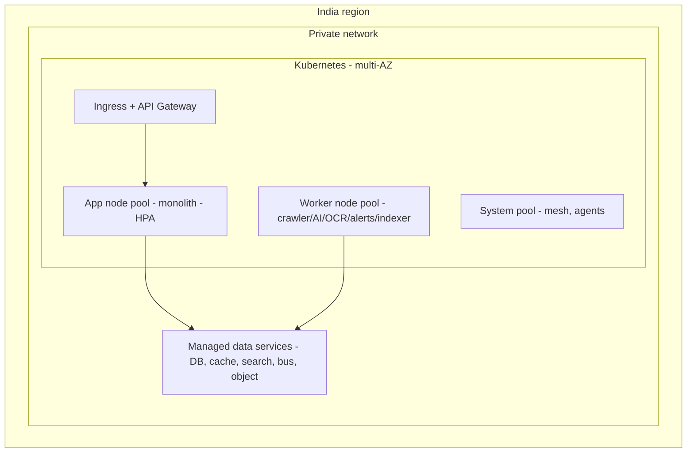
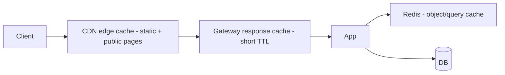

# CareerMitra — Infrastructure Architecture

| | |
|---|---|
| **Version** | 1.0 · **Status** | Approved · **Scope** | Architecture only |
| **Principles** | Cloud-Native · 12-Factor · Zero Trust · Observability-First · IaC |

> The cloud, compute, network, storage, and platform services that run CareerMitra. Cloud-native and
> India-resident (DPDP), designed for multi-AZ resilience today and multi-region tomorrow.

---

## 1. Cloud posture
- **Cloud-native, India region** (DPDP data-residency); single provider primary, provider-portable
  design (managed services chosen to have equivalents elsewhere — see `12_TECH_STACK.md`).
- **Why:** managed building blocks (Kubernetes, managed DB, object storage, CDN) cut operational load
  and improve reliability; India region satisfies residency. **Trade-off:** some vendor coupling —
  bounded by using open standards (Kubernetes, S3-compatible storage, PostgreSQL, OpenSearch,
  Kafka-compatible bus). **Future:** add a second region for DR/latency, then multi-region active.

## 2. Compute — Kubernetes

- **Separate node pools** for app (latency-sensitive) vs workers (bursty/CPU/GPU) → **bulkheading**
  and independent autoscaling. GPU pool (or managed inference) for AI/OCR.
- **Horizontal Pod Autoscaling** on app; **queue-depth-based scaling** on workers.
- **Why Kubernetes:** portable, self-healing, standard autoscaling/rollout; **trade-off:**
  operational complexity — mitigated by managed control plane + GitOps (10). **Future:** the same
  cluster hosts extracted microservices without re-platforming.

## 3. Network & Zero Trust
- Private VPC; app tier not directly internet-exposed (only via CDN→LB→ingress).
- **mTLS between pods** (service mesh or equivalent); every hop authenticated/authorized.
- Egress control: only allow-listed destinations (sources, providers) via an egress proxy — aligns
  with `PROJECT_CONTEXT.md` network posture.
- **Why Zero Trust:** no implicit trust inside the network; **trade-off:** more certificate/policy
  management — automated.

## 4. Environments (12-Factor)
| Env | Purpose | Notes |
|---|---|---|
| dev | local + shared dev | seeded data, no real PII |
| staging | pre-prod mirror | prod-like, synthetic data, DR drills |
| production | live | India region, HA, restricted access |
- Strict parity; config via environment (never in code); one codebase, many deploys.
- **Secrets** from a managed secrets manager/Vault, injected at runtime — never in images or git
  (`.env.example` is the only committed contract, per `PROJECT_RULES.md`).

## 5. Configuration & secrets
- **Config:** environment variables + a config service for dynamic values; typed and validated at boot.
- **Secrets:** central manager (Vault/cloud KMS-backed), short-lived credentials, rotation, audited
  access. Detailed in 09.
- **Why:** 12-factor portability + Zero Trust; **trade-off:** boot-time dependency on secret store —
  mitigated by caching + graceful startup.

## 6. Storage strategy
| Store | Role | Notes |
|---|---|---|
| Primary DB (Postgres) | transactional write models per context | HA, replicas, PITR |
| Cache (Redis) | hot reads, sessions, rate-limit counters | eviction policies per use |
| Search cluster (OpenSearch) | full-text/facets/rank read model | 06 |
| Vector store | embeddings for semantic/AI search | 07 |
| Object storage (S3-compatible) | documents, raw crawl artefacts, proofs | encrypted, lifecycle tiers |
| Analytics lakehouse | events, trends, reporting | 05 |
Details and ownership in `05_DATA_ARCHITECTURE.md`.

## 7. Caching strategy (layers)

- **What to cache:** SEO/entity pages (public, long TTL, purge on event), search results (short TTL),
  opportunity detail, reference data (long TTL), session/rate-limit counters.
- **Invalidation:** event-driven purge on `OpportunityPublished/Corrected` etc. (correctness > staleness).
- **Why layered:** each layer removes load from the next; **trade-off:** invalidation complexity —
  solved by tying purges to domain events.

## 8. Queue / event backbone strategy
- **Durable, partitioned, replayable** log (Kafka-compatible) as the event backbone + work queues.
- Ordering per key (e.g., per Opportunity); consumer groups scale horizontally; DLQs for poison
  messages; replay for rebuilding read models.
- **Why a log, not just a queue:** enables CQRS read-model rebuilds, history capture, and future CDC
  to microservices; **trade-off:** more infra than a simple queue — justified by the event-driven core.

## 9. CDN strategy
- CDN in front of everything: static assets, images, and **server-rendered SEO/entity pages** (the
  primary acquisition channel, PRD §31) cached at edge; WAF + DDoS at the edge.
- **Why:** offloads the origin, cuts latency for pan-India users on mobile networks, protects origin;
  **future:** edge personalization/rendering as traffic grows.

## 10. Observability infrastructure (first-class)
- **Metrics** (RED/USE + business KPIs), **structured logs** (no PII), **distributed traces**
  (trace-id from edge through async plane), dashboards + alerting on SLOs.
- Freshness/pipeline dashboards for ingestion and search; cost-per-active-user telemetry.
- Detailed in 10 (deployment) and 11 (SLOs).

## 11. Infrastructure as Code
- **All** infra (network, cluster, data services, DNS, CDN, policies) defined as code; no console
  changes. GitOps for cluster state. **Why:** reproducibility, review, DR rebuild; **trade-off:**
  upfront investment — pays back in reliability and audited change.

## 12. Cost efficiency (built in)
Autoscaling to zero-ish for idle worker pools; spot/preemptible for batch (crawler/OCR) with
checkpointing; caching to cut DB/AI calls; tiered object storage; per-workload budgets and alerts.
Cost per active user is a tracked SLO (11, PRD §40).
