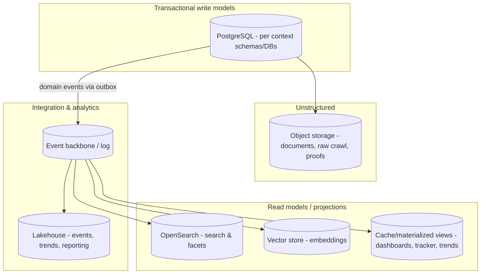
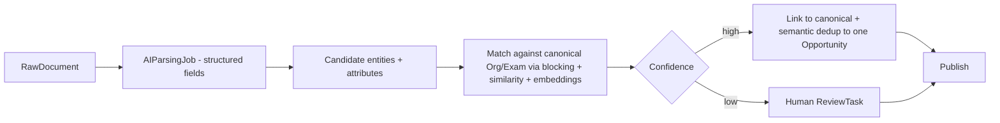

# CareerMitra — Data Architecture

| | |
|---|---|
| **Version** | 1.0 · **Status** | Approved · **Scope** | Architecture only — no SQL/schema |
| **Principles** | Data ownership per context · Polyglot persistence · Event-sourced integration · Privacy by Design · History from day one |

> How data is owned, stored, moved, secured, and scaled. Every canonical entity and rule comes from
> `DOMAIN_MODEL.md`; this document says *where* data lives and *how* it flows — never schema or SQL.

---

## 1. Core principles
1. **Each context owns its data.** No shared tables across contexts; integration is via events +
   canonical ids (Published Language). This is what makes future service-extraction safe.
2. **Reference is the shared kernel.** Canonical `Organization/Exam/Skill/Qualification/Certification/
   Location` have stable ids every context references (never copies as free text).
3. **Polyglot persistence.** The right store per job (relational, search, vector, object, cache,
   lakehouse) rather than forcing one database to do everything.
4. **Provenance & history are non-negotiable.** Every published fact links to a `Notification` +
   `Source`; trends are captured continuously (PRD §11).
5. **Privacy by design.** Data classified `public/internal/pii/sensitive-pii/secret`; handling,
   consent, and access follow the class.

## 2. Polyglot persistence map

| Store | Chosen for | Why · trade-off · future |
|---|---|---|
| **PostgreSQL** | primary transactional data (opportunities, profiles, payments, service requests) | ACID, relational integrity, JSON where needed · trade-off: not a search/vector engine → offload those · future: read replicas, then per-context DBs on extraction |
| **OpenSearch** | full-text, facets, ranking (06) | best-in-class search · trade-off: eventually consistent, ops cost · future: dedicated cluster per service |
| **Vector store** | embeddings for semantic/AI search & RAG (07) | ANN at scale · trade-off: another system to run · future: scale/shard as corpus grows |
| **Object storage** | documents, raw crawl artefacts, proofs | cheap, durable, tiered · trade-off: eventual consistency semantics · future: lifecycle to cold tiers |
| **Cache (Redis)** | hot reads, sessions, counters, materialized dashboards | speed · trade-off: volatile → rebuildable · future: partition per workload |
| **Lakehouse** | analytics events, trends, reporting | cheap columnar analytics · trade-off: batch/near-real-time, not OLTP · future: streaming analytics |

## 3. Data ownership by context (illustrative)
| Context | Owns (write model) | Publishes | Reads (via events/ids) |
|---|---|---|---|
| Reference | canonical entities | reference-updated | — |
| Recruitment | Notification, Recruitment, Opportunity, Vacancy, records, Cutoff | OpportunityPublished, ResultAnnounced, CutoffRecorded | Reference |
| Career | Profile, Application, SavedJob, CareerDNA | ProfileUpdated, ApplicationStageChanged | Recruitment, AI |
| Documents | DocumentVault, Document, VaultAccessLog | DocumentUploaded | Consent |
| AI | ResumeParseJob, EligibilityEvaluation, Recommendation, model registry | EligibilityEvaluated, RecommendationsGenerated | Career, Recruitment, Reference |
| Search | SearchDocument (read model) | — | Recruitment events |
| Payments | Order, Payment, Invoice, Subscription | OrderPaid, RefundProcessed | — |
| Prof. Services | ServiceRequest, Executive, proofs | ServiceSubmitted | Payments, Documents, Recruitment |
| Crawler | Source, CrawlerRun, RawDocument, OCR/Parse jobs | NotificationIngested, SourceHealthDegraded | Reference |
| Notifications | Alert, AlertPreference, AlertSubscription | AlertSent | many (event-triggered) |
| Analytics | AnalyticsEvent, metrics, cohorts | — | all (events) |

## 4. Entity resolution & dedup data flow (the core scale problem)

- Combines deterministic keys (official ids/domains), fuzzy similarity, and **embeddings** for
  semantic matching; low-confidence merges go to review. *Why:* one Opportunity per real recruitment
  across 100k sources; *trade-off:* compute + tuning — offset by caching and human backstop.

## 5. History & trends capture (day one)
- On `OpportunityPublished`, `ResultAnnounced`, `CutoffRecorded`, `VacancyUpdated`, immutable
  snapshots are written to the lakehouse/trends store. *Why:* trends (cutoff/vacancy/salary) and
  entity profiles cannot be reconstructed later; *future:* predictive models consume this history.

## 6. Data classification & handling
| Class | Examples | Handling |
|---|---|---|
| public | published Opportunities, entity profiles | cacheable, CDN, indexable |
| internal | operational metrics, source configs | internal access only |
| pii | name, contact, preferences | encrypted at rest, access-controlled, consented |
| sensitive-pii | documents, resume content, category, form data | field-level encryption, access-logged, step-up auth, strict retention |
| secret | keys, tokens | secrets manager, never in DB/logs |
- **No plaintext PII/secrets in logs or events** (events carry ids only).

## 7. Backup & retention
- **Postgres:** automated backups + point-in-time recovery; **object storage:** versioned + replicated;
  **search/vector/read models:** rebuildable from events (backup of source-of-truth is enough).
- **Retention** per data class (PRD §34): Vault/form data purged after service completion; analytics
  minimized/anonymized. Backups tested by restore drills (10). RTO/RPO in 10/11.

## 8. Consistency model
- **Strong** within an aggregate/context (transactional).
- **Eventual** across contexts (events) — search/dashboards/trends lag by seconds; money and consent
  are never eventual-only.
- Transactional Outbox ensures no lost events; consumers idempotent.

## 9. Scaling data to 100M/5M DAU
- **Read replicas** for read-heavy contexts; **cache** hot paths; **CQRS read models** for search/
  dashboards/trends (offload OLTP).
- **Partitioning:** time-partition high-volume append data (alerts log, analytics events, crawl
  artefacts); shard by tenant/region only when needed (YAGNI until measured).
- **Search/vector** scale horizontally (sharding/replicas).
- **Why staged:** avoid premature sharding complexity; add partitioning/sharding when metrics demand.
  *Future:* per-context databases upon service extraction; regional data partitioning for multi-region.

## 10. Data governance
Metrics have one governed definition (Analytics); event taxonomy is versioned; schema/data changes
are reviewed; access to sensitive-PII stores is least-privilege and audited (09). A data catalog +
lineage grows with the lakehouse.
