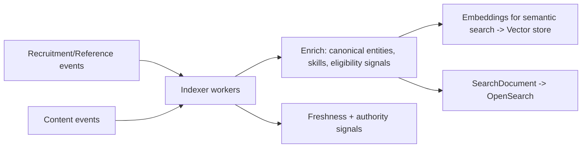
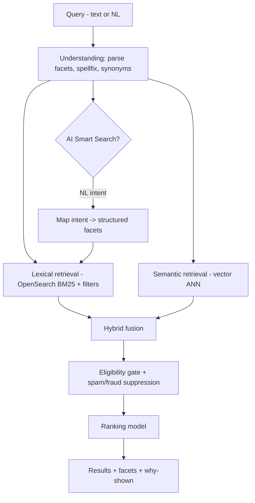
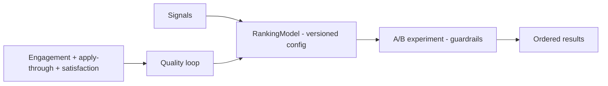

# CareerMitra — Search Architecture

| | |
|---|---|
| **Version** | 1.0 · **Status** | Approved · **Scope** | Architecture only |
| **Realizes** | PRD §18 (Search & ranking), Domain `SearchDocument`, `RankingModel`, `Facet` |

> India's best government-career search: fast structured filtering + full-text + semantic/AI search +
> a **governed ranking** subsystem. Search is a **read model** (CQRS) rebuilt from domain events —
> never a source of truth, and only ever indexes **verified, published** data.

---

## 1. What search must cover
Opportunities (all job/non-job facets), Results, Admit Cards, Answer Keys, Organizations, Departments,
Exams, Skills, Qualifications, Locations, Government Schemes, Career News, and the Exam Calendar —
with full-text, semantic, autocomplete, synonyms, facets, ranking, popularity, and personalization.

## 2. Indexing pipeline (event-driven)

- Triggered by `OpportunityPublished/Corrected/Withdrawn`, `ResultAnnounced`, reference updates.
- **Only verified/published** records are indexed; withdrawal/fraud events remove/demote instantly.
- *Why event-driven:* keeps the index fresh without coupling to the write path; *trade-off:* eventual
  consistency (seconds) — acceptable for discovery.

## 3. Query architecture (hybrid retrieval)

- **Hybrid** = lexical (precise filters, exact terms) + semantic (intent, synonyms, related roles),
  fused then ranked. *Why:* government queries mix exact constraints (age, qualification, state) with
  fuzzy intent ("cyber jobs for B.Tech, no fee"). *Trade-off:* two retrieval systems — justified by
  quality; unified behind one search service.

## 4. Ranking (governed subsystem)
Signals (from PRD §18.2): relevance, **eligibility as a hard gate**, Profile Match, freshness,
deadline proximity, authority (verified source), popularity, personalization.

- **Governance:** ranking changes ship behind experiments with guardrails; **no pay-to-rank**;
  fairness monitored across region/category/language; deterministic fallback when signals/
  personalization unavailable. *Why:* ranking is product-critical and abuse-prone; *future:* learned
  ranking (governed, explainable), always with the eligibility gate intact.

## 5. Autocomplete, synonyms, spellfix
- **Autocomplete:** prefix + popularity + entity-aware suggestions (exams, organizations, skills).
- **Synonyms/aliases:** sourced from the governed Skill Taxonomy and entity aliases (e.g., "hall
  ticket" → Admit Card; "InfoSec" → Cyber Security). *Why:* aspirants use many terms for one concept;
  *trade-off:* curation effort — automated from canonical aliases + reviewed.

## 6. Personalization & recommendations
- Personalized ranking uses the aspirant's Profile Match/eligibility (from AI, 07) as signals.
- Recommendations (opportunities/exams/certifications) are served from the AI recommendation outputs
  and surfaced in search/dashboard. **Eligibility-gated and explainable**; never pay-to-rank.

## 7. Zero-result recovery
On empty results, relax the least-important facet (explained to the user) and offer semantic
neighbors — never fabricate listings. *Why:* preserves trust while staying helpful.

## 8. Freshness, popularity & signals
- Freshness boosts new/closing-soon Opportunities; popularity from privacy-safe `SearchQueryLog` +
  engagement events; result-day content prioritized.
- Signals are logged (minimized/anonymized) and feed the ranking quality loop and analytics (05, 07).

## 9. Scale & performance
- Sharded/replicated search cluster; query caching for common facets; autocomplete on a low-latency
  path; index partitioned by type (opportunities vs records vs entities).
- Targets: fast mobile search; index lag seconds. Surge (result day) handled by read replicas + cache.
- *Future:* dedicated search service (extraction), regional indices for multi-region.

## 10. Trust & safety in search
Suspected fake/duplicate listings are demoted/withheld (Trust & Safety events, 09/PRD §28); provenance
shown on results; only verified data indexed. Search never becomes a scam vector.
