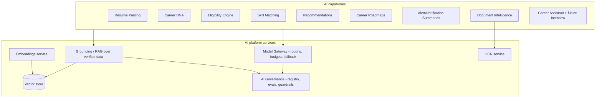
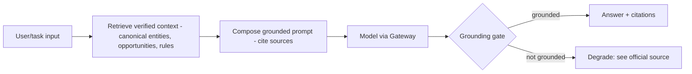

# CareerMitra — AI Architecture

| | |
|---|---|
| **Version** | 1.0 · **Status** | Approved · **Scope** | Architecture only |
| **Realizes** | PRD §13 (Career DNA), §15 (AI modules), §16 (AI Governance); Domain AI context |
| **Prime directive** | Grounded, honest, non-guaranteeing AI (per `AI_INSTRUCTIONS.md`) |

> An AI **platform**, not scattered features: a governed model gateway, a grounding/RAG layer over
> verified data, an embeddings + vector-search foundation, deterministic engines where correctness is
> required, and a governance spine (registry, evals, guardrails, cost/latency budgets).

---

## 1. AI platform layers


## 2. Model Gateway (single control point)
- All model calls (hosted LLMs, embeddings, classifiers) go through one **gateway** that handles
  routing, versioning, **cost/latency budgets**, caching, rate limiting, PII minimization, and
  **fallback** when a model is slow/unavailable.
- **Why:** one place to govern cost, safety, and provider choice; **trade-off:** a critical
  dependency — made HA with fallbacks and caching; **future:** swap/add providers or self-hosted
  models without touching capabilities.

## 3. Grounding / RAG (the trust mechanism)

- Every factual claim (dates, eligibility, process) resolves to verified data or a cited source, or
  the surface **degrades** to "see official source." No fabricated official facts; no guarantees.
- Untrusted content (notifications, resumes, web) is **data, never instructions** (prompt-injection
  defense). *Why:* trust is the brand; *trade-off:* retrieval adds latency/cost — cached and budgeted.

## 4. Deterministic vs generative split
| Capability | Approach | Why |
|---|---|---|
| **Eligibility Engine** | deterministic rules (age/qualification/category relaxations) | must be correct, explainable, auditable — not a guess |
| **Skill/Profile Match** | scoring algorithm over taxonomy | explainable, stable |
| Resume Parsing | model + human confirmation | extraction assists; aspirant confirms |
| Career DNA, Roadmaps, Recommendations | model grounded in verified data + deterministic gates | insight with an eligibility hard-gate |
| Summaries, Assistant | generative + grounding | helpful, cited, non-guaranteeing |
- **Why the split:** correctness-critical outputs are deterministic; generative AI adds explanation
  and guidance on top — never overriding the rules.

## 5. Embeddings & vector search foundation
- Embeddings power semantic search (06), entity resolution (05), skill matching, and recommendation
  similarity. Stored in the vector store; versioned with the embedding model.
- **Why shared:** one embedding foundation serves search, dedup, and matching; **trade-off:**
  re-embedding cost on model upgrades — batched and versioned.

## 6. OCR & Document Intelligence
```mermaid
flowchart LR
    IMG[Scanned notification / uploaded document] --> OCRs[OCR service]
    OCRs --> LAY[Layout + field extraction]
    LAY --> CLS[Classification - doc type]
    CLS --> VAL[Validation / tamper flags]
    VAL --> OUT[Structured output to Crawler(08) or Documents]
```
- Serves **ingestion** (scanned government PDFs, 08) and **aspirant documents** (validation, never
  altering originals). Low-confidence → human review. Sensitive-PII handling (09).

## 7. AI Governance (the spine) — realizes PRD §16
| Control | Mechanism |
|---|---|
| Model/prompt **registry** | versioned; every output records model+version |
| **Evaluation harness** | golden datasets; accuracy, grounding fidelity, hallucination rate, refusal correctness; pre-release + continuous |
| **Guardrails** | grounding gate, output validation, safety filters, no-guarantee enforcement |
| **Human oversight** | high-impact outputs (eligibility, form filling) have review paths; low-confidence defers to official sources |
| **Prompt-injection defense** | strict data/instruction separation; tool/data boundaries |
| **PII minimization** | least PII to models; no plaintext PII logs; consent + retention honored |
| **Cost/latency budgets** | per-surface budgets; caching; fallback |
| **Fairness & red-team** | disparity monitoring; periodic adversarial testing |
- **No AI surface ships without passing evals + grounding gate.** Release blocked on regression.

## 8. Inference infrastructure & cost
- Managed/hosted inference behind the gateway; GPU/managed endpoints for embeddings/OCR; **caching**
  of embeddings and frequent groundings; **async job workers** for heavy tasks (parse, DNA) with
  queue-based scaling.
- Cost per active user is a tracked SLO; budgets enforced at the gateway. *Future:* selective
  self-hosting for high-volume, low-complexity tasks to cut unit cost.

## 9. Data & privacy in AI
Career DNA/resume/document content is **sensitive-PII**: encrypted, access-logged, consent-gated;
minimized in prompts; never used to train third-party models without explicit consent. Aligns with
09 and PRD §34.

## 10. Future evolution
Interview Assistant (labeled practice), predictive upcoming-recruitment modeling (on captured
history), multilingual/voice, and selective self-hosted models — all under the same governance spine.
The AI context extracts to a service early (16) due to distinct scaling (GPU) and cost profile.
