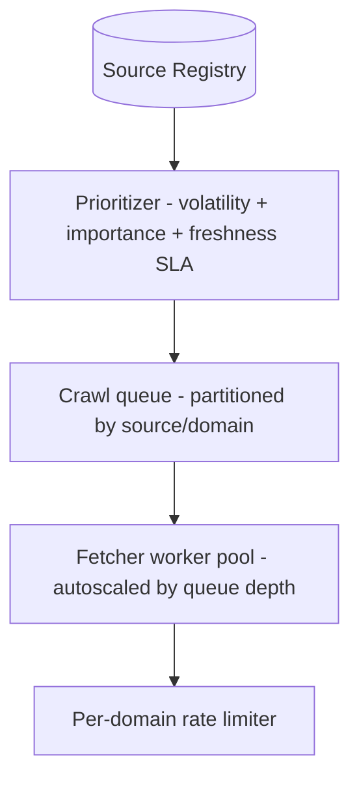
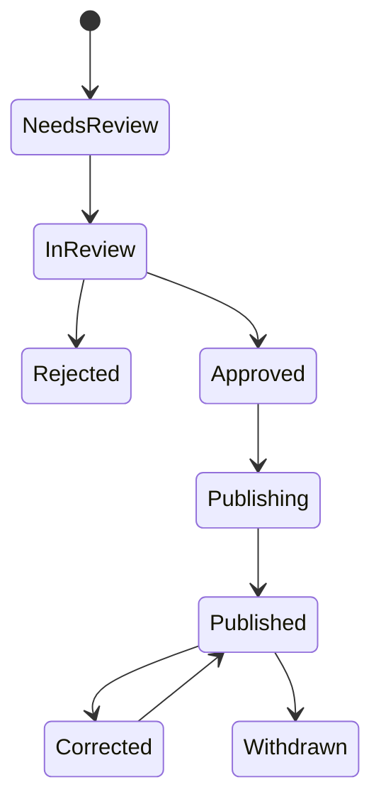

# CareerMitra — Crawler & Ingestion Architecture

| | |
|---|---|
| **Version** | 1.0 · **Status** | Approved · **Scope** | Architecture only |
| **Realizes** | PRD §25 (Ingestion), §26 (Source Registry & Health); Domain Crawler context |
| **Mandate** | 100,000+ government sources → verified, deduplicated, published data |

> The supply engine. Turns messy, fragmented official information into trustworthy canonical data
> behind an **Anti-Corruption Layer**, a human **verification gate**, and continuous **source-health**
> monitoring. Fully asynchronous, idempotent, observable, and legally governed.

---

## 1. End-to-end pipeline

```mermaid
flowchart LR
    REG[Source Registry] --> SCH[Scheduler]
    SCH --> FET[Fetchers - HTML / PDF / RSS / future API]
    FET --> LEGAL[Politeness: robots, rate, terms - ACL]
    LEGAL --> DEDUPc[Content dedup - checksum]
    DEDUPc --> EXT[Extraction - PDF/HTML parse]
    EXT --> OCR[OCR - scans/images]
    OCR --> AIP[AI parsing - normalize to canonical]
    AIP --> ER[Entity resolution + semantic dedup]
    ER --> HIST[Capture history/trends]
    HIST --> CONF[Confidence scoring]
    CONF --> TASK[ReviewTask]
    TASK --> GATE{Verification gate}
    GATE -->|approved| PUB[PublishingWorkflow]
    GATE -->|rejected| REJ[Rejected + reason]
    PUB --> EVT[OpportunityPublished -> Search, Alerts, History]
    FET --> HEALTH[Source Health signals]
```

## 2. Source Registry & Source Health (first-class)
- **Source Registry:** canonical `Source` records — owner, type, jurisdiction, official domain, crawl
  config, **legal status** (robots/terms), reliability score, mapped Organization.
- **Source Health:** per-source freshness, success/failure rates, and **drift detection** (format
  changes); failing sources are triaged with SLAs. Silent failure = a production incident.
- **Why first-class:** at 100k sources, "a crawler broke" must be monitored and actionable, not a
  footnote; **future:** predictive failure detection; auto-onboarding of structured official feeds.

## 3. Scheduling at 100k sources

- **Adaptive scheduling:** high-volatility/high-value sources crawled more often; per-domain rate
  limits respect politeness. *Why:* finite budget across 100k sources → prioritize; *trade-off:*
  scheduling complexity — encapsulated in the prioritizer; *future:* ML-driven crawl frequency.

## 4. Fetchers & content types
| Type | Handling |
|---|---|
| HTML | structured/DOM extraction; change-diff for corrigenda |
| PDF | text extraction; OCR fallback for scans |
| RSS/feeds | lightweight polling |
| Images/scans | OCR + layout (07) |
| Future APIs | direct structured ingestion (preferred when available) |
- All behind **fetcher adapters (ACL)** so a new source type/format is a new adapter, not a rewrite.

## 5. Politeness, legality & Anti-Corruption Layer
- Respect robots/terms/rate limits; correct attribution; official links preserved. External structure
  is translated into the canonical model at the boundary and **never leaks inward**.
- Egress via allow-listed proxy (04, `PROJECT_CONTEXT.md`). *Why:* legal + ethical ingestion protects
  the brand and the platform; *trade-off:* some sources are slow/limited — offset by prioritization.

## 6. Extraction → normalization → entity resolution
- Extraction yields raw text; **AI parsing** (07) normalizes to canonical fields (dates, vacancies,
  posts, eligibility, skills); **entity resolution + semantic dedup** map to canonical Organization/
  Exam and collapse duplicates to one Opportunity (data flow in 05 §4).
- **Confidence scoring** routes low-confidence/high-impact items to human review.

## 7. Review workflow & publishing (verification gate)

- Nothing publishes without an **approved ReviewTask** (reviewer ≠ author). Publishing indexes,
  captures history, and triggers Alerts. Corrections re-notify tracked aspirants; fraud/takedown →
  Withdrawn. (Administration context, PRD §27.)

## 8. Version history & provenance
- Every `Notification`, `RawDocument`, and change is retained with checksums → full **provenance**
  chain and **version history** (corrigenda diffing). *Why:* trust, audit, and corrigendum handling;
  *future:* public "change history" on Opportunities.

## 9. Reliability: retry, idempotency, backpressure
- **Idempotent** stages keyed by content checksum → safe re-runs, no duplicates.
- **Retries** with backoff; **DLQ** for poison items; **backpressure** via queues so source spikes
  don't overwhelm downstream (AI/review).
- **Bulkheads:** crawler workers isolated from app/AI pools (04).

## 10. Observability
Per-run metrics (found/new/failed), freshness dashboards, source-health alerts, and coverage-gap
reports by sector/state. Feeds Admin (PRD §26) and Analytics.

## 11. Scale & future
- Workers scale on queue depth; spot/preemptible compute with checkpointing for cost (04).
- **Future:** the Crawler context extracts to its own service **first** (16) — distinct scaling,
  bursty load, and fault-isolation make it the clearest early seam. Structured official APIs replace
  scraping where governments provide them.
