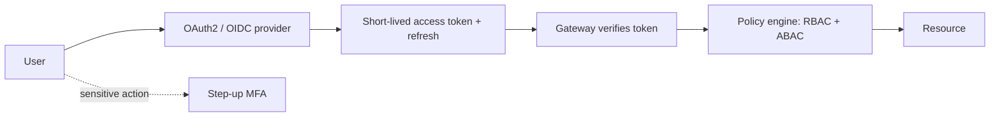
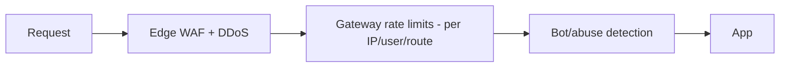
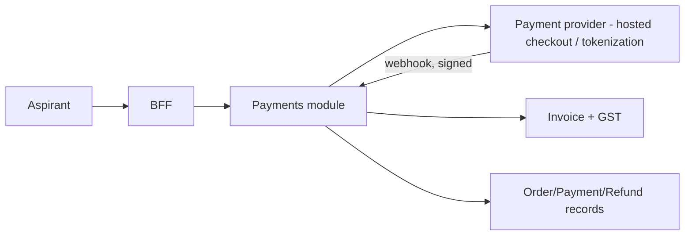

# CareerMitra — Security Architecture

| | |
|---|---|
| **Version** | 1.0 · **Status** | Approved · **Scope** | Architecture only |
| **Principles** | Zero Trust · Security & Privacy by Design · OWASP · Least Privilege |
| **Realizes** | PRD §33 (Security), §34 (Privacy/Consent/DPDP), §28 (Fraud/Trust & Safety) |

> Security is non-negotiable and pervasive. Citizen PII at national scale demands Zero Trust, strong
> identity, layered encryption, consent-first data use, and active abuse/fraud defense — all auditable.

---

## 1. Zero Trust posture
- No implicit trust by network location. **Every request and every internal hop is authenticated and
  authorized** (mTLS between pods, signed service identities). Least privilege everywhere.
- **Why:** a breach of one component must not grant lateral access; **trade-off:** more identity/cert
  management — automated (04, 10).

## 2. Identity & authentication

- **OAuth2/OIDC** for auth; **short-lived JWT** access tokens + rotating refresh; **MFA** and
  **step-up auth** for sensitive actions (Vault, Form Filling, payments, operator actions).
- Future **gov-SSO adapters** (e.g., DigiLocker-style identity) behind the same port.
- **Why:** standards-based, revocable, scalable; **trade-off:** token/session management complexity —
  handled centrally at the gateway (see Identity context, DOMAIN_MODEL §5.1).

## 3. Authorization — RBAC + ABAC
- **RBAC:** roles (aspirant, reviewer, admin, support, trust-safety, executive, finance) bundle
  permissions.
- **ABAC:** attribute rules refine access at runtime — e.g., an **Executive** may access **only** the
  ServiceRequest assigned to them, **only** while the assignment is active (scoped + time-boxed);
  reviewers can't publish records they authored (separation of duties).
- **Why both:** RBAC is coarse and manageable; ABAC expresses the fine, contextual rules the domain
  needs (consent, ownership, scope). **Trade-off:** policy complexity — centralized in a policy engine,
  tested, and audited.

## 4. Encryption & key management
| Layer | Control |
|---|---|
| In transit | TLS everywhere (edge + mTLS internal) |
| At rest | encrypted volumes/DB/object storage |
| Field-level | sensitive-PII (Vault documents, resume content, form data, category) encrypted at field level |
| Keys | managed KMS/HSM; rotation; separation of duties; envelope encryption |
- **Why field-level for sensitive-PII:** limits blast radius even if a store is compromised;
  **trade-off:** performance/complexity — applied only to the highest class.

## 5. Secrets management
Central secrets manager (KMS-backed); short-lived, rotated credentials; injected at runtime; **never**
in images, code, or git. Access is least-privilege and audited. `.env.example` is the only committed
contract (`PROJECT_RULES.md`).

## 6. Data protection, consent & DPDP (Privacy by Design)
- **Consent gate:** every sensitive-PII use checks an active, purpose-matching `ConsentRecord`
  (Identity context); minors get guardian-aware consent.
- **Data-subject rights:** access/correction/deletion/portability workflows with SLAs (Support §27).
- **Minimization & retention:** collect the minimum; purge per class (Vault/form data after service);
  **data residency** in India.
- **No plaintext PII/secrets in logs or events** (events carry ids only).
- **Why:** legal + trust requirement at national scale; **trade-off:** engineering discipline — made
  systematic via classification-driven handling (05 §6).

## 7. Audit logging
- **Tamper-evident, append-only** `AuditLog` of operator actions and every sensitive-PII access
  (`VaultAccessLog`), with actor, action, resource, purpose, consent ref, time.
- **Why:** compliance, forensics, and deterrence; **trade-off:** storage/volume — partitioned and
  retention-bounded (05).

## 8. Application security (OWASP)
Input validation at edge + domain; output encoding; authZ on every resource; CSRF/SSRF/XXE defenses;
dependency and container scanning; SAST/DAST in CI; secure headers; strict egress allow-listing.
Security Review required for Vault, Resume Parser, Form Filling, identity, and ingestion changes
(`PROJECT_RULES.md` R16).

## 9. Rate limiting & abuse prevention

- Tiered limits (per IP, per user, per route); stricter on auth, search, AI, and write endpoints;
  bot-detection and challenge on signup/abuse. **Why:** protect availability and cost (AI/SMS) from
  abuse and surges; **trade-off:** risk of false positives — tuned with allow-lists and observability.

## 10. Threat detection & Trust & Safety
- Runtime anomaly detection (auth spikes, scraping, credential stuffing); **fraud/abuse** as a
  first-class subsystem (PRD §28): fake-listing detection, executive-behavior anomalies, document
  tampering flags, impersonation/phishing monitoring. Reports feed Trust & Safety with SLAs.
- **Why:** government-job scams are endemic; the platform will be targeted; **future:** ML fraud
  scoring (governed).

## 11. Payments security architecture (realizes PRD §30)

- **No card data touches CareerMitra** — hosted checkout/tokenization at a PCI-compliant provider.
  We store only tokens/references, `Order/Payment/Invoice/Refund` records, and **GST** details.
- **Products modeled:** recurring **Premium** subscriptions (`PremiumPlan` → `Subscription`) and
  **one-time services** (assisted **Form Filling**, **Resume Review**) as `Order`s. Premium adds
  convenience/insight and **never gates access to verified public data** (PRD §30).
- **Webhooks** are signature-verified; payments reconciled asynchronously; **refunds** (service
  failure) and **coupons** modeled as first-class; **separation of duties** (refund requester ≠
  approver). **Why:** minimizes PCI scope and risk; **trade-off:** provider dependency — abstracted
  behind the `PaymentProviderPort` ACL; **future:** UPI/wallets, additional providers, B2B invoicing.

## 12. Professional Services access control (Form Filling)
- **Executive access is least-privilege, scoped to one ServiceRequest, and time-boxed**; auto-revoked
  on completion; every action audited; behavior anomaly-monitored. **Never** stores external portal
  credentials; **never** auto-submits (explicit consent recorded). Realizes PRD §21 + DOMAIN §5.9.

## 13. Compliance & governance
DPDP-aligned processing; vendor/AI processors bound to the same privacy terms; documented breach
response (detect/contain/notify/postmortem); periodic security review and red-teaming; audit trails
for regulators/grievance. **Future:** formal certifications (e.g., ISO 27001, SOC 2) as the company
scales.
