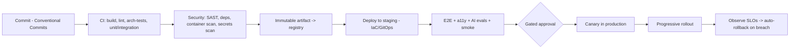
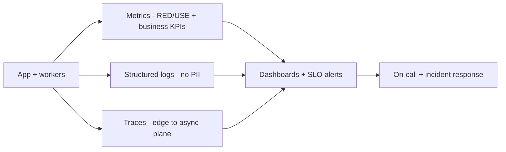
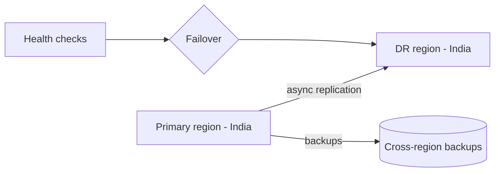

# CareerMitra — Deployment Architecture (CI/CD, DR, Operations)

| | |
|---|---|
| **Version** | 1.0 · **Status** | Approved · **Scope** | Architecture only |
| **Principles** | GitOps · IaC · Progressive delivery · Observability-First · 12-Factor |

> How CareerMitra is built, shipped, observed, and recovered. Covers CI/CD, versioning, environments,
> feature flags, monitoring/logging, backup, disaster recovery, and business continuity.

---

## 1. CI/CD pipeline

- **Architecture tests** enforce module boundaries and the dependency rule (03); **AI evals** gate
  AI changes (07). **Why:** safety-critical rules and grounded AI must be protected on every change;
  **trade-off:** slower pipeline — worth it for a decade-long, trust-critical product.

## 2. Progressive delivery
- **Canary → progressive rollout**, with **auto-rollback** on SLO breach; **blue-green** for risky
  releases. **Why:** limits blast radius; **trade-off:** rollout tooling complexity — standardized via
  GitOps. **Future:** per-context canaries once services are extracted (16).

## 3. Versioning strategy
| Artifact | Scheme |
|---|---|
| Services/app | **SemVer** + immutable image digests |
| APIs (future public) | versioned contracts; backward-compatible by default; deprecation policy |
| Events | versioned schemas; additive changes; consumers tolerant |
| Database | forward-only, reviewed migrations; expand-then-contract for zero-downtime |
| Docs/ADRs | versioned; changes via PR |
- **Why:** predictable evolution and safe rollbacks; **trade-off:** migration discipline (expand/
  contract) — required for zero-downtime at scale.

## 4. Environments & IaC
- `dev → staging → production` with strict parity (04). **All infra is code**; **GitOps** reconciles
  cluster state; no manual console changes. DR environment reproducible from IaC.

## 5. Configuration & feature flags
- Config via environment + a config service (typed, validated at boot).
- **Feature flags** gate rollouts and experiments (kill-switches, cohort targeting), integrated with
  A/B (Analytics). **Why:** decouple deploy from release; safe experimentation; **trade-off:** flag
  hygiene (must expire) — governed via review.

## 6. Observability (operations view)

- **Metrics:** latency/error/throughput per surface + freshness, dedup precision, AI grounding rate,
  **cost per active user**. **Logs:** structured, correlation-id, **no PII/secrets**. **Traces:** end
  to end, including async ingestion/AI/alert paths.
- **Why observability-first:** you can't operate 100M users blind; **trade-off:** telemetry cost —
  sampled and tiered.

## 7. Incident management & on-call
Severity model, on-call rotation, runbooks (in `docs/11_Runbooks`, authored before production launch —
sprint S091+) for source outage, pipeline stall, search outage, alert backlog, payment provider outage;
blameless postmortems feed improvements (PRD §27 incident workflow).

## 8. Backup strategy
| Data | Backup |
|---|---|
| PostgreSQL | automated backups + **point-in-time recovery**; cross-AZ, encrypted |
| Object storage | versioning + cross-region replication |
| Search/vector/read models | **rebuildable from events** (backup source-of-truth only) |
| Config/IaC | in git |
- **Restore-tested on a schedule** — an untested backup is assumed broken. **Why:** recoverability is
  the point of backups; **trade-off:** drill effort — mandatory.

## 9. Disaster Recovery (DR)

- **RTO/RPO by data class:** money/identity tightest (low RPO), rebuildable read models loosest.
  Documented failover; **periodic DR drills**; IaC enables clean-region rebuild.
- **Why:** national-scale service must survive a region/AZ failure; **trade-off:** DR cost (warm
  standby) — sized to RTO/RPO targets. **Future:** active-active multi-region as traffic grows.

## 10. Business Continuity (BC)
- **Graceful degradation** over outage: if AI/search degrade → deterministic results + "see official
  source"; if alerts back up → digest + prioritize; read-only mode preserves discovery during partial
  outages. Communication plan and grievance channel remain available.
- **Why:** aspirants depend on time-critical dates (result day) — the product must degrade, not die.

## 11. Change management & audit
Conventional Commits + PR review; security review for sensitive areas (09); every production change
traceable (who/what/when) via GitOps + AuditLog. Architectural changes recorded as ADRs (14,
`docs/10_ADR`).
