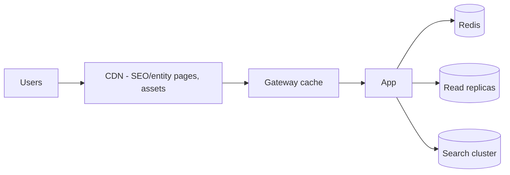
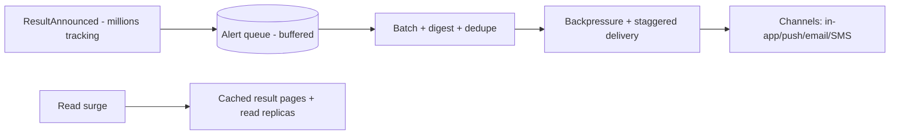
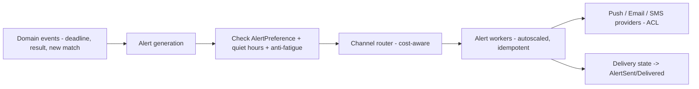
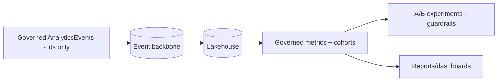

# CareerMitra — Scalability Strategy

| | |
|---|---|
| **Version** | 1.0 · **Status** | Approved · **Scope** | Architecture only |
| **Targets** | 100M users · 5M DAU · 100k+ sources · surge-resilient · cost-controlled |

> How the architecture scales to national volume and survives its hardest day (results day), while
> keeping cost per active user in budget. Includes the Notification/Alert and Analytics sub-systems
> whose defining challenge is scale.

---

## 1. Scaling philosophy
**Scale what's hot, keep the rest simple (YAGNI).** Stateless app tier scales horizontally; heavy or
bursty work is asynchronous; read-heavy paths use caches and CQRS read models; add partitioning/
sharding only when metrics demand it, not preemptively.

## 2. Horizontal scaling & statelessness
- App pods are **stateless** (12-factor) → scale on CPU/latency; sessions/counters in Redis.
- Worker pools scale on **queue depth** (crawler, AI, OCR, alerts, indexer) — independently and
  bulkheaded (04). **Why:** independent scaling matches each workload's profile; **trade-off:**
  more pools to manage — offset by autoscaling + GitOps.

## 3. Read-path scaling (the 5M DAU reality)

- Layered caching (CDN → gateway → Redis), **read replicas**, and CQRS read models (search, tracker,
  dashboards, trends) keep the primary DB off the hot path. Public SEO/entity pages served largely
  from CDN. **Why:** most traffic is reads; cache-first slashes cost and latency.

## 4. Write-path & async scaling
Writes persist to an aggregate then **propagate asynchronously** via the event backbone (fan-out to
search, alerts, history). Backbone is partitioned (ordered per key) and consumers scale as consumer
groups. **Why:** decouples user-facing latency from downstream work; **trade-off:** eventual
consistency — bounded to seconds and acceptable for discovery.

## 5. Surge resilience — results day (the hardest day)

- **Absorb, don't amplify:** buffer alerts, digest and stagger delivery, apply backpressure; serve
  result pages from cache/replicas; **load-shed** non-critical work. **Why:** result day is peak love
  and peak risk — it must never cause an outage or a cost spike; **trade-off:** slight alert delay
  under extreme load — acceptable vs failure.

## 6. Notification / Alert architecture at scale

- **Cost-aware routing** (SMS reserved for high-value time-critical alerts), **anti-fatigue** caps,
  **idempotent** delivery (at-least-once), and surge batching. **Why:** alerts are the retention
  engine but also the biggest variable cost and spam risk; **future:** new channels (e.g., WhatsApp)
  as adapters; predictive/priority delivery.

## 7. Analytics & experimentation at scale

- High-volume events flow async to the lakehouse (never on the user's critical path); one governed
  definition per metric; experiments gate ranking/alert/growth changes. **Why:** you can't run
  ranking/growth blind; **trade-off:** analytics infra cost — minimized/anonymized + sampled.

## 8. Data scaling
Read replicas; **time-partitioning** for append-heavy data (alerts log, analytics events, crawl
artefacts, history); search/vector sharding; object-storage tiering. **Shard OLTP only when measured
to need it** (per-tenant/region). Detail in 05.

## 9. AI cost & scaling
Model gateway budgets + caching (embeddings, groundings); async job workers for heavy tasks; batch
embedding; selective self-hosting for high-volume tasks later. Cost per active user is an SLO (07, 10).

## 10. Capacity planning & SLOs
- **SLOs:** availability ≥ 99.9% reads; p95 cached detail < 300 ms; ingestion freshness targets;
  alert delivery latency (non-surge); **cost per active user** budget.
- Load/soak/spike testing before peak seasons; headroom targets; autoscaling limits sized to
  forecasts. **Why:** measured capacity beats hope; **trade-off:** testing effort — scheduled around
  exam calendars.

## 11. Multi-region path (future)
Start single-region (India) multi-AZ → add a warm DR region → active-active multi-region for latency
and resilience as usage grows, with regional data partitioning for residency. Sequenced with the
microservice extraction (16). **Why staged:** avoid multi-region complexity/cost before it's needed.
