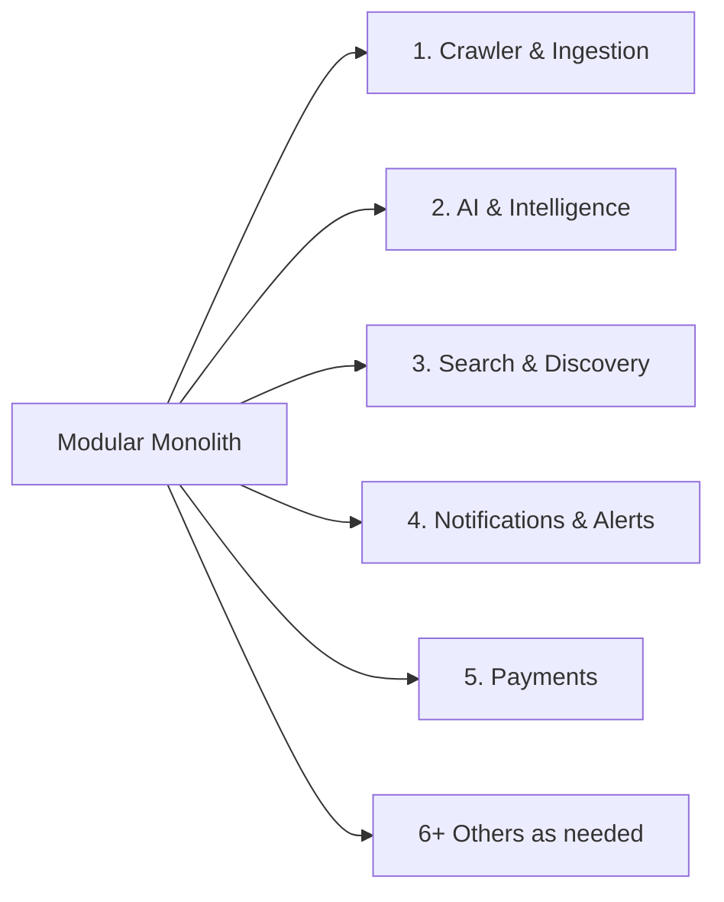
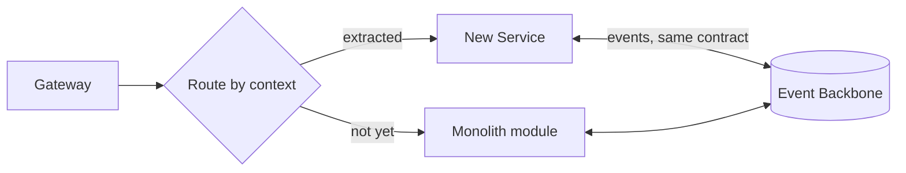
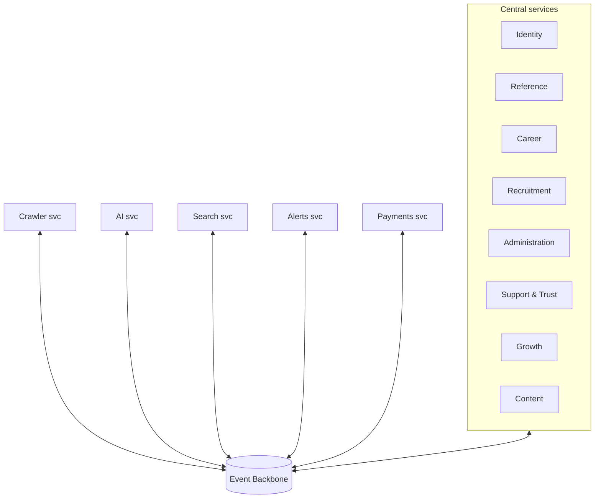

# CareerMitra — Future Microservices Extraction Plan

| | |
|---|---|
| **Version** | 1.0 · **Status** | Approved (roadmap) · **Scope** | Architecture only |
| **Premise** | The Modular Monolith (ADR-0001) is built so contexts extract along existing seams. |

> This is the deliberate path from a modular monolith to microservices — **only when metrics justify
> it**, never as a fashion. Because contexts already integrate via events + canonical ids (Published
> Language) and are isolated (Clean/Hexagonal), extraction moves code, not concepts.

---

## 1. Guiding principle: extract on evidence, not aspiration
Extract a context to its own service **only** when one of these is true:
- it needs **independent scaling** (different load/compute profile),
- it needs **fault isolation** (its failures shouldn't affect others),
- it has a distinct **cost profile** worth isolating (e.g., GPU),
- a **dedicated team** needs autonomous deploy cadence.
Until then, the module stays in the monolith (KISS/YAGNI). Premature extraction adds network,
distributed-transaction, and operational cost for no benefit.

## 2. Extraction order (and why)

| Order | Context | Why first/early |
|---|---|---|
| 1 | **Crawler & Ingestion** | bursty 100k-source load, fault-isolation, spot compute; noisiest workload (ADR-0015) |
| 2 | **AI & Intelligence** | GPU/cost profile, independent scaling, Python runtime, distinct evals/release |
| 3 | **Search & Discovery** | read-heavy, scales differently, already a rebuildable read model |
| 4 | **Notifications & Alerts** | surge fan-out, provider integration, ret/backpressure profile |
| 5 | **Payments** | compliance isolation, independent uptime/audit needs |
| 6+ | Professional Services, Analytics, others | extract when team/scale demands |
Reference (shared kernel), Identity, and Career stay central longest (widely shared, transactional).

## 3. The strangler pattern (how, safely)

- Stand up the new service **beside** the monolith; move traffic incrementally behind the gateway;
  the **event contract is unchanged** (already the integration mechanism). Roll back by routing back.
- **Why:** zero big-bang risk; **trade-off:** a transition period of dual-running — bounded and
  observable.

## 4. Data decomposition
- Each extracted context takes its **own datastore** (its data was already private, no cross-context
  joins — 05). Read models it consumes are rebuilt from events in the new service.
- Shared **Reference** data is accessed via its published events/contract (or a thin reference service),
  never by reaching into another service's DB.
- **Why:** independent data ownership is what makes services truly independent; **trade-off:**
  reference-data access indirection — acceptable and cache-friendly.

## 5. Integration contract (already in place)
- **Events** (past-tense, versioned, ids-only) on the durable backbone — the same contract used
  in-process today (03, 05). **Sync** calls between services are minimized and go through explicit
  ports/ACLs; prefer choreography (events) over orchestration where possible.
- Versioned event schemas + tolerant consumers enable independent deploys.

## 6. Cross-cutting concerns after extraction
| Concern | Approach |
|---|---|
| Identity/authZ | central IdP + per-service policy (Zero Trust, mTLS) |
| Observability | distributed tracing already end-to-end (10) |
| Config/secrets | same managed stores; per-service scoping |
| Deployment | per-service pipelines + canaries (10) |
| Data consistency | sagas/process managers already model cross-context flows (03) |

## 7. Triggers & metrics (when to pull the trigger)
Extract when, sustained over time: a context's scaling needs diverge sharply from the monolith
(CPU/GPU/queue), its incidents affect unrelated features, its cost warrants isolation, or its team
needs independent cadence. These map to existing SLOs/dashboards (10/11) — the decision is
data-driven and recorded as an ADR.

## 8. Anti-patterns to avoid
- **Distributed monolith:** services that must deploy together / call each other synchronously in
  chains → keep boundaries event-first.
- **Shared database across services** → forbidden (breaks independence).
- **Extracting Reference/Identity too early** → they're widely shared; keep central until a clear need.
- **Nano-services** → don't split below a bounded context; the context *is* the unit.
- **Premature extraction** → violates YAGNI; wait for evidence.

## 9. End state (illustrative, 10-year horizon)

- A small set of independently-scaled services around a still-cohesive core — **not** 16 services for
  their own sake. The architecture earns each split. **Why this restraint:** operational simplicity is
  a feature; complexity is added only where it buys scaling, isolation, or autonomy.
