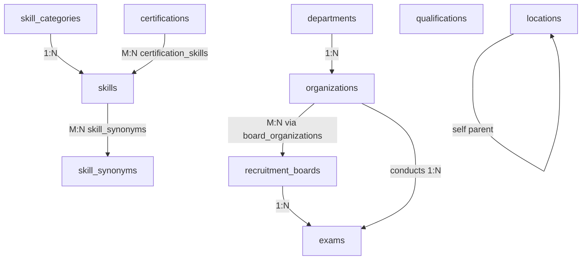

# CareerMitra — `reference` Schema (Shared Kernel)

| | |
|---|---|
| **Postgres schema** | `reference` · **Context** | 2 · Reference & Canonical (Domain Model §5.2) |
| **Version** | 1.0 · **Status** | Approved · **Role** | Shared kernel — the only schema other contexts reference by id |
| **Assumes** | `01_SCHEMA_OVERVIEW.md` conventions (ids, standard columns, enums, no cross-context FK) |

> Canonical identities every context agrees on: Organization, Department, RecruitmentBoard, Exam, Skill,
> SkillCategory, Qualification, Certification, Location. Everything else references these by id (never free
> text) — the root of dedup, entity resolution, trends, profiles, and analytics (Domain Model §1.2 tenet 1).
> **This schema is small and governed by design** — it must not bloat (Domain Model §12.2).

---

## 1. ER overview

All tables here are `public`-class (publishable, cacheable, indexable) — canonical reference data, no PII.
User-visibility still requires `status` in a verified/active state.

## 2. Shared enums (schema `reference`)

| Enum type | Values (from Domain Model lifecycles) |
|---|---|
| `reference.entity_status` | `draft`, `verified`, `active`, `merged`, `archived` |
| `reference.taxonomy_status` | `proposed`, `approved`, `active`, `deprecated`, `merged` |
| `reference.jurisdiction` | `central`, `state`, `psu`, `autonomous`, `judiciary`, `international` |
| `reference.location_type` | `country`, `state`, `division`, `district`, `city` |
| `reference.qualification_level` | `secondary`, `senior_secondary`, `diploma`, `graduate`, `post_graduate`, `doctorate`, `professional` |

## 3. Tables

### 3.1 `reference.departments` — *Department / Ministry / GovernmentBody* (Domain Model §5.2)
| Column | Type | Null | Class | Notes |
|---|---|---|---|---|
| `id` | uuid | no | public | PK (UUIDv7) |
| `name` | text | no | public | Canonical department/ministry name |
| `level` | reference.jurisdiction | no | public | `central`/`state` primarily |
| `jurisdiction_location_id` | uuid | yes | public | FK → `locations` (state for state depts) |
| `status` | reference.entity_status | no | public | default `draft` |
| `version`, `created_at`, `updated_at`, `deleted_at` | — | — | — | standard (Overview §3) |

**Keys/constraints:** `ux_departments_name_level` unique (`name`,`level`). **FK (same-schema):**
`fk_departments_location`. **Powers:** Department Profile & analytics.

### 3.2 `reference.organizations` — *Organization (aggregate root)*
| Column | Type | Null | Class | Notes |
|---|---|---|---|---|
| `id` | uuid | no | public | PK |
| `canonical_name` | text | no | public | e.g., "Staff Selection Commission" |
| `short_name` | text | yes | public | e.g., "SSC" |
| `slug` | text | no | public | SEO URL key; unique |
| `org_type` | text | no | public | commission/board/bank/psu/university/court/defence/research (lookup-governed) |
| `department_id` | uuid | yes | public | **FK → `departments`** (same schema) |
| `jurisdiction` | reference.jurisdiction | no | public | central/state/psu/… |
| `official_domains` | text[] | no | public | verified domains — provenance validation for sources/links |
| `description` | text | yes | public | |
| `logo_ref` | text | yes | public | object-storage reference (public asset) |
| `merged_into_id` | uuid | yes | public | self-ref; set when `status='merged'` (redirect references) |
| `status` | reference.entity_status | no | public | only `verified`/`active` are user-visible |
| `version`, `created_at`, `updated_at`, `deleted_at` | — | — | — | standard |

**Keys/constraints:** `ux_organizations_canonical_name`, `ux_organizations_slug`;
`ck_organizations_merged_requires_target` (`status='merged'` ⇒ `merged_into_id` not null).
**Indexes:** `ix_organizations_department_id`, `ix_organizations_status`.
**Aliases:** see `organization_aliases` (§3.3) — aliases resolve to one org (dedup, Domain Model §5.2).

### 3.3 `reference.organization_aliases` — alias resolution
| Column | Type | Null | Class | Notes |
|---|---|---|---|---|
| `id` | uuid | no | public | PK |
| `organization_id` | uuid | no | public | **FK → `organizations`** |
| `alias` | text | no | public | alternate name/spelling seen in sources |
| `created_at` | timestamptz | no | public | append-context; no `updated_at` |

**Constraint:** `ux_organization_aliases_alias` unique (`alias`) — an alias maps to exactly one org.

### 3.4 `reference.recruitment_boards` — *RecruitmentBoard*
| Column | Type | Null | Class | Notes |
|---|---|---|---|---|
| `id` | uuid | no | public | PK |
| `canonical_name` | text | no | public | e.g., a Staff Selection body, an RRB |
| `slug` | text | no | public | unique |
| `scope` | text | yes | public | national/zonal/state scope description |
| `status` | reference.entity_status | no | public | |
| `version`, `created_at`, `updated_at`, `deleted_at` | — | — | — | standard |

**M:N with organizations** via `reference.board_organizations` (`board_id` FK, `organization_id` FK,
PK both) — a board conducts recruitment for one or more organizations.

### 3.5 `reference.exams` — *Exam (aggregate root)*
| Column | Type | Null | Class | Notes |
|---|---|---|---|---|
| `id` | uuid | no | public | PK |
| `canonical_name` | text | no | public | e.g., "SSC CGL" |
| `slug` | text | no | public | unique; SEO (Exam Profiles are the most-searched pages, PRD §8) |
| `board_id` | uuid | yes | public | **FK → `recruitment_boards`** |
| `conducting_organization_id` | uuid | yes | public | **FK → `organizations`** |
| `pattern_summary` | text | yes | public | high-level pattern |
| `stages` | text[] | no | public | controlled-vocabulary stage names (prelims/mains/interview/…) |
| `recurrence` | text | yes | public | annual/biannual/as-notified |
| `status` | reference.entity_status | no | public | |
| `version`, `created_at`, `updated_at`, `deleted_at` | — | — | — | standard |

**Keys:** `ux_exams_canonical_name`, `ux_exams_slug`. **Anchor:** cross-year Results/AdmitCards/
AnswerKeys/Cutoffs and Exam Profile link to `exam_id` (in `recruitment`, by canonical id — no cross-context FK).
**Aliases:** `reference.exam_aliases` (same shape as `organization_aliases`).

### 3.6 `reference.skill_categories` — *SkillCategory*
| Column | Type | Null | Class | Notes |
|---|---|---|---|---|
| `id` | uuid | no | public | PK |
| `name` | text | no | public | e.g., "Cyber Security" |
| `parent_category_id` | uuid | yes | public | self-FK (shallow curated hierarchy) |
| `status` | reference.taxonomy_status | no | public | `active`/`deprecated` |
| `created_at`, `updated_at` | — | — | — | standard |

**Constraint:** `ux_skill_categories_name` unique.

### 3.7 `reference.skills` — *Skill (taxonomy node)*
| Column | Type | Null | Class | Notes |
|---|---|---|---|---|
| `id` | uuid | no | public | PK |
| `canonical_name` | text | no | public | e.g., "Splunk", "Python" |
| `slug` | text | no | public | unique; powers Skill Profile |
| `category_id` | uuid | no | public | **FK → `skill_categories`** |
| `description` | text | yes | public | |
| `demand_signal` | numeric(6,3) | yes | internal | governed demand indicator (recomputed) |
| `taxonomy_version` | integer | no | public | the versioned taxonomy this node belongs to |
| `status` | reference.taxonomy_status | no | public | `proposed→approved→active→deprecated→merged` |
| `merged_into_id` | uuid | yes | public | self-ref on merge |
| `version`, `created_at`, `updated_at`, `deleted_at` | — | — | — | standard |

**Keys:** `ux_skills_canonical_name`, `ux_skills_slug`. **Synonyms:** `reference.skill_synonyms`
(`skill_id` FK, `synonym` text, `ux_skill_synonyms_synonym` unique) — aspirant-entered and
ingestion-extracted skills resolve to one canonical node (Domain Model §5.2; PRD §12.1).
**Related skills** (M:N self): `reference.skill_relations` (`skill_id`, `related_skill_id`, `relation_type`).

### 3.8 `reference.qualifications` — *Qualification (canonical)*
| Column | Type | Null | Class | Notes |
|---|---|---|---|---|
| `id` | uuid | no | public | PK |
| `canonical_name` | text | no | public | e.g., "B.Tech", "GATE", "NET" |
| `slug` | text | no | public | unique; powers Qualification Profile |
| `level` | reference.qualification_level | no | public | controlled vocabulary |
| `status` | reference.taxonomy_status | no | public | |
| `version`, `created_at`, `updated_at`, `deleted_at` | — | — | — | standard |

**Keys:** `ux_qualifications_canonical_name`, `ux_qualifications_slug`. **Equivalences** (M:N self):
`reference.qualification_equivalences` (`qualification_id`, `equivalent_qualification_id`) — governed.
Aliases via `reference.qualification_aliases`.

### 3.9 `reference.certifications` — *Certification (canonical)*
| Column | Type | Null | Class | Notes |
|---|---|---|---|---|
| `id` | uuid | no | public | PK |
| `name` | text | no | public | e.g., "CEH", "Security+" |
| `issuer` | text | no | public | governing/issuing body |
| `slug` | text | no | public | unique |
| `validity_months` | integer | yes | public | 0/null = no expiry |
| `cost_band` | text | yes | public | coarse cost bucket (no live pricing) |
| `status` | reference.taxonomy_status | no | public | |
| `version`, `created_at`, `updated_at`, `deleted_at` | — | — | — | standard |

**Keys:** `ux_certifications_issuer_name` unique (`issuer`,`name`). **M:N Skill** via
`reference.certification_skills` (`certification_id` FK, `skill_id` FK) — powers gap-closing recommendations.

### 3.10 `reference.locations` — *Location*
| Column | Type | Null | Class | Notes |
|---|---|---|---|---|
| `id` | uuid | no | public | PK |
| `name` | text | no | public | |
| `location_type` | reference.location_type | no | public | country/state/division/district/city |
| `parent_id` | uuid | yes | public | self-FK (hierarchy) |
| `code` | text | yes | public | stable official code (e.g., LGD/census) |
| `status` | reference.entity_status | no | public | `active`/`deprecated` (uses entity_status subset) |
| `created_at`, `updated_at`, `deleted_at` | — | — | — | standard |

**Constraint:** `ux_locations_parent_name` unique (`parent_id`,`name`); `ix_locations_type`.
Used for domicile eligibility and filters (referenced by Opportunity/Profile/Organization via canonical id).

## 4. Cross-context consumers (references IN, never FKs OUT)
`reference` **never** references another context. It is referenced by canonical id from:
`recruitment` (organization/board/exam/qualification/skill/location/scheme-eligibility),
`career` (profile skills/qualifications/preferences), `ai` (resolution & recommendations),
`search` (facets), `crawler` (source→organization mapping), `content` (SEO/entity pages).

## 5. Governance rules realized here
- **Canonical over free text** (Domain Model §7 rule 3) — enforced by unique canonical names + alias/synonym
  resolution tables; ingestion must resolve to an id, never store a raw string on the Opportunity.
- **Merges preserve history** — `merged_into_id` redirects references; rows are never hard-deleted, only
  `merged`/`archived` (Domain Model §5.2).
- **Small & governed kernel** — new canonical entity types are added deliberately with an owner and an ADR,
  not ad hoc (Domain Model §12.2). Adding a *value* (a new organization) is data; adding a *table* is a decision.
