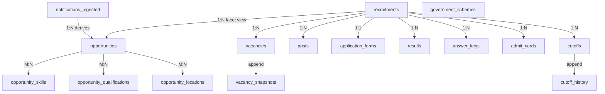

# CareerMitra — `recruitment` Schema (Core)

| | |
|---|---|
| **Postgres schema** | `recruitment` · **Context** | 3 · Recruitment (Domain Model §5.3) |
| **Version** | 1.0 · **Status** | Approved · **Role** | The verified, user-facing core: opportunities, records, cutoffs, forms, schemes |
| **Assumes** | `01_SCHEMA_OVERVIEW.md`; references `reference` canonical ids (no cross-context FK) |

> This is where the trust promise becomes schema: **provenance columns** (§Overview 7), the
> **verification gate** (nothing user-visible without approval), and **history capture from day one**
> (§Overview 8). Opportunity is the atomic user-facing unit — all category "modules" are *facets* of it,
> not separate tables (Domain Model §5.3, PRD §9).

---

## 1. ER overview

## 2. Enums (schema `recruitment`)

| Enum type | Values (Domain Model lifecycles §5.3 / §10) |
|---|---|
| `recruitment.recruitment_status` | `draft`, `in_review`, `published`, `closing_soon`, `closed`, `postponed`, `result`, `archived`, `withdrawn` |
| `recruitment.opportunity_type` | `job`, `scholarship`, `fellowship`, `internship`, `apprenticeship` |
| `recruitment.sector` | `central`, `state`, `psu`, `university`, `judiciary`, `railway`, `banking`, `defence`, `research`, `autonomous`, `international` |
| `recruitment.employment_type` | `permanent`, `contract`, `temporary`, `apprenticeship`, `internship`, `fellowship` |
| `recruitment.record_status` | `announced`, `provisional`, `available`, `final`, `revised`, `published`, `expired`, `archived` |
| `recruitment.calendar_event_type` | `open`, `close`, `admit_card`, `exam`, `answer_key`, `objection`, `result` |
| `recruitment.date_confidence` | `provisional`, `confirmed` |

Governed lookups (ops-extendable): `recruitment.reservation_categories` (UR/OBC/SC/ST/EWS/PwD/ESM/…),
`recruitment.pay_levels`.

## 3. Provenance & verification (applies to every published table)
Per Overview §7, these columns appear on `recruitments`, `opportunities`, `results`, `answer_keys`,
`admit_cards`, `cutoffs`, `government_schemes`:

| Column | Type | Null | Class | Notes |
|---|---|---|---|---|
| `source_id` | uuid | no | public | canonical id → `crawler.sources` (no FK) |
| `notification_id` | uuid | no | public | **FK → `recruitment.notifications_ingested`** (same schema) |
| `verified_at` | timestamptz | yes | internal | set when the verification gate approves |
| `verified_by` | uuid | yes | internal | operator id → `identity` (no FK) |
| `published_at` | timestamptz | yes | public | set on publish |

**Invariant (R11):** a row is user-visible **only** when `verified_at IS NOT NULL` and `status` is a
published state. Read models/APIs filter on this. Displaying a row without it is a severity-1 defect.

## 4. Tables

### 4.1 `recruitment.notifications_ingested` — *Notification (provenance anchor)*
> Named `notifications_ingested` to avoid any ambiguity with outbound `Alert`s (Ubiquitous Language §4.1).
| Column | Type | Null | Class | Notes |
|---|---|---|---|---|
| `id` | uuid | no | internal | PK |
| `source_id` | uuid | no | internal | canonical id → `crawler.sources` (no FK) |
| `raw_reference` | text | no | internal | source URL / doc reference |
| `checksum` | text | no | internal | content checksum (first-line dedup) |
| `extracted_text_ref` | text | yes | internal | object-storage ref to extracted text |
| `parse_status` | text | no | internal | fetched/parsed/resolved/linked/archived |
| `confidence` | numeric(5,4) | yes | internal | resolution confidence |
| `fetched_at` | timestamptz | no | internal | |
| `created_at` | timestamptz | no | internal | append-only provenance; **no `updated_at`/soft delete** |

**Immutable provenance record; never user-facing.** One notification may yield ≥1 opportunity after
resolution. **Constraint:** `ux_notifications_source_checksum` unique (`source_id`,`checksum`).

### 4.2 `recruitment.recruitments` — *Recruitment (aggregate root)*
| Column | Type | Null | Class | Notes |
|---|---|---|---|---|
| `id` | uuid | no | public | PK |
| `title` | text | no | public | e.g., "SSC CGL 2026" |
| `organization_id` | uuid | no | public | canonical id → `reference.organizations` (no FK) |
| `board_id` | uuid | yes | public | canonical id → `reference.recruitment_boards` |
| `exam_id` | uuid | yes | public | canonical id → `reference.exams` |
| `sector` | recruitment.sector | no | public | |
| `open_date` | date | yes | public | |
| `close_date` | date | yes | public | |
| `exam_date` | date | yes | public | |
| `result_date` | date | yes | public | |
| `vacancy_total` | integer | yes | public | ≥ sum of `vacancies.count` |
| `status` | recruitment.recruitment_status | no | public | full lifecycle (§10 of Domain Model) |
| *provenance/verification cols* | — | — | — | §3 |
| `version`, `created_at`, `updated_at`, `deleted_at` | — | — | — | standard |

**Constraints:** `ck_recruitments_date_coherence` (`open_date ≤ close_date ≤ exam_date ≤ result_date`,
nulls allowed — Domain Model §7 rule 15); `ck_recruitments_vacancy_nonneg`. **Indexes:**
`ix_recruitments_org_status`, `ix_recruitments_close_date`.

### 4.3 `recruitment.opportunities` — *Opportunity (atomic user-facing unit; facet-typed)*
| Column | Type | Null | Class | Notes |
|---|---|---|---|---|
| `id` | uuid | no | public | PK |
| `recruitment_id` | uuid | no | public | **FK → `recruitments`** |
| `slug` | text | no | public | SEO URL key; unique |
| `title` | text | no | public | |
| `opportunity_type` | recruitment.opportunity_type | no | public | facet |
| `sector` | recruitment.sector | no | public | facet (denormalized from recruitment for search) |
| `employment_type` | recruitment.employment_type | no | public | facet |
| `level` | text | yes | public | entry/junior/officer/senior/specialist (lookup) |
| `eligibility_summary` | text | yes | public | human-readable summary (rules live on `posts`) |
| `pay_level_id` | uuid | yes | public | → `recruitment.pay_levels` (same schema) |
| `min_age` / `max_age` | integer | yes | public | base age window (relaxations computed by Eligibility) |
| `application_url` | text | yes | public | official link (from verified org domain) |
| `category_fields` | jsonb | yes | public | category-specific fields (GATE req, zone, medical std…) per PRD §9.2 |
| `status` | recruitment.recruitment_status | no | public | mirrors recruitment |
| *provenance/verification cols* | — | — | — | §3 |
| `version`, `created_at`, `updated_at`, `deleted_at` | — | — | — | standard |

**Constraints:** `ux_opportunities_slug`; `ix_opportunities_status_close`, `ix_opportunities_type_sector`.
**Semantic dedup:** entity resolution (Crawler/AI) ensures one opportunity per real recruitment before
insert; the resolution decision is recorded in `crawler` (AIParsingJob), not here. **Facets are columns/
values, not tables** — a new category is a new facet value, never a new codebase (Domain Model §12.1).

**Association tables (M:N; same-schema FK to `opportunities`, canonical id to `reference`):**
- `recruitment.opportunity_skills` (`opportunity_id` FK, `skill_id` canonical id, `criticality` = must/nice).
- `recruitment.opportunity_qualifications` (`opportunity_id` FK, `qualification_id` canonical id, `is_minimum`).
- `recruitment.opportunity_locations` (`opportunity_id` FK, `location_id` canonical id, `role` = posting/domicile).

### 4.4 `recruitment.posts` — *Post*
| Column | Type | Null | Class | Notes |
|---|---|---|---|---|
| `id` | uuid | no | public | PK |
| `recruitment_id` | uuid | no | public | **FK → `recruitments`** |
| `name` | text | no | public | e.g., "Assistant Section Officer" |
| `pay_level_id` | uuid | yes | public | → `pay_levels` |
| `min_age` / `max_age` | integer | yes | public | |
| `job_description` | text | yes | public | |
| `eligibility_rules` | jsonb | yes | public | structured, machine-evaluable rule set (Eligibility Engine input) |
| `created_at`, `updated_at`, `deleted_at` | — | — | — | standard |

Eligibility rules attach at **post** level. Post↔Skill/Qualification via `recruitment.post_skills` /
`recruitment.post_qualifications` (same pattern as opportunity associations).

### 4.5 `recruitment.vacancies` — *Vacancy*
| Column | Type | Null | Class | Notes |
|---|---|---|---|---|
| `id` | uuid | no | public | PK |
| `recruitment_id` | uuid | no | public | **FK → `recruitments`** |
| `post_id` | uuid | yes | public | **FK → `posts`** |
| `reservation_category_id` | uuid | no | public | **FK → `reservation_categories`** |
| `count` | integer | no | public | ≥ 0 |
| `pwd_allocation` | integer | yes | public | |
| `esm_allocation` | integer | yes | public | ex-serviceman |
| `status` | text | no | public | defined/published/revised/closed |
| `version`, `created_at`, `updated_at` | — | — | — | standard |

**Constraint:** `ck_vacancies_count_nonneg`. Corrigenda revise counts and append to `vacancy_snapshots` (§4.11).

### 4.6 `recruitment.application_forms` — *ApplicationForm*
| Column | Type | Null | Class | Notes |
|---|---|---|---|---|
| `id` | uuid | no | public | PK |
| `recruitment_id` | uuid | no | public | **FK → `recruitments`** (1:1) |
| `official_url` | text | no | public | must be on the org's verified domain |
| `required_fields` | jsonb | yes | public | field definitions (informs Form Filling mapping) |
| `required_documents` | jsonb | yes | public | document checklist |
| `fee_minor` | bigint | yes | public | fee in minor units |
| `currency` | char(3) | yes | public | |
| `open_at` / `close_at` | timestamptz | yes | public | within recruitment window |
| `status` | text | no | public | draft/published/closed |
| `version`, `created_at`, `updated_at` | — | — | — | standard |

**CareerMitra never submits this form** — it informs the Form Filling Service (Domain Model §5.3, R13).
**Constraint:** `ux_application_forms_recruitment` unique (`recruitment_id`).

### 4.7 `recruitment.results` — *Result*
| Column | Type | Null | Class | Notes |
|---|---|---|---|---|
| `id` | uuid | no | public | PK |
| `recruitment_id` | uuid | no | public | **FK → `recruitments`** |
| `exam_id` | uuid | yes | public | canonical id → `reference.exams` (cross-year history anchor) |
| `stage` | text | no | public | which exam stage |
| `official_url` | text | no | public | verified |
| `scorecard_available` | boolean | no | public | default false |
| `cutoff_id` | uuid | yes | public | **FK → `cutoffs`** |
| `status` | recruitment.record_status | no | public | announced/published/revised/archived |
| *provenance/verification cols* | — | — | — | §3 |
| `version`, `created_at`, `updated_at` | — | — | — | standard |

Result-day surge is handled at the read/notify tier (Architecture §11), not by schema. Revisions tracked
via `status='revised'` + append to `recruitment_history`.

### 4.8 `recruitment.answer_keys` — *AnswerKey*
| Column | Type | Null | Class | Notes |
|---|---|---|---|---|
| `id` | uuid | no | public | PK |
| `recruitment_id` | uuid | no | public | **FK → `recruitments`** |
| `exam_id` | uuid | yes | public | canonical id → `reference.exams` |
| `key_type` | text | no | public | provisional / final |
| `keys_ref` | text | yes | public | object-storage ref to per-set keys |
| `objection_open_at` / `objection_close_at` | timestamptz | yes | public | flows into Exam Calendar |
| `official_url` | text | no | public | verified |
| `status` | recruitment.record_status | no | public | provisional/final/archived |
| *provenance/verification cols* + standard | — | — | — | |

### 4.9 `recruitment.admit_cards` — *AdmitCard*
| Column | Type | Null | Class | Notes |
|---|---|---|---|---|
| `id` | uuid | no | public | PK |
| `recruitment_id` | uuid | no | public | **FK → `recruitments`** |
| `exam_id` | uuid | yes | public | canonical id → `reference.exams` |
| `stage` | text | no | public | |
| `release_date` | date | yes | public | before `exam_date` |
| `official_url` | text | no | public | verified |
| `status` | recruitment.record_status | no | public | announced/available/expired |
| *provenance/verification cols* + standard | — | — | — | |

An aspirant's **downloaded copy** is a `Document` in the `documents` context (consented) — not stored here.
**Constraint:** `ck_admit_cards_release_before_exam`.

### 4.10 `recruitment.cutoffs` — *Cutoff (core of Cutoff History)*
| Column | Type | Null | Class | Notes |
|---|---|---|---|---|
| `id` | uuid | no | public | PK |
| `exam_id` | uuid | no | public | canonical id → `reference.exams` |
| `recruitment_id` | uuid | yes | public | **FK → `recruitments`** (where applicable) |
| `year` | integer | no | public | plausibility-checked |
| `stage` | text | no | public | |
| `marks_by_category` | jsonb | no | public | `{reservation_category: marks}` (category from vocabulary) |
| `status` | text | no | public | recorded/verified/published |
| *provenance/verification cols* + standard | — | — | — | |

**Constraint:** `ck_cutoffs_year_plausible`. Verified before publish; every insert also appends to
`cutoff_history` (§4.11). Powers Exam Profile & cutoff trends (the single most-demanded insight, PRD §11).

### 4.11 History / snapshot tables (append-only, Overview §8)
| Table | Written on event | Key columns |
|---|---|---|
| `recruitment.cutoff_history` | `CutoffRecorded` | `exam_id`, `year`, `stage`, `marks_by_category` (jsonb), `captured_at`, `source_id` |
| `recruitment.vacancy_snapshots` | `VacancyUpdated` | `recruitment_id`, `post_id`, `reservation_category_id`, `count`, `captured_at` |
| `recruitment.recruitment_history` | `OpportunityPublished`, corrections | `recruitment_id`, `organization_id`, `change_type`, `snapshot` (jsonb), `captured_at` |

**Immutable** — no `updated_at`, no soft delete, no `UPDATE`/`DELETE` grants. Trends cannot be
reconstructed later; missing capture is a severity-1 planning defect (PRD §11).

### 4.12 `recruitment.calendar_events` — *CalendarEvent (Exam Calendar projection)*
| Column | Type | Null | Class | Notes |
|---|---|---|---|---|
| `id` | uuid | no | public | PK |
| `recruitment_id` | uuid | yes | public | **FK → `recruitments`** |
| `exam_id` | uuid | yes | public | canonical id → `reference.exams` |
| `event_type` | recruitment.calendar_event_type | no | public | open/close/admit_card/exam/answer_key/objection/result |
| `event_date` | date | no | public | |
| `event_end_date` | date | yes | public | for windows (objection) |
| `confidence` | recruitment.date_confidence | no | public | provisional vs confirmed — always marked |
| `status` | text | no | public | provisional/confirmed/passed/cancelled |
| `created_at`, `updated_at` | — | — | — | standard |

Drives Alerts and the dashboard calendar; date changes re-notify tracked aspirants (Domain Model §7 rule 12).

### 4.13 `recruitment.government_schemes` — *GovernmentScheme*
| Column | Type | Null | Class | Notes |
|---|---|---|---|---|
| `id` | uuid | no | public | PK |
| `name` | text | no | public | |
| `slug` | text | no | public | unique; SEO |
| `benefits` | text | yes | public | |
| `eligibility_rules` | jsonb | yes | public | resolves to canonical qualifications/categories |
| `deadline` | date | yes | public | |
| `required_documents` | jsonb | yes | public | |
| `official_url` | text | no | public | verified |
| `status` | recruitment.recruitment_status | no | public | same gate as opportunities |
| *provenance/verification cols* + standard | — | — | — | |

Same verification gate and provenance as opportunities (Domain Model §5.3; PRD §22).

## 5. Outbox
`recruitment.outbox_events` (Overview §5) — emits `OpportunityPublished`, `OpportunityCorrected`,
`OpportunityWithdrawn`, `ResultAnnounced`, `AdmitCardReleased`, `AnswerKeyReleased`, `CutoffRecorded`,
`VacancyUpdated`, `CalendarEventChanged`. **Payloads carry ids + minimal metadata only — never PII.**
Consumers: Search, AI, Notifications, Analytics, Content (Domain Model §11.1).

## 6. Invariants realized in this schema
| Invariant (Domain Model §7 / PRD) | How enforced here |
|---|---|
| R11 — no unverified data ships | verification columns + user-visible filter (§3); severity-1 |
| Provenance on every fact | `source_id` + `notification_id` on every published table (§3) |
| Canonical references, no free text | canonical ids to `reference`; no name strings on facts |
| Date coherence | `ck_recruitments_date_coherence`, `ck_admit_cards_release_before_exam` |
| History from day one | append-only `*_history` / `*_snapshots` on events (§4.11) |
| Material-change re-notification | corrections update `status` + emit events consumed by Notifications |
| Facets not tables | opportunity type/sector/employment as columns/values (§4.3) |
