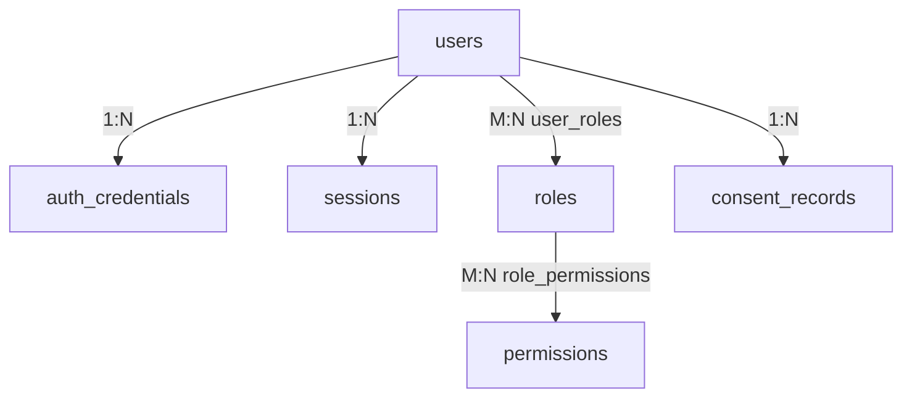

# CareerMitra — `identity` Schema

| | |
|---|---|
| **Postgres schema** | `identity` · **Context** | 1 · Identity & Access (Domain Model §5.1) |
| **Version** | 1.0 · **Status** | Approved · **Role** | Who the user is, what they may do, and what they consented to |
| **Assumes** | `01_SCHEMA_OVERVIEW.md`; **Security-Review-gated** (R16 — identity/auth) |

> Accounts, authentication, authorization (RBAC), and the **consent** model that every sensitive-PII use
> across the platform checks. Operators (reviewer, admin, support, trust-safety, executive, finance) are
> `users` with operator roles; the operator-specific rows (Executive, Reviewer) live in their own contexts
> and reference `user_id` by canonical id. Auth secrets are **never** readable — hashes only (R14).

---

## 1. ER overview

## 2. Enums (schema `identity`)
| Enum type | Values |
|---|---|
| `identity.user_status` | `registered`, `active`, `suspended`, `deactivated`, `deleted` |
| `identity.account_type` | `aspirant`, `operator` |
| `identity.credential_method` | `password`, `otp`, `sso`, `passkey` |
| `identity.credential_status` | `issued`, `active`, `rotated`, `revoked` |
| `identity.session_status` | `created`, `active`, `expired`, `revoked` |
| `identity.consent_status` | `requested`, `granted`, `revoked`, `expired` |

Governed lookup: `identity.consent_purposes` (purpose catalog — every sensitive-PII use names one).

## 3. Tables

### 3.1 `identity.users` — *User (aggregate root)*
| Column | Type | Null | Class | Notes |
|---|---|---|---|---|
| `id` | uuid | no | internal | PK |
| `primary_contact` | text | no | pii | verified email/phone; unique per verified account |
| `contact_verified_at` | timestamptz | yes | internal | required before sensitive actions |
| `display_name` | text | yes | pii | |
| `locale` | text | no | public | from supported set |
| `account_type` | identity.account_type | no | internal | aspirant/operator |
| `status` | identity.user_status | no | internal | full lifecycle |
| `last_active_at` | timestamptz | yes | internal | |
| `version`, `created_at`, `updated_at`, `deleted_at` | — | — | — | standard; **hard delete** on data-rights erasure (not soft) |

**Constraints:** `ux_users_primary_contact` unique. **Note:** deletion triggers the data-rights workflow
(Support §14) — a soft flag does not satisfy erasure (Overview §3).

### 3.2 `identity.auth_credentials` — *AuthCredential*
| Column | Type | Null | Class | Notes |
|---|---|---|---|---|
| `id` | uuid | no | secret-adjacent | PK |
| `user_id` | uuid | no | internal | **FK → `users`** |
| `method` | identity.credential_method | no | internal | password/otp/sso/passkey |
| `secret_hash` | text | yes | **never-readable** | password/passkey hash; **no plaintext secret ever** (R14) |
| `sso_issuer` | text | yes | internal | from issuer allow-list |
| `status` | identity.credential_status | no | internal | |
| `last_used_at` | timestamptz | yes | internal | |
| `version`, `created_at`, `updated_at` | — | — | — | standard |

Admin **cannot** read secrets; step-up auth for Vault/Form Filling/payments is enforced in app.

### 3.3 `identity.sessions` — *Session*
| Column | Type | Null | Class | Notes |
|---|---|---|---|---|
| `id` | uuid | no | internal | PK |
| `user_id` | uuid | no | internal | **FK → `users`** |
| `device_agent` | text | yes | internal | for shared-device safety |
| `expires_at` | timestamptz | no | internal | enforced |
| `revoked_at` | timestamptz | yes | internal | revoke on password change |
| `status` | identity.session_status | no | internal | |
| `created_at` | timestamptz | no | internal | append-context |

### 3.4 `identity.roles` / `identity.permissions` / joins
- `identity.roles` (`id`, `name` unique, `description`, `scope`, `status`) — aspirant/reviewer/admin/
  support/trust-safety/executive/finance. Least privilege; SoD (reviewer ≠ publisher).
- `identity.permissions` (`id`, `code` unique e.g. `opportunity.publish`/`vault.read`, `resource`,
  `action`, `sensitivity`). Sensitive permissions audited on use.
- `identity.user_roles` (`user_id` FK, `role_id` FK, PK both, `granted_at`, `expires_at` for time-boxed
  operator roles).
- `identity.role_permissions` (`role_id` FK, `permission_id` FK, PK both).

### 3.5 `identity.consent_records` — *ConsentRecord*
| Column | Type | Null | Class | Notes |
|---|---|---|---|---|
| `id` | uuid | no | internal | PK |
| `user_id` | uuid | no | internal | **FK → `users`** |
| `purpose_code` | text | no | internal | **FK → `consent_purposes`** |
| `scope` | text | yes | internal | |
| `terms_version` | text | no | internal | version of terms consented to |
| `guardian_consent` | boolean | no | internal | true for minors (guardian-aware) |
| `status` | identity.consent_status | no | internal | requested/granted/revoked/expired |
| `granted_at` / `revoked_at` | timestamptz | yes | internal | |
| `created_at`, `updated_at` | — | — | — | standard |

**Central to the platform:** Documents, AI, Form Filling, Notifications check an **active,
purpose-matching** consent by `consent_id` (cross-context, no FK) before any sensitive-PII use
(Domain Model §7 rule 5). Minors require `guardian_consent = true`.

## 4. Outbox
`identity.outbox_events` — emits `UserRegistered`, `ConsentGranted`, `ConsentRevoked`.
Consumers: Career, Growth, Analytics, Documents, AI, Notifications, Compliance (Domain Model §11.1).

## 5. Invariants realized
| Invariant | How |
|---|---|
| R14 — no secrets in DB | only hashes in `secret_hash`; never plaintext; admin cannot read |
| R17 — least privilege / SoD | roles + time-boxed `user_roles.expires_at`; permission catalog |
| Consent before sensitive PII (§7.5) | `consent_records` + purpose catalog; checked cross-context by id |
| Data-rights erasure (PRD §34) | `users` hard-deleted, not soft-flagged |
| Minors handling (§17.4) | `guardian_consent` on consent records |
