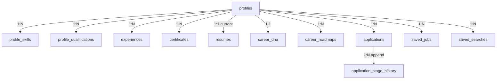

# CareerMitra — `career` Schema

| | |
|---|---|
| **Postgres schema** | `career` · **Context** | 4 · Career & Journey (Domain Model §5.4) |
| **Version** | 1.0 · **Status** | Approved · **Role** | The aspirant's career identity, saved items, applications, and derived Career DNA |
| **Assumes** | `01_SCHEMA_OVERVIEW.md`; references `identity`, `reference`, `recruitment`, `documents` by canonical id |

> The Profile is the fuel for eligibility, matching, and Career DNA. Sensitive demographics (category, DOB)
> are **encrypted** (Overview §6); derived signals (scores, DNA) are computed by the AI context and stored
> here for instant load. Application progress is an **append-only** stage history.

---

## 1. ER overview

## 2. Enums (schema `career`)
| Enum type | Values |
|---|---|
| `career.profile_status` | `created`, `in_progress`, `complete`, `updated` |
| `career.application_stage` | `interested`, `applied`, `admit_card`, `exam`, `result`, `closed`, `withdrawn` |
| `career.dna_status` | `computed`, `cached`, `stale`, `recomputed` |
| `career.roadmap_status` | `generated`, `active`, `completed`, `superseded` |
| `career.proficiency` | `beginner`, `intermediate`, `advanced`, `expert` |
| `career.evidence_source` | `self`, `parsed` |

## 3. Tables

### 3.1 `career.profiles` — *Profile (aggregate root; 1:1 aspirant user)*
| Column | Type | Null | Class | Notes |
|---|---|---|---|---|
| `id` | uuid | no | internal | PK |
| `user_id` | uuid | no | internal | canonical id → `identity.users` (no FK); unique |
| `dob_ciphertext` / `dob_dek_id` / `dob_enc_alg` | bytea/uuid/text | yes | sensitive-pii | encrypted DOB (Overview §6); age derived in app |
| `category_ciphertext` / `category_dek_id` / `category_enc_alg` | bytea/uuid/text | yes | sensitive-pii | reservation category (encrypted) |
| `gender` | text | yes | sensitive-pii | optional; accuracy-only |
| `is_pwd` | boolean | yes | sensitive-pii | optional |
| `is_ex_serviceman` | boolean | yes | pii | |
| `languages` | text[] | yes | pii | |
| `preferences` | jsonb | yes | pii | state/department/salary/job-type/skills/orgs — ids reference `reference` |
| `profile_completion_pct` | numeric(5,2) | yes | internal | derived, impact-weighted |
| `eligibility_score` | numeric(5,2) | yes | internal | derived |
| `status` | career.profile_status | no | internal | |
| `version`, `created_at`, `updated_at`, `deleted_at` | — | — | — | standard |

**Constraint:** `ux_profiles_user` unique (`user_id`). Sensitive columns are **never** filter/index keys.

### 3.2 Association & sub-entities
- `career.profile_skills` — *ProfileSkill*: `profile_id` FK, `skill_id` (→`reference.skills`),
  `proficiency` (career.proficiency), `years`, `evidence_ref`, `source` (career.evidence_source).
  Parsed skills require confirmation (`source='parsed'` then aspirant-confirmed).
- `career.profile_qualifications` — *ProfileQualification*: `profile_id` FK, `qualification_id`
  (→`reference`), `institution`, `year`, `marks`, `document_id` (→`documents`, evidence), `verified` bool.
- `career.experiences` — *Experience*: `profile_id` FK, `employer`, `role`, `start_date`, `end_date`,
  `description`; M:N skills via `career.experience_skills`.
- `career.certificates` — *Certificate (held)*: `profile_id` FK, `certification_id` (→`reference`),
  `issuer`, `issued_at`, `expires_at`, `document_id` (→`documents`).
- `career.resumes` — *Resume*: `profile_id` FK, `template`, `language`, `output_ref` (object storage),
  `source` (built/uploaded), `status`. Content is sensitive-PII — bytes in object storage, not columns.

### 3.3 `career.career_dna` — *CareerDNA (derived aggregate; 1:1 profile)*
| Column | Type | Null | Class | Notes |
|---|---|---|---|---|
| `id` | uuid | no | internal | PK |
| `profile_id` | uuid | no | internal | **FK → `profiles`**; unique |
| `profile_score` | numeric(5,2) | yes | internal | explainable blend |
| `eligible_counts` | jsonb | yes | internal | `{domain: count}` — "eligible now" reflects passing eligibility |
| `missing_qualifications` | jsonb | yes | internal | qualification ids (→`reference`) |
| `recommended_certifications` | jsonb | yes | internal | certification ids |
| `next_recruitments` | jsonb | yes | internal | opportunity/exam ids (→`recruitment`/`reference`) |
| `growth_path` | jsonb | yes | internal | ordered roles |
| `time_to_eligibility` | text | yes | internal | labeled estimate |
| `explanations` | jsonb | no | internal | every figure has a grounded explanation (R12) |
| `computed_at` | timestamptz | no | internal | |
| `ai_model_version_id` | uuid | no | internal | model version (→`ai`) — audit (R12) |
| `status` | career.dna_status | no | internal | recomputed on `ProfileUpdated`/`ResumeParsed` |
| `version`, `created_at`, `updated_at` | — | — | — | standard |

Guidance not guarantee; references only **verified** opportunities; caches last card for instant load.

### 3.4 `career.career_roadmaps` — *CareerRoadmap*
`profile_id` FK, `steps` jsonb (ordered; reference canonical ids), `milestones` jsonb, `target_refs`
jsonb, `status` (career.roadmap_status). Timelines labeled as estimates.

### 3.5 `career.applications` — *Application (aggregate root)* + history
| Column | Type | Null | Class | Notes |
|---|---|---|---|---|
| `id` | uuid | no | pii | PK |
| `profile_id` | uuid | no | internal | **FK → `profiles`** |
| `opportunity_id` | uuid | no | public | canonical id → `recruitment.opportunities` (no FK) |
| `current_stage` | career.application_stage | no | pii | |
| `document_checklist` | jsonb | yes | pii | per-application checklist |
| `service_request_id` | uuid | yes | internal | → `services` (if assisted) |
| `version`, `created_at`, `updated_at`, `deleted_at` | — | — | — | standard |

`career.application_stage_history` — *ApplicationStageHistory* (append-only, Examples §5): `application_id`
FK, `from_stage`, `to_stage`, `actor`, `note`, `at`. **INSERT-only; never edited/deleted.**

### 3.6 Saved items
- `career.saved_jobs` — `profile_id` FK, `opportunity_id` (→`recruitment`, no FK), `labels[]`, `saved_at`.
- `career.saved_searches` — `profile_id` FK, `query`, `facets` jsonb, `alert_frequency`; feeds AlertSubscription.
- `career.bookmarks` — generic bookmark (entity ref, kind).
- `career.learning_resources` — curated resource: `title`, `type`, related skill/qualification/certification
  ids, `provider`, `link`, affiliate-disclosed flag (no pay-to-rank).

## 4. Outbox
`career.outbox_events` — emits `ProfileUpdated`, `OpportunitySaved`, `ApplicationStageChanged`,
`CareerDnaInvalidated`. Consumers: AI (recompute), Notifications, Analytics.

## 5. Invariants realized
| Invariant | How |
|---|---|
| Sensitive PII encrypted (R15) | `dob_*`/`category_*` envelope columns; never plaintext/index |
| Grounded, explainable DNA (R12) | `explanations` required; `ai_model_version_id` recorded; verified refs only |
| Journey audit trail | append-only `application_stage_history` |
| Canonical references | skill/qualification/opportunity by id, never free text |
