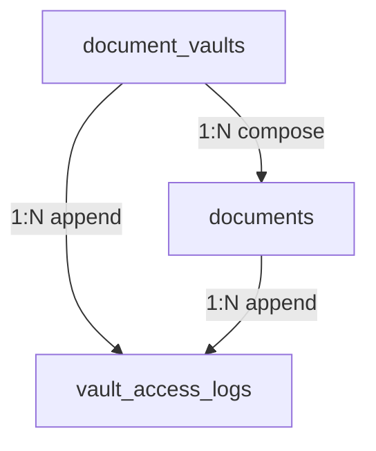

# CareerMitra — `documents` Schema (Sensitive-PII, Security-Review-gated)

| | |
|---|---|
| **Postgres schema** | `documents` · **Context** | 5 · Documents & Vault (Domain Model §5.5) |
| **Version** | 1.0 · **Status** | Approved · **Role** | The aspirant's secure document store — the platform's crown-jewel data |
| **Assumes** | `01_SCHEMA_OVERVIEW.md`; **every change requires Security Review (R16)** |

> The highest-sensitivity subsystem. Document **bytes live in encrypted object storage**; PostgreSQL holds
> only **metadata + an integrity checksum + encrypted references** — never document content. Every access
> appends an immutable `vault_access_log` row with actor, purpose, and consent reference (R15). No sensitive
> read path bypasses the access log.

---

## 1. ER overview

## 2. Enums (schema `documents`)
| Enum type | Values |
|---|---|
| `documents.vault_status` | `created`, `active`, `locked`, `purged` |
| `documents.document_type` | `marksheet`, `id_proof`, `photo`, `signature`, `certificate`, `admit_card_copy`, `other` |
| `documents.document_status` | `uploaded`, `scanned`, `verified`, `expired`, `deleted` |
| `documents.access_purpose` | `self_view`, `resume_build`, `resume_parse`, `form_filling`, `document_analysis`, `support` |

## 3. Tables

### 3.1 `documents.document_vaults` — *DocumentVault (aggregate root; 1:1 profile)*
| Column | Type | Null | Class | Notes |
|---|---|---|---|---|
| `id` | uuid | no | internal | PK |
| `profile_id` | uuid | no | internal | canonical id → `career.profiles` (no FK); unique |
| `storage_policy` | jsonb | yes | internal | retention/region policy |
| `kms_key_ref` | uuid | no | secret-adjacent | reference to the KEK (in secrets manager, **not** the key) |
| `status` | documents.vault_status | no | internal | |
| `version`, `created_at`, `updated_at` | — | — | — | standard |

**Constraint:** `ux_document_vaults_profile` unique. Access requires active Session + step-up auth +
matching active consent (checked in app).

### 3.2 `documents.documents` — *Document*
| Column | Type | Null | Class | Notes |
|---|---|---|---|---|
| `id` | uuid | no | internal | PK |
| `vault_id` | uuid | no | internal | **FK → `document_vaults`** |
| `document_type` | documents.document_type | no | internal | |
| `object_ref_ciphertext` | bytea | no | sensitive-pii | encrypted object-storage locator (Overview §6) |
| `object_dek_id` | uuid | no | sensitive-pii | wrapped DEK reference |
| `object_enc_alg` | text | no | internal | e.g., `aes-256-gcm` |
| `checksum` | text | no | internal | integrity (tamper detection) |
| `issuer` | text | yes | pii | |
| `valid_until` | date | yes | pii | |
| `mime_type` | text | no | internal | allowed types only |
| `size_bytes` | bigint | no | internal | policy-limited |
| `analysis_result` | jsonb | yes | internal | AI Document Analyzer flags (never alters original) |
| `status` | documents.document_status | no | internal | |
| `version`, `created_at`, `updated_at`, `deleted_at` | — | — | — | standard; aspirant-controlled deletion + retention purge |

**Content is never a column and never logged in plaintext.** Bytes are in object storage; the DB stores
only the encrypted locator + checksum + metadata. Referenced (by id) from `career` (Certificate,
ProfileQualification, Resume), `recruitment` (AdmitCard copy), `services` (ServiceRequest, ServiceProof).

### 3.3 `documents.vault_access_logs` — *VaultAccessLog (append-only, tamper-evident)*
| Column | Type | Null | Class | Notes |
|---|---|---|---|---|
| `id` | uuid | no | internal | PK |
| `vault_id` | uuid | yes | internal | **FK → `document_vaults`** |
| `document_id` | uuid | yes | internal | **FK → `documents`** |
| `actor` | text | no | internal | self / system / operator id |
| `purpose` | documents.access_purpose | no | internal | required |
| `consent_id` | uuid | yes | internal | required for non-self actors (→`identity.consent_records`) |
| `prev_hash` / `row_hash` | text | no | internal | hash-chain for tamper-evidence |
| `at` | timestamptz | no | internal | append-only; **no `updated_at`/soft delete; no UPDATE/DELETE grants** |

**Constraint:** `ck_vault_access_logs_consent_for_nonself` — non-self access must carry `consent_id`.
Mirrored to `admin.audit_log`.

## 4. Outbox
`documents.outbox_events` — emits `DocumentUploaded`, `VaultAccessed`. Consumers: AI, Audit (Admin).
**Payloads carry ids only — never document content or PII** (R15).

## 5. Invariants realized
| Invariant | How |
|---|---|
| R15 — sensitive PII encrypted, access-logged | bytes in object storage; encrypted locator; every access → `vault_access_logs` |
| R16 — Security Review gate | stated in header; all changes here are gated |
| Consent before access (§7.5) | `consent_id` required for non-self access; step-up auth in app |
| Tamper-evident audit (§7.7) | hash-chained append-only access log, mirrored to `admin.audit_log` |
| No plaintext PII in logs (§7.6) | content never in columns; event payloads carry ids only |
