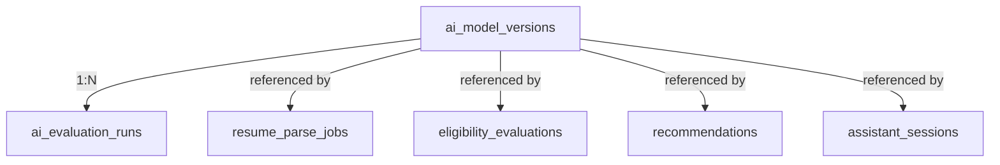

# CareerMitra — `ai` Schema

| | |
|---|---|
| **Postgres schema** | `ai` · **Context** | 6 · AI & Intelligence (Domain Model §5.6) |
| **Version** | 1.0 · **Status** | Approved · **Role** | AI job records, deterministic evaluations, recommendations, and model governance |
| **Assumes** | `01_SCHEMA_OVERVIEW.md`; reads `documents`/`career` under consent; **grounded, versioned, non-guaranteeing (R12)** |

> Every AI output **records its model version** for audit (R12). Inputs that are sensitive PII (parsed
> resume fields) are minimized and never stored in plaintext; conversational messages never persist
> plaintext PII. Eligibility is **deterministic and explainable**, not a black box. No AI surface ships
> without passing its evals and grounding gate (`ai_model_versions` + `ai_evaluation_runs`).

---

## 1. ER overview

## 2. Enums (schema `ai`)
| Enum type | Values |
|---|---|
| `ai.job_status` | `queued`, `running`, `extracted`, `confirmed`, `discarded`, `generated`, `delivered`, `failed` |
| `ai.eval_verdict` | `eligible`, `not_eligible`, `insufficient_data` |
| `ai.recommendation_target` | `opportunity`, `exam`, `certification` |
| `ai.recommendation_status` | `generated`, `served`, `actioned`, `dismissed`, `expired` |
| `ai.model_status` | `registered`, `evaluated`, `staged`, `active`, `rolled_back`, `retired` |
| `ai.eval_status` | `queued`, `running`, `passed`, `failed` |
| `ai.capability` | `resume_parse`, `resume_build`, `eligibility`, `recommendation`, `assistant`, `notification_summary`, `document_analysis`, `smart_search`, `entity_resolution` |

## 3. Tables

### 3.1 `ai.ai_model_versions` — *AIModelVersion (governance)*
| Column | Type | Null | Class | Notes |
|---|---|---|---|---|
| `id` | uuid | no | internal | PK |
| `capability` | ai.capability | no | internal | |
| `provider` | text | no | internal | |
| `version` | text | no | internal | |
| `prompt_template_ref` | text | yes | internal | versioned prompt |
| `eval_status` | ai.eval_status | no | internal | must be `passed` before `active` |
| `cost_budget` / `latency_budget_ms` | numeric/integer | yes | internal | per-surface budgets (PRD §16) |
| `status` | ai.model_status | no | internal | staged rollout + rollback |
| `version`, `created_at`, `updated_at` | — | — | — | standard |

**Constraint:** `ck_model_active_requires_passed` — `status='active'` ⇒ `eval_status='passed'`.

### 3.2 `ai.ai_evaluation_runs` — *AIEvaluationRun*
`model_version_id` FK, `dataset` (versioned), `metrics` jsonb (accuracy, grounding fidelity, hallucination
rate), `thresholds` jsonb, `result` (ai.eval_status). Release blocked on regression beyond guardrails.

### 3.3 `ai.resume_parse_jobs` / `ai.resume_build_jobs`
| Column | Type | Null | Class | Notes |
|---|---|---|---|---|
| `id` | uuid | no | internal | PK |
| `profile_id` | uuid | no | internal | canonical id → `career.profiles` (no FK) |
| `source_document_id` | uuid | yes | internal | → `documents.documents` (parse job) |
| `extracted_fields_ciphertext` | bytea | yes | sensitive-pii | encrypted proposed fields (parse) — **proposed, not applied** |
| `extracted_dek_id` / `extracted_enc_alg` | uuid/text | yes | sensitive-pii | envelope refs |
| `output_ref` | text | yes | internal | object-storage ref (build job) |
| `confidence` | numeric(5,4) | yes | internal | |
| `ai_model_version_id` | uuid | no | internal | **FK → `ai_model_versions`** |
| `status` | ai.job_status | no | internal | extraction is confirmed by aspirant before applying |
| `version`, `created_at`, `updated_at` | — | — | — | standard |

Parsed output maps to canonical skills/qualifications (→`reference`); consent-gated; never logged plaintext.

### 3.4 `ai.eligibility_evaluations` — *EligibilityEvaluation (deterministic)*
| Column | Type | Null | Class | Notes |
|---|---|---|---|---|
| `id` | uuid | no | internal | PK |
| `profile_id` | uuid | no | internal | → `career.profiles` |
| `opportunity_id` | uuid | no | public | → `recruitment.opportunities` (must be published) |
| `verdict` | ai.eval_verdict | no | internal | eligible/not/insufficient-data |
| `reasons` | jsonb | no | internal | enumerated factors (explainable) |
| `relaxations_applied` | jsonb | yes | internal | category/age relaxations |
| `unverified_input_flags` | jsonb | yes | internal | which inputs were unverified |
| `computed_at` | timestamptz | no | internal | |
| `status` | text | no | internal | computed/cached/invalidated |
| `created_at`, `updated_at` | — | — | — | standard |

Deterministic engine (not generative); guidance not guarantee. Invalidated on `ProfileUpdated`.

### 3.5 `ai.recommendations` — *Recommendation*
`profile_id`, `target_type` (ai.recommendation_target), `target_id` (verified entity id), `score`,
`factors` jsonb (disclosed), `ai_model_version_id` FK, `status`. Eligibility-gated; **no pay-to-rank**.

### 3.6 `ai.assistant_sessions` — *AssistantSession*
| Column | Type | Null | Class | Notes |
|---|---|---|---|---|
| `id` | uuid | no | internal | PK |
| `profile_id` | uuid | no | internal | → `career.profiles` |
| `messages_ref` | text | yes | sensitive-pii | object-storage ref; **PII minimized, never plaintext columns/logs** |
| `citations` | jsonb | yes | internal | grounding citations per factual claim (R12) |
| `ai_model_version_id` | uuid | no | internal | **FK → `ai_model_versions`** |
| `safety_flags` | jsonb | yes | internal | grounding/injection flags |
| `status` | text | no | internal | started/active/ended |
| `created_at`, `updated_at` | — | — | — | standard |

Responses pass the grounding gate or degrade to "see official source"; untrusted content is data, not
instructions (prompt-injection defense, PRD §16).

## 4. Outbox
`ai.outbox_events` — emits `ResumeParsed`, `EligibilityEvaluated`, `MatchComputed`,
`RecommendationsGenerated`, `CareerDnaComputed`, `AIModelActivated`, `AIEvaluationFailed`.
Consumers: Career, Search, Dashboard, Administration, Analytics.

## 5. Invariants realized
| Invariant | How |
|---|---|
| R12 — grounded, versioned, non-guaranteeing | `ai_model_version_id` on every output; `citations`; grounding gate |
| No ship without evals (§16) | `ck_model_active_requires_passed`; `ai_evaluation_runs` guardrails |
| Sensitive PII protected | extracted fields + assistant messages encrypted/minimized; consent-gated |
| Explainability | `reasons`/`factors`/`explanations` enumerated; deterministic eligibility |
| No pay-to-rank | recommendations eligibility-gated, factors disclosed |
