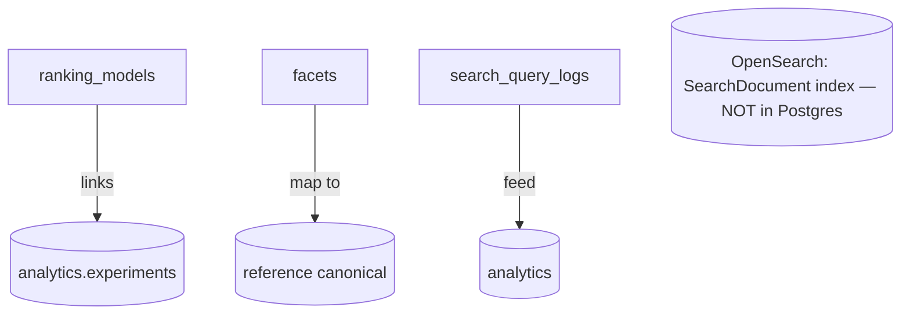

# CareerMitra — `search` Schema

| | |
|---|---|
| **Postgres schema** | `search` · **Context** | 7 · Search & Discovery (Domain Model §5.7) |
| **Version** | 1.0 · **Status** | Approved · **Role** | Governed ranking/facet configuration + privacy-safe query logs |
| **Assumes** | `01_SCHEMA_OVERVIEW.md`; the search **index** itself is OpenSearch, not Postgres |

> **Important:** the `SearchDocument` (the fast, faceted projection of an Opportunity) is a **read model in
> OpenSearch**, rebuilt from `recruitment` domain events — it is **not** a PostgreSQL table (Overview §1;
> Search Architecture §06). PostgreSQL here holds only the **source-of-truth configuration** that governs
> search — ranking models, facet definitions — and the **privacy-safe query log**.

---

## 1. ER overview

## 2. Enums (schema `search`)
| Enum type | Values |
|---|---|
| `search.ranking_status` | `draft`, `experiment`, `active`, `retired` |
| `search.facet_status` | `defined`, `active`, `deprecated` |
| `search.facet_value_type` | `enum`, `range`, `boolean`, `entity_ref`, `date` |

## 3. Tables

### 3.1 `search.ranking_models` — *RankingModel (governed config)*
| Column | Type | Null | Class | Notes |
|---|---|---|---|---|
| `id` | uuid | no | internal | PK |
| `name` | text | no | internal | |
| `signals` | jsonb | no | internal | weights: relevance, eligibility gate (hard), profile match, freshness, deadline, authority, personalization |
| `experiment_id` | uuid | yes | internal | → `analytics.experiments` (no FK) — changes ship behind A/B |
| `is_fallback` | boolean | no | internal | deterministic non-personalized fallback exists |
| `status` | search.ranking_status | no | internal | |
| `version`, `created_at`, `updated_at` | — | — | — | standard |

**No pay-to-rank** (verified data/ranking never for sale); eligibility is a **hard gate**; fairness
monitored. Ranking changes ship behind experiments with guardrails (Domain Model §5.7, §7 rule 13).

### 3.2 `search.facets` — *Facet*
`id`, `name` unique, `source_field`, `value_type` (search.facet_value_type), `controlled_values` jsonb
(from canonical vocabularies where applicable), `status`. Facets map to `reference` entities.

### 3.3 `search.search_query_logs` — *SearchQueryLog (append-only, privacy-safe)*
| Column | Type | Null | Class | Notes |
|---|---|---|---|---|
| `id` | uuid | no | internal | PK |
| `parsed_facets` | jsonb | yes | internal | structured facets extracted from the query |
| `result_count` | integer | no | internal | powers zero-result recovery analysis |
| `engagement` | jsonb | yes | internal | clicks/saves (anonymized) |
| `pseudonymous_actor` | text | yes | internal | hashed/rotated — **no PII in plaintext** |
| `at` | timestamptz | no | internal | append-only; retention-bounded; **time-partitioned** |

Minimized/anonymized (Domain Model §5.7); feeds Analytics for relevance improvement and Smart Search intent.

## 4. Outbox / events
Search primarily **consumes** `recruitment` events (`OpportunityPublished`, `OpportunityCorrected`,
`OpportunityWithdrawn`) to (re)build the OpenSearch index; it emits `SearchPerformed` for Analytics.
`search.outbox_events` per Overview §5.

## 5. Invariants realized
| Invariant | How |
|---|---|
| No pay-to-rank (§7 rule 13) | `ranking_models.signals` governed; no monetary signal; documented |
| Eligibility hard gate | eligibility is a gating signal, not a soft weight |
| Only verified data indexed | index built solely from published `recruitment` events (Search Arch §06) |
| Privacy-safe analytics | `search_query_logs` pseudonymous, no plaintext PII, retention-bounded |
| Experiment-gated changes | `experiment_id` links ranking changes to `analytics.experiments` |
