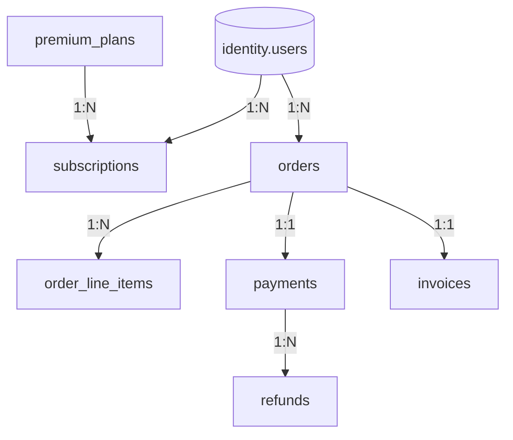

# CareerMitra — `payments` Schema

| | |
|---|---|
| **Postgres schema** | `payments` · **Context** | 8 · Payments & Billing (Domain Model §5.8) |
| **Version** | 1.0 · **Status** | Approved · **Role** | Money, plans, entitlements — strong consistency; no card data stored |
| **Assumes** | `01_SCHEMA_OVERVIEW.md`; money is integer minor units; **Security-sensitive** |

> Sensitive payment instrument data is handled entirely by the external provider and **never stored** —
> only provider references. Money is `amount_minor bigint` + `currency char(3)`, never float. Money and
> entitlement are **never eventual-only** (Data Architecture §8). Refund requester ≠ approver (SoD, R17).

---

## 1. ER overview

## 2. Enums (schema `payments`)
| Enum type | Values |
|---|---|
| `payments.plan_status` | `draft`, `active`, `deprecated` |
| `payments.subscription_status` | `trial`, `active`, `past_due`, `cancelled`, `expired` |
| `payments.order_status` | `created`, `pending`, `paid`, `failed`, `cancelled` |
| `payments.payment_status` | `initiated`, `authorized`, `captured`, `failed`, `refunded` |
| `payments.invoice_status` | `draft`, `issued`, `paid`, `void` |
| `payments.refund_status` | `requested`, `approved`, `processed`, `rejected` |

## 3. Tables

### 3.1 `payments.premium_plans` — *PremiumPlan*
`id`, `name`, `price_minor` bigint, `currency` char(3), `billing_period` (monthly/annual), `entitlements`
jsonb, `region`, `status`. Premium adds convenience/insight; **never gates basic opportunity access** (no
dark patterns, PRD §30.2).

### 3.2 `payments.subscriptions` — *Subscription (billing)*
| Column | Type | Null | Class | Notes |
|---|---|---|---|---|
| `id` | uuid | no | internal | PK |
| `user_id` | uuid | no | internal | canonical id → `identity.users` (no FK) |
| `plan_id` | uuid | no | internal | **FK → `premium_plans`** |
| `status` | payments.subscription_status | no | internal | |
| `current_period_start` / `current_period_end` | timestamptz | yes | internal | |
| `cancel_at_period_end` | boolean | no | internal | cancellation retains access to period end |
| `version`, `created_at`, `updated_at` | — | — | — | standard |

**Constraint:** partial unique — one `active`/`trial` subscription per user (add-ons excepted).
*Distinct from `notifications.alert_subscriptions`* (Domain Model naming note).

### 3.3 `payments.orders` + `payments.order_line_items` — *Order*
- `orders`: `id`, `user_id` (→identity), `amount_minor`, `currency`, `status`. An Order precedes fulfilment.
- `order_line_items`: `order_id` FK, `item_type` (plan/service), `item_ref` (plan id / service ref),
  `amount_minor`, `quantity`. **Constraint:** `ck_orders_amount = sum(line_items)`.

### 3.4 `payments.payments` — *Payment*
| Column | Type | Null | Class | Notes |
|---|---|---|---|---|
| `id` | uuid | no | internal | PK |
| `order_id` | uuid | no | internal | **FK → `orders`** (1:1) |
| `amount_minor` | bigint | no | internal | matches order |
| `currency` | char(3) | no | internal | |
| `method` | text | yes | internal | coarse method label only |
| `provider_reference` | text | no | internal | external provider txn ref — **no card/instrument data** |
| `status` | payments.payment_status | no | internal | |
| `version`, `created_at`, `updated_at` | — | — | — | standard |

### 3.5 `payments.invoices` — *Invoice*
`order_id` FK (1:1), `line_items` jsonb, `tax_minor`, `total_minor`, `currency`, `issued_at`, `status`.
Immutable once issued; tax per jurisdiction (GST). Totals reconcile with Order/Payment.

### 3.6 `payments.refunds` — *Refund*
`payment_id` FK, `amount_minor` (≤ captured), `reason` (catalog), `requested_by`, `approved_by`, `status`.
**Constraint:** `ck_refunds_sod` — `approved_by <> requested_by` (separation of duties, R17). Form Filling
failure triggers refund eligibility (→`services`).

## 4. Outbox
`payments.outbox_events` — emits `OrderPaid`, `SubscriptionActivated`, `RefundProcessed`.
Consumers: Professional Services (fulfilment starts only after `OrderPaid`), Career (entitlements), Analytics.

## 5. Invariants realized
| Invariant | How |
|---|---|
| No card data stored (R14/PCI posture) | provider references only; instrument handled externally |
| Money integrity | integer minor units + currency; `ck_orders_amount`; invoice reconciliation |
| SoD on refunds (R17) | `ck_refunds_sod` requester ≠ approver |
| Fulfilment only after paid | `OrderPaid` event gates `services` start (Conformist, §10) |
| Premium never gates basic access (§30.2) | entitlements are additive; enforced in app + plan config |
