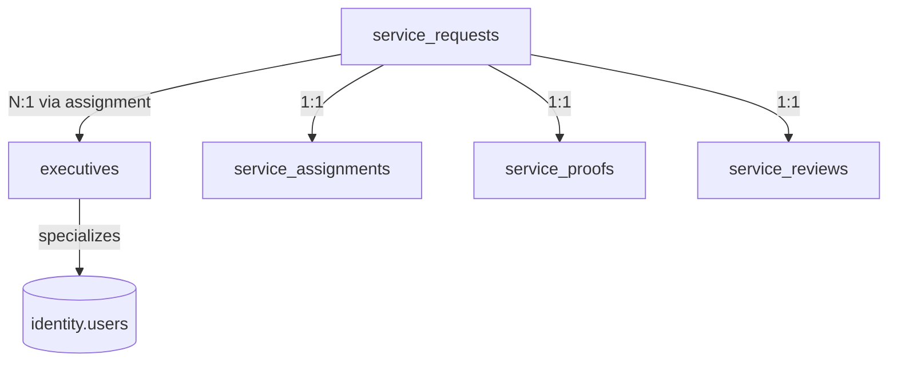

# CareerMitra — `services` Schema (Form Filling, Security-Review-gated)

| | |
|---|---|
| **Postgres schema** | `services` · **Context** | 9 · Professional Services (Domain Model §5.9) |
| **Version** | 1.0 · **Status** | Approved · **Role** | Assisted, consent-gated Form Filling fulfilment |
| **Assumes** | `01_SCHEMA_OVERVIEW.md`; **every change requires Security Review (R16)** |

> Human-plus-AI assisted form completion. **Never auto-submits; never stores external portal credentials
> (R16);** submission requires explicit recorded consent. Executive access is **scoped and time-boxed** to a
> single assigned request, all actions audited (least privilege + SoD, R17). Starts only after `OrderPaid`.

---

## 1. ER overview

## 2. Enums (schema `services`)
| Enum type | Values (Domain Model §5.9 / §8.2) |
|---|---|
| `services.request_status` | `requested`, `documents_collected`, `executive_assigned`, `in_progress`, `review_ready`, `aspirant_review`, `submitted`, `proof_available`, `rated`, `refunded` |
| `services.executive_status` | `onboarded`, `active`, `suspended`, `offboarded` |
| `services.assignment_status` | `assigned`, `active`, `completed`, `revoked` |
| `services.proof_status` | `generated`, `available`, `archived` |
| `services.review_status` | `submitted`, `published`, `moderated` |

## 3. Tables

### 3.1 `services.service_requests` — *ServiceRequest (aggregate root)*
| Column | Type | Null | Class | Notes |
|---|---|---|---|---|
| `id` | uuid | no | internal | PK |
| `profile_id` | uuid | no | internal | canonical id → `career.profiles` (no FK) |
| `opportunity_id` | uuid | no | public | → `recruitment.opportunities` |
| `form_id` | uuid | no | public | → `recruitment.application_forms` |
| `order_id` | uuid | no | internal | → `payments.orders` — start only after paid |
| `document_ids` | uuid[] | yes | internal | → `documents.documents` (consented, scoped) |
| `submission_consent_id` | uuid | yes | internal | → `identity.consent_records`; **required before `submitted`** |
| `status` | services.request_status | no | internal | full lifecycle |
| `version`, `created_at`, `updated_at` | — | — | — | standard |

**Constraint:** `ck_service_requests_consent_before_submit` — `status` in (`submitted`,`proof_available`,
`rated`) ⇒ `submission_consent_id` is not null. **No column stores external portal credentials — ever.**

### 3.2 `services.executives` — *Executive (specialization of User)*
`id`, `user_id` (→identity, unique), `skills` text[], `languages` text[], `capacity` int,
`performance_rating` numeric, `status`. Background-checked; capacity-limited; behavior anomaly-monitored
by Trust & Safety (→`support.fraud_cases`).

### 3.3 `services.service_assignments` — *ServiceAssignment (scoped, time-boxed grant)*
| Column | Type | Null | Class | Notes |
|---|---|---|---|---|
| `id` | uuid | no | internal | PK |
| `request_id` | uuid | no | internal | **FK → `service_requests`** |
| `executive_id` | uuid | no | internal | **FK → `executives`** |
| `granted_scope` | jsonb | no | internal | limited to this request's data only |
| `expires_at` | timestamptz | no | internal | access auto-revokes on completion/expiry |
| `status` | services.assignment_status | no | internal | |
| `created_at`, `updated_at` | — | — | — | standard |

Every executive action against a request is audited (→`admin.audit_log`); no broad Vault access.

### 3.4 `services.service_proofs` — *ServiceProof*
`request_id` FK (1:1), `artefact_ref` (→`documents`, object storage), `generated_at`, `status`. Immutable;
exists **only** for submitted (consented) requests.

### 3.5 `services.service_reviews` — *ServiceReview*
`request_id` FK (1:1), `executive_id` FK, `rating` (range-checked), `comment`, `at`, `status`. One review
per completed request; moderated for abuse; feeds executive quality scoring.

## 4. Outbox
`services.outbox_events` — emits `ServiceRequested`, `ServicePaid`, `ExecutiveAssigned`,
`ServiceSubmitted`, `ServiceRefunded`. Consumers: Notifications, Payments (refund), Trust & Safety, Analytics.

## 5. Invariants realized
| Invariant | How |
|---|---|
| Never auto-submit; consent required (R13) | `ck_service_requests_consent_before_submit` |
| Never store portal credentials (R16) | no credential column exists by design |
| Least privilege / time-boxed (R17) | `service_assignments.granted_scope` + `expires_at`; per-request scope |
| Refund on failure | failure path emits `ServiceRefunded` → `payments.refunds` |
| Security Review gate (R16) | stated in header; all changes gated |
