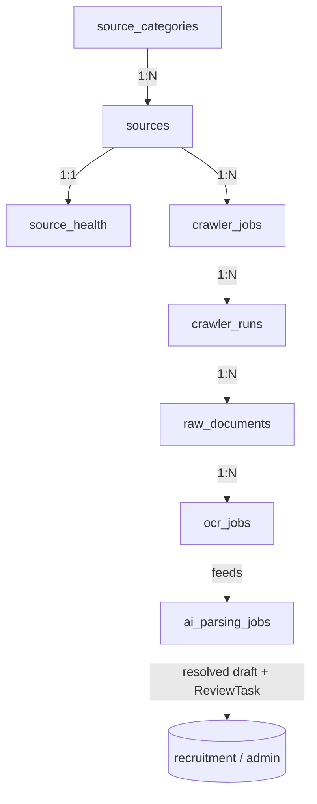

# CareerMitra — `crawler` Schema (Ingestion trust boundary, Security-Review-gated)

| | |
|---|---|
| **Postgres schema** | `crawler` · **Context** | 10 · Crawler & Ingestion (Domain Model §5.10) |
| **Version** | 1.0 · **Status** | Approved · **Role** | Source Registry, crawling, extraction, entity resolution — the anti-corruption boundary |
| **Assumes** | `01_SCHEMA_OVERVIEW.md`; **ingestion trust-boundary changes require Security Review (R16)** |

> The **anti-corruption layer**: messy external data is translated into the canonical model and never leaks
> inward as free text. Sources are **first-class managed assets** with health monitoring (silent failure is
> an incident). Nothing here is user-visible — the pipeline hands verified drafts to `recruitment` via the
> verification gate. `Notification` (the provenance anchor) is owned by `recruitment`; `crawler` produces
> the raw artefacts and resolution that lead to it.

---

## 1. ER overview

## 2. Enums (schema `crawler`)
| Enum type | Values |
|---|---|
| `crawler.source_status` | `registered`, `verified`, `active`, `failing`, `disabled`, `retired` |
| `crawler.job_status` | `scheduled`, `enabled`, `paused`, `retired` |
| `crawler.run_status` | `started`, `fetching`, `completed`, `failed`, `partially_failed` |
| `crawler.raw_status` | `fetched`, `extracted`, `archived`, `purged` |
| `crawler.ocr_status` | `queued`, `running`, `completed`, `failed` |
| `crawler.parse_status` | `queued`, `running`, `parsed`, `resolved`, `needs_review` |

## 3. Tables

### 3.1 `crawler.sources` — *Source (Registry member; aggregate root)*
| Column | Type | Null | Class | Notes |
|---|---|---|---|---|
| `id` | uuid | no | internal | PK |
| `name` | text | no | internal | |
| `official_domain` | text | no | internal | validated before crawling |
| `category_id` | uuid | no | internal | **FK → `source_categories`** |
| `organization_id` | uuid | yes | public | canonical id → `reference.organizations` (mapping) |
| `jurisdiction` | text | no | internal | |
| `crawl_config` | jsonb | no | internal | scope, selectors |
| `legal_status` | jsonb | no | internal | robots/terms — recorded before crawling (ACL) |
| `reliability_score` | numeric(5,3) | yes | internal | accuracy/timeliness; low → stricter review |
| `status` | crawler.source_status | no | internal | registry lifecycle |
| `version`, `created_at`, `updated_at`, `deleted_at` | — | — | — | standard |

**Constraint:** `ck_sources_legal_before_active` — `status='active'` ⇒ `legal_status` recorded.

### 3.2 `crawler.source_categories` / `crawler.source_health`
- `source_categories`: `id`, `name` unique, `description` — drives coverage management by sector/state.
- `source_health` — *SourceHealth* (1:1 source): `source_id` FK unique, `last_success_at`, `success_rate`,
  `freshness`, `drift_signal`, `alert_status`. **Silent failure is an incident** — feeds Admin dashboards/alerts.

### 3.3 `crawler.crawler_jobs` / `crawler.crawler_runs`
- `crawler_jobs` — *CrawlerJob*: `source_id` FK, `schedule`, `scope`, `rate_limits` jsonb (within legal
  bounds), `status`. Idempotent.
- `crawler_runs` — *CrawlerRun*: `crawler_job_id` FK, `started_at`, `finished_at`, `items_found`,
  `items_new`, `items_failed`, `errors` jsonb, `status`. Failures update `source_health`.

### 3.4 `crawler.raw_documents` — *RawDocument (append; time-partitioned)*
| Column | Type | Null | Class | Notes |
|---|---|---|---|---|
| `id` | uuid | no | internal | PK |
| `run_id` | uuid | no | internal | **FK → `crawler_runs`** |
| `source_ref` | text | no | internal | fetched URL/reference |
| `checksum` | text | no | internal | content dedup |
| `content_ref` | text | no | internal | object-storage ref to raw bytes |
| `mime_type` | text | no | internal | |
| `status` | crawler.raw_status | no | internal | retained for provenance/audit, then purged |
| `created_at` | timestamptz | no | internal | append; **time-partitioned** (Overview §10) |

**Constraint:** `ux_raw_documents_checksum` unique (dedup).

### 3.5 `crawler.ocr_jobs` / `crawler.ai_parsing_jobs`
- `ocr_jobs` — *OCRJob*: `raw_document_id` FK, `text_ref`, `confidence`, `language`, `status`. Low-confidence
  flagged for human review.
- `ai_parsing_jobs` — *AIParsingJob*: `notification_ref` (→recruitment), `structured_output` jsonb,
  `entity_resolution_result` jsonb, `confidence`, `ai_model_version_id` (→`ai`), `status`. Performs entity
  resolution + **semantic dedup**; low confidence → `needs_review` (creates `admin.review_tasks`); **never
  publishes directly**.

## 4. Outbox
`crawler.outbox_events` — emits `NotificationIngested`, `EntityResolved`, `SourceHealthDegraded`.
Consumers: Recruitment, Administration, Analytics.

## 5. Invariants realized
| Invariant | How |
|---|---|
| Anti-corruption boundary (§3.2) | canonical resolution in `ai_parsing_jobs`; no free text leaks to `recruitment` |
| Entity resolution before publish (§7.4) | `ai_parsing_jobs` resolves + semantically dedups; low-confidence → review |
| Nothing publishes without the gate (R11) | parsing creates `review_tasks`; never writes user-visible rows |
| Legal governance (ACL) | `legal_status` recorded; `ck_sources_legal_before_active`; rate limits within bounds |
| Silent failure = incident (§26) | `source_health` monitored; `SourceHealthDegraded` event |
