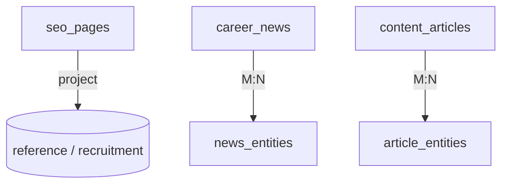

# CareerMitra — `content` Schema

| | |
|---|---|
| **Postgres schema** | `content` · **Context** | 11 · Content & SEO (Domain Model §5.11) |
| **Version** | 1.0 · **Status** | Approved · **Role** | Editorial + SEO surfaces: entity pages, news, FAQ/blog/KB |
| **Assumes** | `01_SCHEMA_OVERVIEW.md`; SEO is the #1 acquisition channel (PRD §31) |

> Entity **SEO pages** are **generated from canonical entities** (never hand-authored per page); this
> schema stores their metadata/freshness, not the rendered HTML. Editorial content (news, FAQ, blog, KB) is
> authored source-of-truth here, reviewed before publish, localized, and every news item links to a
> credible source (no rumor amplification).

---

## 1. ER overview

## 2. Enums (schema `content`)
| Enum type | Values |
|---|---|
| `content.page_status` | `generated`, `published`, `updated`, `deprecated` |
| `content.editorial_status` | `draft`, `in_review`, `published`, `updated`, `archived` |
| `content.article_type` | `faq`, `blog`, `kb_article` |

## 3. Tables

### 3.1 `content.seo_pages` — *SEOPage (generated)*
| Column | Type | Null | Class | Notes |
|---|---|---|---|---|
| `id` | uuid | no | public | PK |
| `entity_type` | text | no | public | organization/exam/skill/qualification/opportunity |
| `entity_id` | uuid | no | public | canonical id → `reference`/`recruitment` (no FK) |
| `canonical_url` | text | no | public | unique |
| `structured_metadata` | jsonb | no | public | rich-results / schema.org metadata |
| `localized_variants` | jsonb | yes | public | per-language metadata |
| `freshness_at` | timestamptz | no | public | regenerated on entity change |
| `status` | content.page_status | no | public | |
| `version`, `created_at`, `updated_at` | — | — | — | standard |

**Constraint:** `ux_seo_pages_canonical_url`. Generated/maintained from canonical entities (only verified
data; interlinked; localized) — never hand-authored per page (PRD §8/§31).

### 3.2 `content.career_news` — *CareerNews*
| Column | Type | Null | Class | Notes |
|---|---|---|---|---|
| `id` | uuid | no | public | PK |
| `title` | text | no | public | |
| `slug` | text | no | public | unique |
| `body` | text | no | public | fact vs commentary clearly separated |
| `official_source_url` | text | no | public | credible source — required (no rumor amplification) |
| `published_at` | timestamptz | yes | public | |
| `status` | content.editorial_status | no | public | reviewed before publish |
| `version`, `created_at`, `updated_at`, `deleted_at` | — | — | — | standard |

**Constraint:** `ck_career_news_source_required`. M:N to entities via `content.news_entities`
(`news_id` FK, `entity_type`, `entity_id`) — ties news to exams/orgs to drive re-notification.

### 3.3 `content.content_articles` — *FAQ / Blog / KnowledgeBaseArticle*
`id`, `article_type` (content.article_type), `title`, `slug` unique, `body`, `language`, `author`,
`status`. M:N entities/skills via `content.article_entities`. KB articles power self-service support
(deflection → `support.support_tickets`).

## 4. Outbox
`content.outbox_events` — emits `NewsPublished`, `SeoPageUpdated`. Consumers: Notifications, Search.
Content **consumes** `OpportunityPublished`/`CutoffRecorded` to regenerate SEO pages.

## 5. Invariants realized
| Invariant | How |
|---|---|
| Only verified data on pages (R11) | `seo_pages` generated from published canonical entities |
| No rumor amplification | `ck_career_news_source_required`; fact/commentary separated; reviewed |
| SEO from canonical entities | pages generated, never hand-authored; interlinked; localized |
| Drives re-notification | `news_entities` ties items to exams/orgs |
