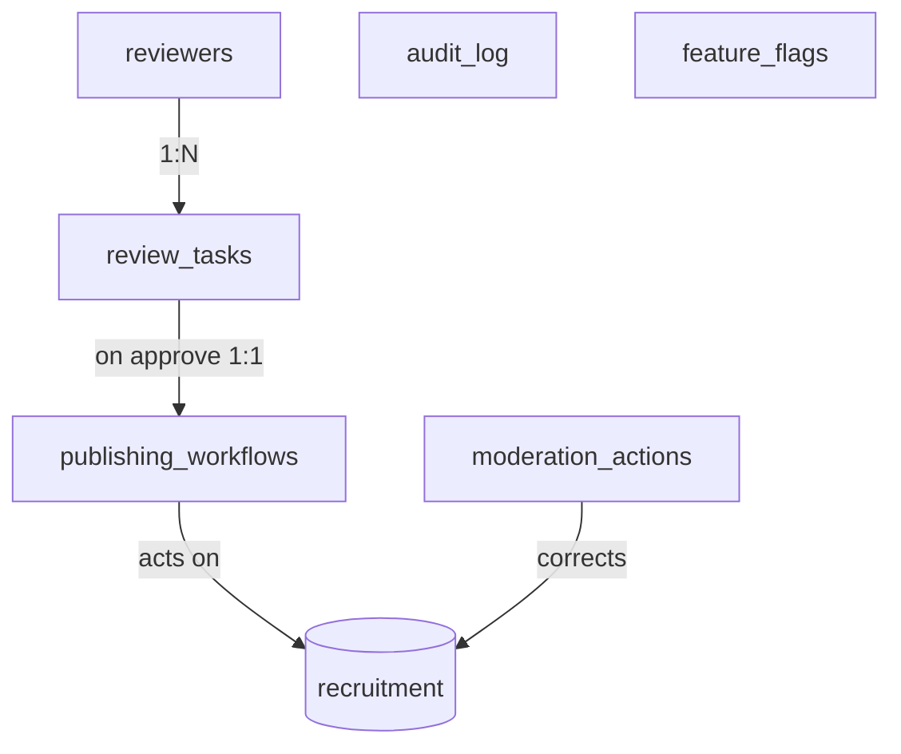

# CareerMitra — `admin` Schema (Governance & Audit)

| | |
|---|---|
| **Postgres schema** | `admin` · **Context** | 12 · Administration & Governance (Domain Model §5.12) |
| **Version** | 1.0 · **Status** | Approved · **Role** | The verification gate, publishing, moderation, feature flags, and the tamper-evident audit log |
| **Assumes** | `01_SCHEMA_OVERVIEW.md`; the audit log is crown-jewel append-only |

> Where the **verification gate** is operated and where **every operator action and sensitive-PII access**
> is recorded immutably. `ReviewTask` is the gate: nothing in `recruitment` becomes user-visible without an
> `approved` task. The `audit_log` is append-only, hash-chained, time-partitioned, and has no UPDATE/DELETE
> grants.

---

## 1. ER overview

## 2. Enums (schema `admin`)
| Enum type | Values |
|---|---|
| `admin.review_status` | `created`, `assigned`, `in_review`, `approved`, `rejected`, `escalated` |
| `admin.workflow_status` | `triggered`, `publishing`, `published`, `rolled_back` |
| `admin.moderation_type` | `correction`, `duplicate_merge`, `withdrawal`, `takedown` |
| `admin.moderation_status` | `requested`, `approved`, `applied`, `reverted` |
| `admin.flag_status` | `defined`, `active`, `archived` |

## 3. Tables

### 3.1 `admin.review_tasks` — *ReviewTask (verification gate work item)*
| Column | Type | Null | Class | Notes |
|---|---|---|---|---|
| `id` | uuid | no | internal | PK |
| `target_type` | text | no | internal | recruitment/opportunity/cutoff/scheme |
| `target_id` | uuid | no | internal | → `recruitment` (no FK) |
| `confidence` | numeric(5,4) | yes | internal | low-confidence prioritized |
| `assignee_id` | uuid | yes | internal | → `reviewers` |
| `decision` | text | yes | internal | approve/reject/escalate + notes |
| `notes` | text | yes | internal | |
| `status` | admin.review_status | no | internal | the gate — publish requires `approved` |
| `version`, `created_at`, `updated_at` | — | — | — | standard |

**Rule:** reviewer ≠ record author (SoD); SLA tracked; nothing publishes without `approved` (R11).

### 3.2 `admin.reviewers` — *Reviewer (specialization of User)*
`id`, `user_id` (→identity, unique), `domains` text[], `throughput` int, `accuracy` numeric, `status`.
Least privilege; separated from publishing where required; performance monitored.

### 3.3 `admin.publishing_workflows` — *PublishingWorkflow*
`id`, `review_task_id` FK, `target_type`, `target_id`, `steps` jsonb (publish/index/notify/capture-history),
`status`. Only `approved` targets publish; publishing captures history and triggers notifications;
rollbackable. Emits domain events.

### 3.4 `admin.moderation_actions` — *ModerationAction / TakedownRequest*
`id`, `target_type`, `target_id` (→recruitment), `action_type` (admin.moderation_type), `reason` (catalog),
`actor_id`, `status`. Material corrections re-notify tracked aspirants; fraud/withdrawal transitions
Opportunity to `withdrawn`; links `support.fraud_cases`/`grievances`.

### 3.5 `admin.audit_log` — *AuditLog (append-only, tamper-evident, time-partitioned)*
| Column | Type | Null | Class | Notes |
|---|---|---|---|---|
| `id` | uuid | no | internal | PK |
| `actor` | text | no | internal | operator/system id |
| `action` | text | no | internal | required |
| `resource_type` / `resource_id` | text / uuid | no / yes | internal | required action target |
| `purpose` | text | yes | internal | for sensitive access |
| `context` | jsonb | yes | internal | request context — **no plaintext PII/secrets** |
| `prev_hash` / `row_hash` | text | no | internal | hash-chain (tamper-evidence) |
| `at` | timestamptz | no | internal | append-only; **time-partitioned**; **no UPDATE/DELETE grants** |

Receives mirrored `documents.vault_access_logs`; every sensitive action recorded (R15, §7.7).

### 3.6 `admin.feature_flags` — *FeatureFlag*
`id`, `key` unique, `scope` jsonb (segment), `status`. Gates rollouts/experiments (links
`analytics.experiments`); changes audited.

## 4. Outbox
`admin.outbox_events` — emits `ReviewTaskCreated`, `ReviewCompleted`. Publishing workflow triggers
`recruitment` publish events. Consumers: Recruitment, Analytics.

## 5. Invariants realized
| Invariant | How |
|---|---|
| Verification gate (R11, §7.1) | `review_tasks.status='approved'` required before publish |
| SoD (R17) | reviewer ≠ author; publishing separated where required |
| Tamper-evident audit (§7.7) | hash-chained append-only `audit_log`; no UPDATE/DELETE |
| No plaintext PII in logs (§7.6) | `context` carries ids/metadata only |
| Material-change re-notification (§7.12) | `moderation_actions` → re-notify via events |
