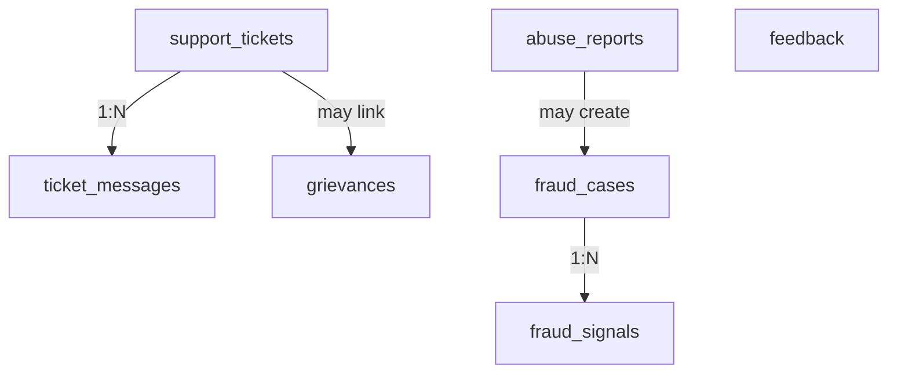

# CareerMitra — `support` Schema (Support & Trust)

| | |
|---|---|
| **Postgres schema** | `support` · **Context** | 13 · Support & Trust (Domain Model §5.13) |
| **Version** | 1.0 · **Status** | Approved · **Role** | Tickets, grievances, feedback, abuse reports, and fraud/Trust-&-Safety cases |
| **Assumes** | `01_SCHEMA_OVERVIEW.md`; Trust & Safety changes are security-reviewed |

> Government-job scams are endemic; Trust & Safety is first-class here. Every user-facing surface has an
> abuse-report path feeding this context with SLAs. Grievance redressal follows legally-expected channels
> with a grievance officer and defined SLA. Fraud cases can withhold/demote listings and monitor executive
> behavior.

---

## 1. ER overview

## 2. Enums (schema `support`)
| Enum type | Values |
|---|---|
| `support.ticket_status` | `open`, `in_progress`, `waiting`, `resolved`, `closed`, `reopened` |
| `support.grievance_status` | `filed`, `acknowledged`, `investigating`, `resolved`, `closed` |
| `support.report_status` | `reported`, `triaged`, `actioned`, `dismissed` |
| `support.fraud_status` | `signal_raised`, `under_review`, `confirmed`, `actioned`, `closed`, `dismissed` |
| `support.fraud_type` | `fake_listing`, `impersonation`, `executive_abuse`, `document_tampering`, `account_abuse`, `misinformation` |
| `support.feedback_status` | `submitted`, `triaged`, `actioned`, `archived` |

## 3. Tables

### 3.1 `support.support_tickets` — *SupportTicket (aggregate root)* + messages
| Column | Type | Null | Class | Notes |
|---|---|---|---|---|
| `id` | uuid | no | pii | PK |
| `user_id` | uuid | no | internal | → `identity.users` |
| `category` | text | no | internal | account/data/billing/service (catalog) |
| `priority` | text | no | internal | catalog |
| `assignee_id` | uuid | yes | internal | support agent |
| `sla_due_at` | timestamptz | yes | internal | response/resolution SLA |
| `resolution` | text | yes | pii | |
| `status` | support.ticket_status | no | internal | |
| `version`, `created_at`, `updated_at` | — | — | — | standard |

`support.ticket_messages` (compose): `ticket_id` FK, `author`, `body` (pii), `at`. KB deflection
(→`content.content_articles`); escalation to `grievances` where formal.

### 3.2 `support.grievances` — *Grievance*
`id`, `user_id` (→identity), `subject`, `severity`, `resolution`, `sla_due_at`, `status`. Grievance-officer
ownership; defined redressal SLA; auditable; may link ticket/service_request/data-rights request.

### 3.3 `support.feedback` — *Feedback*
`id`, `user_id`, `surface`, `rating` (range where present), `comment`, `at`, `status`. Drives
prioritization; NPS/trust tracked; feeds Analytics/Growth.

### 3.4 `support.abuse_reports` — *AbuseReport*
`id`, `reporter` (user/operator id), `target_type`, `target_id`, `reason`, `evidence` jsonb, `status`.
On every user-facing surface; feeds Trust & Safety with SLAs; may create `fraud_cases`/`moderation_actions`.

### 3.5 `support.fraud_cases` / `support.fraud_signals` — *FraudCase / FraudSignal*
| Column | Type | Null | Class | Notes |
|---|---|---|---|---|
| `id` | uuid | no | internal | PK (case) |
| `fraud_type` | support.fraud_type | no | internal | |
| `subject_type` / `subject_id` | text / uuid | no | internal | listing/user/executive/document |
| `severity` | text | no | internal | catalog |
| `action_taken` | text | yes | internal | withhold/demote/withdraw/suspend |
| `status` | support.fraud_status | no | internal | |
| `version`, `created_at`, `updated_at` | — | — | — | standard |

`fraud_signals` (1:N): `case_id` FK, `signal_type`, `value` jsonb, `at`. Suspicious listings
withheld/demoted (→`admin.moderation_actions`); executive-behavior anomalies escalate; document tampering
flagged. Security-reviewed.

## 4. Outbox
`support.outbox_events` — emits `TicketOpened`, `GrievanceFiled`, `AbuseReported`, `FraudConfirmed`.
Consumers: Administration (withdraw), Recruitment, Analytics.

## 5. Invariants realized
| Invariant | How |
|---|---|
| Fraud is first-class (§28) | `fraud_cases`/`fraud_signals`; abuse-report path on every surface |
| Executive-abuse control (R17/§21) | `fraud_type='executive_abuse'`; anomaly signals; audited |
| Grievance redressal (§34) | `grievances` with officer, SLA, audit trail |
| Fake-listing suppression | `FraudConfirmed` → `moderation_actions` withhold/withdraw |
