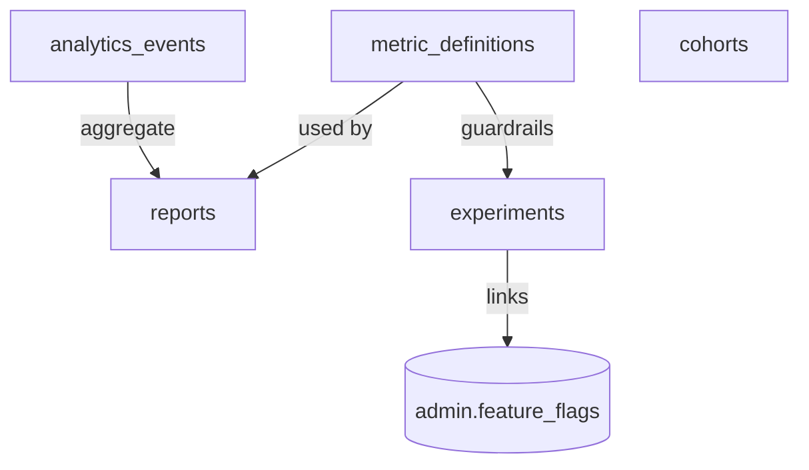

# CareerMitra — `analytics` Schema

| | |
|---|---|
| **Postgres schema** | `analytics` · **Context** | 14 · Analytics & Insights (Domain Model §5.14) |
| **Version** | 1.0 · **Status** | Approved · **Role** | Governed event taxonomy, metric definitions, experiments, cohorts, reports |
| **Assumes** | `01_SCHEMA_OVERVIEW.md`; events are pseudonymous, minimized, consented |

> The governed backbone for ranking, notifications, and growth decisions. The high-volume raw event stream
> primarily lands in the **lakehouse** (Data Architecture §2); PostgreSQL holds the **governed catalog**
> (one definition per metric/event) plus the operational analytics entities. Events are **pseudonymous and
> carry no plaintext PII**; one governed definition per metric (no conflicting numbers).

---

## 1. ER overview

## 2. Enums (schema `analytics`)
| Enum type | Values |
|---|---|
| `analytics.metric_status` | `proposed`, `approved`, `active`, `deprecated` |
| `analytics.experiment_status` | `designed`, `running`, `analyzed`, `decided`, `archived` |
| `analytics.cohort_status` | `defined`, `active`, `archived` |
| `analytics.report_status` | `defined`, `generated`, `distributed`, `archived` |

## 3. Tables

### 3.1 `analytics.analytics_events` — *AnalyticsEvent (append-only, time-partitioned)*
| Column | Type | Null | Class | Notes |
|---|---|---|---|---|
| `id` | uuid | no | internal | PK |
| `event_name` | text | no | internal | from the governed taxonomy (view/save/apply/notify/dna_run/search/pay) |
| `actor_pseudonym` | text | yes | internal | hashed/rotated — **no plaintext PII** |
| `properties` | jsonb | yes | internal | ids + minimized metadata; no sensitive PII |
| `context` | jsonb | yes | internal | device/locale (minimized) |
| `at` | timestamptz | no | internal | append-only; **time-partitioned**; retention-bounded |

**Constraint:** `event_name` must exist in the taxonomy (validated in app/lookup). Consented; minimized.
Mirrored to lakehouse for large-scale analysis (source of truth for governed definitions stays here).

### 3.2 `analytics.metric_definitions` — *MetricDefinition*
`id`, `name` unique, `definition`, `formula_description`, `owner`, `is_guardrail` bool, `status`.
**One definition per metric** — no conflicting numbers (§29). Guardrail metrics flagged (accuracy,
grounding fidelity, cost per active user, opt-out rate).

### 3.3 `analytics.experiments` — *Experiment (A/B)*
| Column | Type | Null | Class | Notes |
|---|---|---|---|---|
| `id` | uuid | no | internal | PK |
| `hypothesis` | text | no | internal | |
| `variants` | jsonb | no | internal | |
| `primary_metric_id` | uuid | no | internal | **FK → `metric_definitions`** |
| `guardrail_metric_ids` | uuid[] | no | internal | must hold |
| `sample_size` | integer | yes | internal | sample-size discipline |
| `result` | jsonb | yes | internal | |
| `decision` | text | yes | internal | logged decision |
| `feature_flag_id` | uuid | yes | internal | → `admin.feature_flags` |
| `status` | analytics.experiment_status | no | internal | |
| `version`, `created_at`, `updated_at` | — | — | — | standard |

Ranking/notification/growth changes ship behind experiments with guardrails; decisions logged (§29).

### 3.4 `analytics.cohorts` / `analytics.reports`
- `cohorts` — *Cohort*: `id`, `definition` jsonb, `criteria` jsonb (governed fields), `size`, `status`.
  Privacy-safe; used for retention/targeting, not exclusionary harm.
- `reports` — *Report*: `id`, `report_type`, `metric_ids` uuid[], `period`, `audience`, `status`. Built on
  governed metrics; privacy-safe aggregation.

## 4. Outbox
`analytics.outbox_events` — emits `ExperimentDecided`. Consumers: Administration (flag change), Search.
Analytics **consumes** events from all contexts (the event taxonomy).

## 5. Invariants realized
| Invariant | How |
|---|---|
| One definition per metric (§29) | `metric_definitions.name` unique + owner |
| Experiment-gated changes | `experiments` guardrails; links `feature_flags`/`ranking_models` |
| Privacy-safe analytics (§34) | `actor_pseudonym`; no plaintext PII; minimized/consented; retention-bounded |
| Cost/AI-quality guardrails (§40) | `is_guardrail` metrics (cost per active user, grounding fidelity) |
