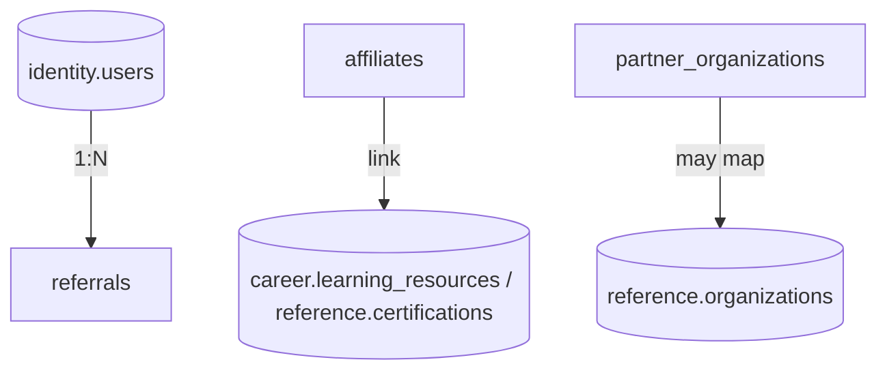

# CareerMitra — `growth` Schema

| | |
|---|---|
| **Postgres schema** | `growth` · **Context** | 15 · Growth & Partnerships (Domain Model §5.15) |
| **Version** | 1.0 · **Status** | Approved · **Role** | Referrals, affiliates, and (future) B2B partners — trust-respecting growth |
| **Assumes** | `01_SCHEMA_OVERVIEW.md`; incentives never compromise data access or trust |

> Growth mechanisms that never compromise trust: referral incentives never affect data access; affiliate
> links are **always disclosed** and **never pay-to-rank**; any future partner publishing preserves the
> verification standards. Anti-abuse checks on referrals.

---

## 1. ER overview

## 2. Enums (schema `growth`)
| Enum type | Values |
|---|---|
| `growth.referral_status` | `created`, `sent`, `accepted`, `rewarded`, `expired` |
| `growth.affiliate_status` | `registered`, `active`, `suspended`, `terminated` |
| `growth.partner_status` | `prospect`, `onboarding`, `active`, `churned` |

## 3. Tables

### 3.1 `growth.referrals` — *Referral*
| Column | Type | Null | Class | Notes |
|---|---|---|---|---|
| `id` | uuid | no | internal | PK |
| `referrer_user_id` | uuid | no | internal | → `identity.users` (no FK) |
| `invitee_ref` | text | yes | pii | invite target (email/phone), consented — minimized |
| `invited_user_id` | uuid | yes | internal | set on signup |
| `reward` | jsonb | yes | internal | trust-respecting incentive |
| `status` | growth.referral_status | no | internal | |
| `version`, `created_at`, `updated_at` | — | — | — | standard |

**Constraint:** `ck_referrals_no_self` — `invited_user_id <> referrer_user_id` (self-referral blocked).
Anti-abuse checks (→`support.fraud_cases`); incentives never grant data access.

### 3.2 `growth.affiliates` — *Affiliate*
`id`, `partner`, `terms` jsonb, `disclosure` text (**required**), `tracking` jsonb, `status`. Always
disclosed; **never pay-to-rank**; relevance-driven only. Links `career.learning_resources` /
`reference.certifications` by id.

**Constraint:** `ck_affiliates_disclosure_required` — `disclosure` not null.

### 3.3 `growth.partner_organizations` — *PartnerOrganization / CoachingPartner (future)*
`id`, `partner_type` (institution/coaching), `agreement` jsonb, `entitlements` jsonb, `contacts` jsonb,
`mapped_organization_id` (→`reference.organizations`), `status`. Partner data access is scoped and
audited; verification standards preserved for any partner publishing (ACL at the boundary).

## 4. Outbox
`growth.outbox_events` — emits `ReferralAccepted`. Consumers: Identity, Analytics.

## 5. Invariants realized
| Invariant | How |
|---|---|
| No pay-to-rank (§7 rule 13) | affiliates relevance-driven, disclosed; never influence ranking |
| Disclosure required | `ck_affiliates_disclosure_required` |
| Anti-abuse referrals | `ck_referrals_no_self`; fraud checks; incentives never grant data access |
| Partner verification preserved | future publishing keeps the verification gate + scoped/audited access |
