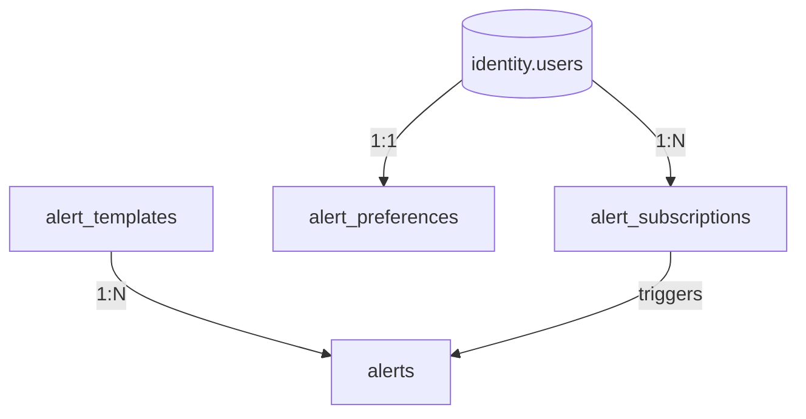

# CareerMitra — `notifications` Schema

| | |
|---|---|
| **Postgres schema** | `notifications` · **Context** | 16 · Notifications & Engagement (Domain Model §5.16) |
| **Version** | 1.0 · **Status** | Approved · **Role** | Outbound Alerts, templates, preferences, and subscriptions |
| **Assumes** | `01_SCHEMA_OVERVIEW.md`; **`Alert` ≠ `Notification`** (Ubiquitous Language §4.1) |

> **Naming (critical):** the entity here is an **`Alert`** — an *outbound message to an aspirant*. The
> official recruitment announcement is a **`Notification`** and lives in `recruitment`
> (`notifications_ingested`). Never conflate them. Delivery is **idempotent** (no duplicates/drops under
> retry), **anti-fatigue** capped, **cost-aware** (SMS reserved for high-value), and **surge-batched** on
> result day.

---

## 1. ER overview

## 2. Enums (schema `notifications`)
| Enum type | Values |
|---|---|
| `notifications.alert_status` | `created`, `queued`, `sent`, `delivered`, `read`, `failed`, `suppressed` |
| `notifications.alert_channel` | `in_app`, `push`, `email`, `sms` |
| `notifications.alert_type` | `deadline`, `admit_card_released`, `result_out`, `answer_key_out`, `new_match`, `profile_suggestion` |
| `notifications.subscription_status` | `created`, `active`, `muted`, `cancelled` |
| `notifications.sub_target_type` | `saved_search`, `opportunity`, `exam`, `skill` |

## 3. Tables

### 3.1 `notifications.alerts` — *Alert (append-heavy, time-partitioned)*
| Column | Type | Null | Class | Notes |
|---|---|---|---|---|
| `id` | uuid | no | internal | PK |
| `user_id` | uuid | no | internal | → `identity.users` (no FK) |
| `alert_type` | notifications.alert_type | no | internal | |
| `channel` | notifications.alert_channel | no | internal | cost-aware choice (SMS reserved) |
| `template_id` | uuid | no | internal | **FK → `alert_templates`** |
| `payload_refs` | jsonb | no | internal | ids of the triggering entity — **no PII payload** |
| `dedup_key` | text | no | internal | idempotency key (no duplicate under retry) |
| `status` | notifications.alert_status | no | internal | |
| `sent_at` / `delivered_at` / `read_at` | timestamptz | yes | internal | |
| `created_at` | timestamptz | no | internal | append; **time-partitioned** (Overview §10) |

**Constraint:** `ux_alerts_dedup` unique (`user_id`,`dedup_key`) — idempotent delivery (§7 rule 14).
Respects `alert_preferences` + quiet hours; anti-fatigue caps; suppressed alerts recorded, not dropped.

### 3.2 `notifications.alert_templates` — *AlertTemplate*
`id`, `alert_type`, `channel`, `localized_content` jsonb (per language), `variables` jsonb, `status`.
Approved before use; AI summaries link to source (never invent facts).

### 3.3 `notifications.alert_preferences` — *AlertPreference (1:1 user)*
`user_id` (unique), `channel_by_type` jsonb, `frequency`, `quiet_hours` jsonb, `digest_enabled` bool.
Honored on every send; opt-out respected; anti-fatigue enforced.

### 3.4 `notifications.alert_subscriptions` — *AlertSubscription*
| Column | Type | Null | Class | Notes |
|---|---|---|---|---|
| `id` | uuid | no | internal | PK |
| `user_id` | uuid | no | internal | → `identity.users` |
| `target_type` | notifications.sub_target_type | no | internal | saved_search/opportunity/exam/skill |
| `target_id` | uuid | no | internal | id of target (→career/recruitment/reference) |
| `frequency` | text | no | internal | allowed set |
| `status` | notifications.subscription_status | no | internal | |
| `version`, `created_at`, `updated_at` | — | — | — | standard |

*Distinct from `payments.subscriptions`* (billing) — Domain Model naming note. New matches/updates trigger
Alerts (respecting anti-fatigue).

## 4. Outbox / consumption
`notifications.outbox_events` — emits `AlertSent`, `AlertDelivered` (for Analytics). **Consumes** many
events: `OpportunityPublished`/`Corrected`, `ResultAnnounced`, `AdmitCardReleased`, `CalendarEventChanged`,
`ApplicationStageChanged`, `CareerDnaComputed` — the backbone of the proactive experience.

## 5. Invariants realized
| Invariant | How |
|---|---|
| Idempotent delivery (§7 rule 14) | `ux_alerts_dedup`; retry-safe; no duplicates/drops |
| Alert ≠ Notification (Ubiquitous Language) | entity named `alerts`; official announcement stays in `recruitment` |
| Anti-fatigue + quiet hours | `alert_preferences` honored on every send; suppressed recorded |
| Cost-aware channels (§19) | `channel` choice; SMS reserved for high-value; time-partitioned volume |
| No PII in event payloads (§11.2) | `payload_refs` carry ids only |
| Material-change re-notification (§7.12) | consumes `*Corrected`/`CalendarEventChanged` |
